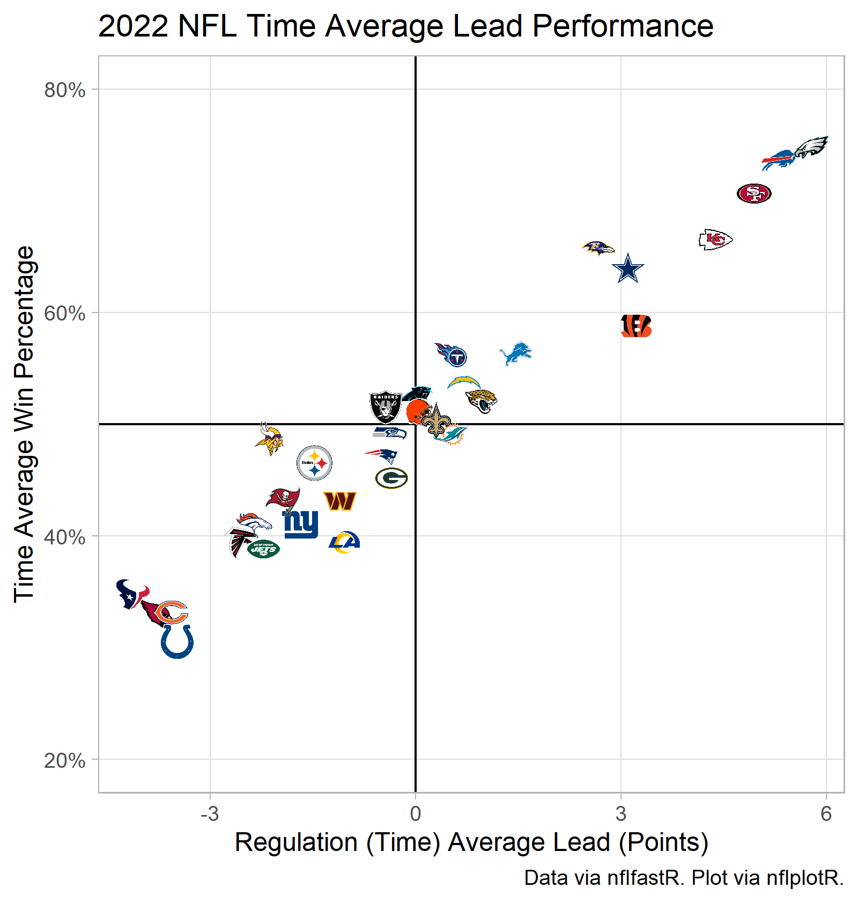

### Packages Used

```{r setup, include=FALSE}
library(tidyverse)
library(nflfastR)
library(reactable)
library(reactablefmtr)
library(nflplotR)
```

### Code to Generate Data

```{r get_time_average_data, echo=FALSE, warning=FALSE}

time_avg_df <- nfltools::nfl_mvt_season(year = 2022) %>%
  mutate(expected_win_percentage = exp(0.31 * time_avg_lead)/(1 + exp(0.31 * time_avg_lead))) %>%
  group_by(team) %>%
  summarize(time_avg_lead = mean(time_avg_lead, na.rm = T),
            time_avg_wins = sum(expected_win_percentage, na.rm = T))

penalty_yards_gained <- function(df){
  df %>%
    mutate(yards_gained = ifelse(play_type_nfl == "PENALTY",
                                 ifelse(penalty_team == posteam,
                                        -1 * penalty_yards,
                                        penalty_yards),
                                 yards_gained)) %>%
    return()
}

pbp_df <- nflfastR::load_pbp(2022) %>%
  filter(season_type == "REG") %>%
  filter(play_type_nfl %in% c("GAME_START",
                              "KICK_OFF",
                              "PUNT",
                              "TIMEOUT",
                              "FIELD_GOAL",
                              "XP_KICK",
                              "END_QUARTER",
                              "END_GAME",
                              "PAT2",
                              "FREE_KICK",
                              "COMMENT") == F) %>%
  filter(is.na(play_type_nfl) == F) %>%
  filter(play_type %in% c("qb_kneel",
                          "qb_spike") == F) %>%
  filter(grepl("(Punt formation)", desc) == F) %>%
  filter(grepl(", offsetting.", desc) == F) %>%
  penalty_yards_gained()

mod_rand_int <- lme4::lmer(yards_gained ~ 1 + (1|posteam) + (1|defteam),
                           data = pbp_df)

off_avg <- pbp_df %>%
  group_by(posteam) %>%
  summarize(off_yards_per_snap = mean(yards_gained)) %>%
  rename(team = posteam)

off_rand_int <- coef(mod_rand_int)$posteam %>%
  rownames_to_column(var = "team") %>%
  rename(off_adj_yards_per_snap = `(Intercept)`)

def_avg <- pbp_df %>%
  group_by(defteam) %>%
  summarize(def_yards_per_snap = mean(yards_gained)) %>%
  rename(team = defteam)

def_rand_int <- coef(mod_rand_int)$defteam %>%
  rownames_to_column(var = "team") %>%
  rename(def_adj_yards_per_snap = `(Intercept)`)

per_snap_df <- off_avg %>%
  left_join(off_rand_int,
            by = "team") %>%
  left_join(def_avg,
            by = "team") %>%
  left_join(def_rand_int,
            by = "team")

df <- teams_colors_logos %>%
  select(team_logo_espn,
         team_abbr) %>%
  rename(team = team_abbr) %>%
  left_join(time_avg_df,
            by = "team") %>%
  # Removes old team names present in teams_colors_logos data.frame
  filter(is.na(time_avg_lead) == F) %>%
  left_join(per_snap_df,
            by = "team") %>%
  mutate(yards_per_snap_diff = off_yards_per_snap - def_yards_per_snap,
         adj_yards_per_snap_diff = off_adj_yards_per_snap - def_adj_yards_per_snap) %>%
  mutate(adj_per_snap_percentile = scale(adj_yards_per_snap_diff)) %>%
  mutate(adj_per_snap_percentile = pnorm(adj_per_snap_percentile))

```

## Graphical Summaries

### (Time) Average Lead Statistics

```{r time_avg_lead_plot, echo=FALSE}

p_time_avg <- df %>%
  ggplot(aes(x = time_avg_lead, y = time_avg_wins)) +
  geom_vline(xintercept = 0,
             color = "black") +
  geom_hline(yintercept = 0,
             color = "black") +
  geom_nfl_logos(aes(team_abbr = team),
                 width = 0.05) +
  scale_x_continuous(breaks = seq(from = -24, to = 24, by = 3),
                     minor_breaks = NULL) +
  scale_y_continuous(breaks = seq(from = 0, to = 18, by = 2),
                     minor_breaks = NULL) +
  theme_light() +
  labs(title = "2022 NFL Time Average Lead Performance",
       x = "Regulation (Time) Average Lead (Points)",
       y = "Time Average Expected Wins",
       caption = "Data via nflfastR. Plot via nflplotR.")

ggsave(filename = "time_avg_plot.png",
       plot = p_time_avg,
       height = 5.25,
       width = 5,
       units = "in",
       dpi = "retina")

```



```{r time_avg_percentile_plot, echo=FALSE}

p_time_avg_percentile <- df %>%
  arrange(time_avg_lead) %>%
  mutate(rank = row_number(),
         time_avg_lead = scale(time_avg_lead)) %>%
  mutate(time_avg_lead = pnorm(time_avg_lead)) %>%
  ggplot(aes(x = time_avg_lead,
             y = rank)) +
  geom_hline(yintercept = c(0.5, 8.5, 16.5, 24.5, 32.5),
             color = "dark gray",
             linetype = "dashed") +
  geom_vline(xintercept = c(0, 0.25, 0.5, 0.75, 1),
             color = "dark gray") +
  geom_nfl_logos(aes(team_abbr = team),
                 width = 0.05) +
  scale_x_continuous(minor_breaks = NULL,
                     labels = scales::percent) +
  scale_y_continuous(breaks = NULL,
                     minor_breaks = NULL) +
  theme_light() +
  labs(title = "2022 NFL Time Average Lead Percentile Rankings",
       x = "Time Average Lead: NFL Percentile",
       y = NULL,
       caption = "Data: nflfastR | Plot: nflplotR")

ggsave("nfl_time_avg_lead_percentile.png",
       plot = p_time_avg_percentile,
       units = "in",
       height = 5.25,
       width = 5,
       dpi = "retina")

```


### Adjusted Yards Per Play

```{r unit_per_snap_graph, echo=FALSE}

p_adj_yards_per_snap <- df %>%
  ggplot(aes(x = off_adj_yards_per_snap,
             y = def_adj_yards_per_snap)) +
  geom_vline(xintercept = mean(df$off_adj_yards_per_snap),
             color = "black") +
  geom_hline(yintercept = mean(df$def_adj_yards_per_snap)) +
  geom_nfl_logos(aes(team_abbr = team),
                 width = 0.05) +
  scale_x_continuous(minor_breaks = NULL) +
  scale_y_reverse(minor_breaks = NULL) +
  theme_light() +
  labs(title = "2022 NFL Adjusted Yards Per Snap Performance",
       subtitle = "Excludes Kneels/Spikes. Includes Penalty Yardage.\nyards_gained ~ 1 + (1|posteam) + (1|defteam)",
       x = "Offense Adjusted Yards/Snap Gained",
       y = "Defense Adjusted Yards/Snap Allowed",
       caption = "Data: nflfastR | Plot: nflplotR | Model: lme4")

ggsave("nfl_adj_per_snap_units.png",
       plot = p_adj_yards_per_snap,
       units = "in",
       height = 5.25,
       width = 5,
       dpi = "retina")
```


```{r per_snap_percentile_plot, echo=FALSE}

p_per_snap_percentile <- df %>%
  arrange(adj_per_snap_percentile) %>%
  mutate(rank = row_number()) %>%
  ggplot(aes(x = adj_per_snap_percentile,
             y = rank)) +
  geom_hline(yintercept = c(0.5, 8.5, 16.5, 24.5, 32.5),
             color = "dark gray",
             linetype = "dashed") +
  geom_vline(xintercept = c(0, 0.25, 0.5, 0.75, 1),
             color = "dark gray") +
  geom_nfl_logos(aes(team_abbr = team),
                 width = 0.05) +
  scale_x_continuous(minor_breaks = NULL,
                     labels = scales::percent) +
  scale_y_continuous(breaks = NULL,
                     minor_breaks = NULL) +
  theme_light() +
  labs(title = "2022 NFL Adjusted Yards/Snap Differential Rankings",
       subtitle = "Excludes Kneels/Spikes. Includes Penalty Yardage.\nyards_gained ~ 1 + (1|posteam) + (1|defteam)",
       x = "Adjusted Yards/Snap Differential: Percentile",
       y = NULL,
       caption = "Data: nflfastR | Plot: nflplotR | Model: lme4")

ggsave("nfl_adj_per_snap_percentile.png",
       plot = p_per_snap_percentile,
       units = "in",
       height = 5.25,
       width = 5,
       dpi = "retina")

```


## Table

```{r table, echo=FALSE}

df %>%
  select(-adj_per_snap_percentile) %>%
  reactable(
    theme = pff(),
    height = 675,
    defaultColDef = colDef(align = "center",
                           format = colFormat(digits = 1)),
    defaultSortOrder = "desc",
    columns = list(
      team_logo_espn = colDef(name = " ",
                              sortable = F,
                              style = list(position = "sticky",
                                           left = 0,
                                           background = "#fff",
                                           zIndex = 1),
                              cell = embed_img(),
                              width = 40),
      team = colDef(name = "Team",
                    width = 60,
                    style = list(position = "sticky",
                                 left = 40,
                                 background = "#fff",
                                 zIndex = 1)),
      time_avg_lead = colDef(name = "Time Average Lead",
                             format = colFormat(digits = 1)),
      time_avg_wins = colDef(name = "Expected Wins",
                             format = colFormat(digits = 1)),
      off_yards_per_snap = colDef(name = "Yards/Snap",
                                  format = colFormat(digits = 1)),
      off_adj_yards_per_snap = colDef(name = "Adj Yards/Snap",
                                      format = colFormat(digits = 1)),
      def_yards_per_snap = colDef(name = "Yards/Snap",
                                  format = colFormat(digits = 1)),
      def_adj_yards_per_snap = colDef(name = "Adj Yards/Snap",
                                      format = colFormat(digits = 1)),
      yards_per_snap_diff = colDef(name = "Yards/Snap Diff",
                                   format = colFormat(digits = 2)),
      adj_yards_per_snap_diff = colDef(name = "Adj Yards/Snap Diff",
                                       format = colFormat(digits = 2))
    ),
    columnGroups = list(
      colGroup(name = "Time Average Stats",
               columns = c("time_avg_lead",
                           "time_avg_wins")),
      colGroup(name = "Offense",
               columns = c("off_yards_per_snap",
                           "off_adj_yards_per_snap")),
      colGroup(name = "Defense",
               columns = c("def_yards_per_snap",
                           "def_adj_yards_per_snap")),
      colGroup(name = "Differential",
               columns = c("yards_per_snap_diff",
                           "adj_yards_per_snap_diff"))
      ),
    pagination = F,
    highlight = T,
    bordered = T,
    defaultSorted = c("time_avg_lead")
  )

```

### Glossary

Description of Metrics:

* <b>Time Average Lead</b>:
  * At any give point in regulation in the 2022 season, team ___ led by an average of ___ points.
* <b>Yards/Snap</b>:
  * Average yards/snap gained (or allowed) by team's offense (or defense)
  * Includes penalty accepted yards
  * Does not consider spikes/kneel downs/special teams plays
* <b>Adjusted Yards/Snap</b>:
  * [Empirical Bayes (shrinkage) Estimate](https://caseycaprini.github.io/the_latest_numbers/posts/2022-09-12-nfl-basic-multilevel-models/) of average yards/snap gained (or allowed) by team's offense (or defense)


