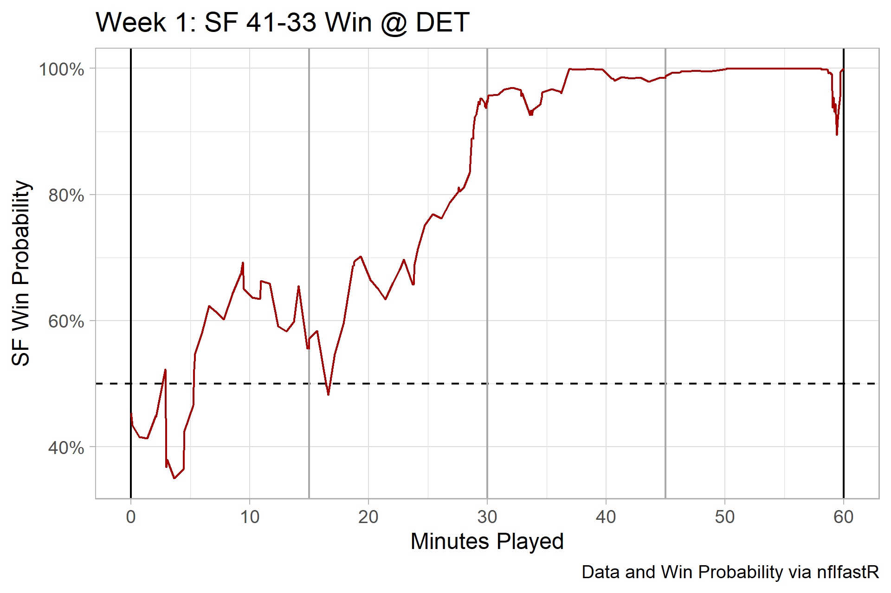

Revised 12/22/2021.

```{r setup, include=FALSE}
knitr::opts_chunk$set(echo = FALSE)

library(tidyverse)
library(nflfastR)
library(ggimage)
library(nfltools)
library(patchwork)
library(nflplotR)
```

## Graphical Summary of 2020 Regular Season
```{r echo=FALSE}
df_2020_summary <- nfl_mvt_season(year = 2020) %>%
  filter(is.na(home_away) == F) %>%
  group_by(team) %>%
  summarize(mean_tal = mean(mean_point_diff),
            median_tal = median(mean_point_diff))

p_2020 <- df_2020_summary %>%
  ggplot(aes(x = mean_tal,
             y = median_tal)) +
  geom_abline(slope = -1,
              intercept = seq(from = -24, to = 24, by = 6),
              color = "gray") +
  geom_vline(xintercept = 0) +
  geom_hline(yintercept = 0) +
  geom_nfl_logos(aes(team_abbr = team),
                 alpha = 0.7,
                 width = 0.065) +
  theme_light() +
  scale_y_continuous(breaks = seq(from = -21, to = 21, by = 3),
                     minor_breaks = NULL) +
  scale_x_continuous(breaks = seq(from = -21, to = 21, by = 3),
                     minor_breaks = NULL) +
  labs(x = "Time Avg Lead (Points)",
       y = "Median Game Time Avg Lead (Points)",
       title = "2020 NFL Time Average Metrics",
       subtitle = "Regular season. Regulation time only.",
       caption = "Data: nflfastR. Plot: nflplotR.") -> p_2020

ggsave("time_avg_2020.png",
       p_2020,
       width = 5,
       height = 5.25,
       units = "in",
       dpi = "retina")
```


## Why "time average" point differentials?
The <b>time average point differential for a game is a coarse-grained metric that summarizes its overall competitiveness</b>.  

Inspired by an Ole Peters talk on [Ergodicity Economics](https://youtu.be/LGqOH3sYmQA), I decided to investigate time averages in NFL games.  Like life, my prior is that a football game is path dependent. Game script matters. Play calling goals vary with game situation.  

At the time, I was reading 2021 NFL season previews and retrospectives on the 2020 season. The hypothesis was this: because of path dependence, time averages might enable better retrospective assessment of regular season team quality than season point differential and other aggregate metrics (e.g., [Pythagorean Win Expectation](https://en.wikipedia.org/wiki/Pythagorean_expectation)).  

A few other notes:

* The units of the metric is points, which is intuitive to football fans.
* For better or worse, the value of the metric relies on the assumption that a time average is informative. However, it does not rely on modeling assumptions.

If you're curious, the current NFL season to date results (with an adjustment for opponent quality) can be found linked on the top navigation bar.  

### A few concrete example games
Consider two games from Week 1 of 2021.  

* PIT 23, BUF 16  
* SF 41, DET 33  

```{r week_1_examples, echo=FALSE}
example_1_id <- fast_scraper_schedules(2021) %>%
  filter(week == 1) %>%
  filter(home_team == "PIT" | away_team == "PIT") %>%
  pull(game_id)

pit_color <- teams_colors_logos %>%
  filter(team_abbr == "PIT") %>%
  pull(team_color)

pit_ex_mean_point_diff <- load_pbp(2021) %>%
  filter(game_id == example_1_id) %>%
  mvt_game("PIT") %>%
  pull(mean_point_diff) %>%
  round(1)

#PIT Win Prob Graph, Week 1
load_pbp(2021) %>%
  filter(game_id == example_1_id) %>%
  mutate(game_minutes = (3600 - game_seconds_remaining)/60) %>%
  filter(is.na(away_wp_post) == FALSE) %>%
  select(game_minutes, away_wp_post) %>%
  rbind(data.frame(game_minutes = 60,
                   away_wp_post = 1)) %>%
  ggplot(aes(x = game_minutes, y = away_wp_post)) +
  geom_hline(yintercept = 0.5,
             linetype = "dashed") +
  geom_vline(xintercept = c(0, 60),
             color = "black") +
  geom_vline(xintercept = c(15, 30, 45),
             color = "dark gray") +
  geom_line(color = pit_color) +
  scale_x_continuous(breaks = seq(from = 0, to = 60, by = 10)) +
  scale_y_continuous(breaks = seq(from = 0, to = 1, by = 0.2),
                     labels = scales::percent_format(accuracy = 1)) +
  theme_light() +
  labs(x = "Minutes Played",
       y = "PIT Win Probability",
       title = "Week 1: PIT 23-16 Win @ BUF") -> p_top

example_2_id <- fast_scraper_schedules(2021) %>%
  filter(home_team %in% c("SF", "DET") & away_team %in% c("SF", "DET")) %>%
  pull(game_id)

sf_color <- teams_colors_logos %>%
  filter(team_abbr == "SF") %>%
  pull(team_color)

sf_ex_mean_point_diff <- load_pbp(2021) %>%
  filter(game_id == example_2_id) %>%
  mvt_game("SF") %>%
  pull(mean_point_diff) %>%
  round(1)

#SF Win Prob Graph, Week 1
load_pbp(2021) %>%
  filter(game_id == example_2_id) %>%
  mutate(game_minutes = (3600 - game_seconds_remaining)/60) %>%
  filter(is.na(away_wp_post) == FALSE) %>%
  select(game_minutes, away_wp_post) %>%
  rbind(data.frame(game_minutes = 60,
                   away_wp_post = 1)) %>%
  ggplot(aes(x = game_minutes, y = away_wp_post)) +
  geom_hline(yintercept = 0.5,
             linetype = "dashed") +
  geom_vline(xintercept = c(0, 60),
             color = "black") +
  geom_vline(xintercept = c(15, 30, 45),
             color = "dark gray") +
  geom_line(color = sf_color) +
  scale_x_continuous(breaks = seq(from = 0, to = 60, by = 10)) +
  scale_y_continuous(breaks = seq(from = 0, to = 1, by = 0.2),
                     labels = scales::percent_format(accuracy = 1)) +
  theme_light() +
  labs(x = "Minutes Played",
       y = "SF Win Probability",
       title = "Week 1: SF 41-33 Win @ DET",
       caption = "Data and Win Probability via nflfastR") -> p_bottom

ggsave("pit_week_1_2021_win_prob.png",
       p_top,
       height = 4,
       width = 6,
       units = "in",
       dpi = "retina")
ggsave("sf_week_1_2021_win_prob.png",
       p_bottom,
       height = 4,
       width = 6,
       units = "in",
       dpi = "retina")
```

The margin of victory for the Steelers and the 49ers was very similar. However, the time average point differential is significantly different.

|Team  | Margin of Victory | Time Average Point Diff      |
|------|:-----------------:|:----------------------------:|
|PIT   | 7                 | `r pit_ex_mean_point_diff[1]`|
|SF    | 8                 | `r sf_ex_mean_point_diff[1]` |

Let's compare the Win Probability graph for the two games.





Despite the similar margin of victory for both teams, the Win Probability graphs reflect very different paths to the result.  

* The Steelers surged to take control in the 4th quarter, fueled by a Bills turnover on downs near midfield and a Pittsburgh TD on a blocked punt.  
* The Lions never threatened the 49ers until it was too late. Detroit scored two TDs and converted two 2-point conversions after the 2-minute warning in the 4th quarter. On top of defensive lapses, the 49ers allowed a successful onside kick and fumbled while trying to kill clock.  

The Steelers made big plays late to win a game they kept close, while the 49ers controlled the game until hilarity ensued inside of 2-minutes. The time average point differential better reflects the path these games took to the final outcome than the final margin of victory. 

## Recent NFL seasons
The following shows the distribution of time average game results (from the home team's perspective) for all regular season games in 2011 to 20202.


As expected,

* Most positive time average differentials result in wins, while most negative time average point differentials result in losses.
* There is evidence of a home team advantage: on average, home teams lead by ~1.4 points at any given point in regulation time for the decade considered of regular season games considered.

## Resources and sources of inspiration
I the most amateur of R users.  This post contains adapted code and inspiration from:

* The [tidyverse](https://www.tidyverse.org/).
* The [nflfastR](https://www.nflfastr.com/) of the nflverse.
* Tom Mock's excellent posts on [plotting images](https://themockup.blog/posts/2020-10-11-embedding-images-in-ggplot/) and [tables](https://jthomasmock.github.io/gtExtras/)  
* Shannon Pileggi's excellent blog post on [creating your own R package](https://www.pipinghotdata.com/posts/2020-10-25-your-first-r-package-in-1-hour/).  