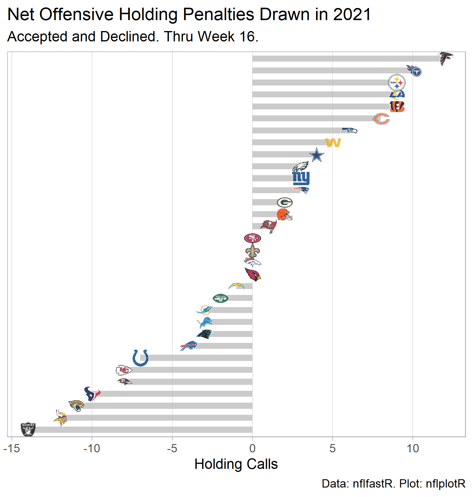
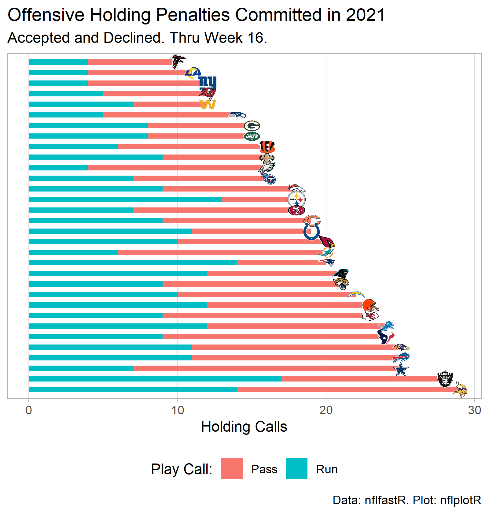
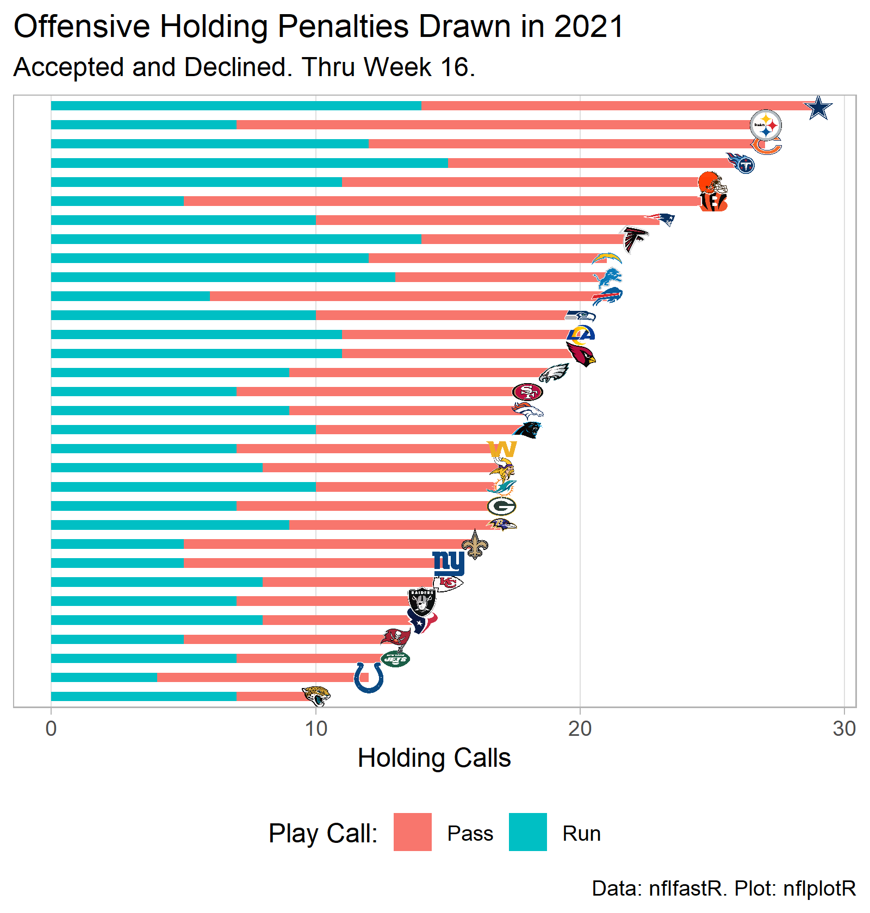

```{r setup, include=FALSE}
knitr::opts_chunk$set(echo = FALSE)
library(tidyverse)
library(nflfastR)
library(nflplotR)

```

```{r data_and_analysis_2021, include=FALSE}
year = 2021
week = 16

nfl_hold_pbp_df <- load_pbp(year) %>%
  filter(week <= week) %>%
  filter(grepl("Offensive Holding", desc,
               ignore.case = T) == T) %>%
  filter(grepl("punts", desc) == F) %>%
  filter(grepl("kicks", desc) == F) %>%
  mutate(season = year) %>%
  mutate(off_hold_play_type = case_when(rush_attempt == 1 ~ "Run",
                                        pass_attempt == 1 ~ "Pass",
                                        grepl("pass", desc) == T ~ "Pass",
                                        grepl("scrambles", desc) == T ~ "Pass",
                                        grepl("sacked", desc) == T ~ "Pass",
                                        TRUE ~ "Run")) %>%
  rename(team = posteam,
         opponent = defteam) %>%
  select(season, team, week, opponent,
         desc, off_hold_play_type,
         rush_attempt, pass_attempt,
         penalty_player_id, penalty_player_name,
         series, series_success, series_result) %>%
  mutate(accept_decline = ifelse(grepl("Offensive Holding, declined", desc),
                                 "declined",
                                 "accepted"))


# Summarize holding penalties committed by each team
team_off_hold_commit <- nfl_hold_pbp_df %>%
  group_by(team, off_hold_play_type) %>%
  summarize(n_holds = n()) %>%
  ungroup()
team_off_hold_commit_totals <- team_off_hold_commit %>%
  group_by(team) %>%
  summarize(total_holds = sum(n_holds))
team_off_hold_commit <- left_join(team_off_hold_commit, team_off_hold_commit_totals,
                               by = c("team" = "team"))

# Plot holding penalties committed
p_commit <- team_off_hold_commit %>%
  ggplot(aes(x = desc(reorder(factor(team), total_holds)),
             y = n_holds)) +
  geom_col(aes(fill = off_hold_play_type),
           width = 0.5) +
  geom_nfl_logos(aes(y = total_holds,
                     team_abbr = team),
                 width = 0.04,
                 alpha = 0.8) +
  theme_light() +
  labs(x = NULL,
       y = "Holding Calls",
       title = "Offensive Holding Penalties Committed in 2021",
       subtitle = "Accepted and Declined. Thru Week 16.",
       caption = "Data: nflfastR. Plot: nflplotR",
       fill = "Play Call:") +
  scale_x_discrete(breaks = NULL) +
  scale_y_continuous(minor_breaks = NULL) +
  coord_flip() +
  theme(legend.position = "bottom")
ggsave(filename = "nfl_2021_holds_commit_thru_wk_16.png",
       plot = p_commit,
       width = 5,
       height = 5.25,
       units = "in",
       dpi = "retina")


# Summarize holding penalties drawn by each team
team_off_hold_drawn <- nfl_hold_pbp_df %>%
  group_by(opponent, off_hold_play_type) %>%
  summarize(n_holds = n()) %>%
  ungroup() %>%
  rename(team = opponent)
team_off_hold_drawn_totals <- team_off_hold_drawn %>%
  group_by(team) %>%
  summarize(total_holds = sum(n_holds))
team_off_hold_drawn <- left_join(team_off_hold_drawn, team_off_hold_drawn_totals,
                                  by = c("team" = "team"))

# Plot holding penalties drawn
p_drawn <- team_off_hold_drawn %>%
  ggplot(aes(x = reorder(factor(team), total_holds),
             y = n_holds)) +
  geom_col(aes(fill = off_hold_play_type),
           width = 0.5) +
  geom_nfl_logos(aes(y = total_holds,
                     team_abbr = team),
                 width = 0.04,
                 alpha = 0.8) +
  theme_light() +
  labs(x = NULL,
       y = "Holding Calls",
       title = "Offensive Holding Penalties Drawn in 2021",
       subtitle = "Accepted and Declined. Thru Week 16.",
       caption = "Data: nflfastR. Plot: nflplotR",
       fill = "Play Call:") +
  scale_x_discrete(breaks = NULL) +
  scale_y_continuous(minor_breaks = NULL) +
  coord_flip() +
  theme(legend.position = "bottom")
ggsave(filename = "nfl_2021_holds_drawn_thru_wk_16.png",
       plot = p_drawn,
       width = 5,
       height = 5.25,
       units = "in",
       dpi = "retina")


# Net offensive hold advantage
team_net_holds <- team_off_hold_drawn_totals %>%
  rename(total_holds_drawn = total_holds) %>%
  left_join(team_off_hold_commit_totals,
            by = c("team" = "team")) %>%
  rename(total_holds_committed = total_holds) %>%
  mutate(net_holds = total_holds_drawn - total_holds_committed)
# Plot net offensive hold advantage
p_net <- team_net_holds %>%
  ggplot(aes(x = reorder(factor(team), net_holds),
             y = net_holds)) +
  geom_col(width = 0.5,
           fill = "gray",
           alpha = 0.8) +
  geom_nfl_logos(aes(team_abbr = team),
                 width = 0.04,
                 alpha = 0.8) +
  theme_light() +
  labs(x = NULL,
       y = "Holding Calls",
       title = "Net Offensive Holding Penalties Drawn in 2021",
       subtitle = "Accepted and Declined. Thru Week 16.",
       caption = "Data: nflfastR. Plot: nflplotR") +
  scale_x_discrete(breaks = NULL) +
  scale_y_continuous(minor_breaks = NULL) +
  coord_flip() +
  theme(legend.position = "bottom")
ggsave(filename = "nfl_2021_net_holds_thru_wk_16.png",
       plot = p_net,
       width = 5,
       height = 5.25,
       units = "in",
       dpi = "retina")


#Series success rate for series with 1+ holds
hold_series_success_rate <- nfl_hold_pbp_df %>%
  group_by(team, week, series) %>%
  summarize(total_series = n_distinct(series),
            successful_series = sum(series_success)) %>%
  ungroup() %>%
  #Prevent series with multiple holds from being counted as multiple successes
  mutate(successful_series = if_else(successful_series == 0,
                                  0,
                                  1)) %>%
  summarize(total_series = sum(total_series),
            successful_series = sum(successful_series),
            rate = round((successful_series/total_series) * 100, 1)) %>%
  pull(rate)


# Proportion of holds by play type
run_holds <- team_off_hold_commit %>%
  filter(off_hold_play_type == "Run") %>%
  summarize(run_holds = sum(n_holds)) %>%
  pull(run_holds)
pass_holds <- team_off_hold_commit %>%
  filter(off_hold_play_type == "Pass") %>%
  summarize(pass_holds = sum(n_holds)) %>%
  pull(pass_holds)
run_hold_prop <- round((run_holds/(run_holds+pass_holds)) * 100, 1)
```

## Motivating questions

Through the black-and-gold colored glasses of a Steelers fan, it seemed like offensive holding calls basically were not called in 2020 (I can't watch as much of other games as I'd like).  

I had been wondering how much a lack of holding calls may have negatively impacted the 2020 Steelers defense.

* How crippling is a holding call to a drive?
* Which teams have taken the most offensive holding penalties?
* Which teams have drawn the most offensive holding calls?
* Which teams draw the most holds while committing the fewest (i.e., drawn - taken = net holds drawn)?

Recently, [Matt Williamson](https://twitter.com/WilliamsonNFL) wondered aloud whether more holds occur on run or pass plays on an episode of [SNR: The Drive](https://player.fm/series/snr-drive-with-matt-dale-pittsburgh-steelers).

## Method

Using play-by-play data via [nflfastR](https://www.nflfastr.com/index.html):

* Throw out punt and kickoffs
* Count all holds called, even if declined or offset by another penalty
* If not directly identified as a pass or run in the data set, infer whether the play call was a pass or run using keywords in the play description.
  * Sacks were counted as "pass" play calls.
  * Scrambles were also counted as play calls.

This is just amateur stuff for fun. I'm probably classifying some play calls incorrectly. I did a quick cross-check of total holding calls for 2021 against this [website](https://www.nflpenalties.com/penalty/offensive-holding?year=2021), and the results were tracking (it looks like the website includes special teams holds, whereas I threw them out).

## Results for 2021, Through Week 16

#### Affect on series conversion rates

[Ben Baldwin](https://twitter.com/benbbaldwin) periodically post team series conversion rates, where a series is a success if it generates a new set of downs or scores a TD. Here's a [recent example](https://twitter.com/benbbaldwin/status/1473655366806392835).

* Typical series conversion rates for an offense are in the neighborhood of 70 percent.
* When an offense commits a holding penalty, the <b>series conversion rate drops to ```r hold_series_success_rate``` percent</b> in 2021.

#### Net offensive hold ranks



#### Offensive holds committed ranks



#### Defense offensive holding calls drawn ranks



#### Offensive holds by play call

Through Week 16, ```r run_hold_prop``` percent of all Offensive Holds have occurred on run plays.

## Conclusion

This was a quick, interesting exercise.

An offensive holding call really does hurt a drive as much as it seems.

In the future, it would be interesting to look at the topic in more detail. For example, more holds were called on run plays (~54 percent) than pass plays in 2020, the opposite of 2021. Is there a trend in officiating, change in play call mix, or just random variation?
