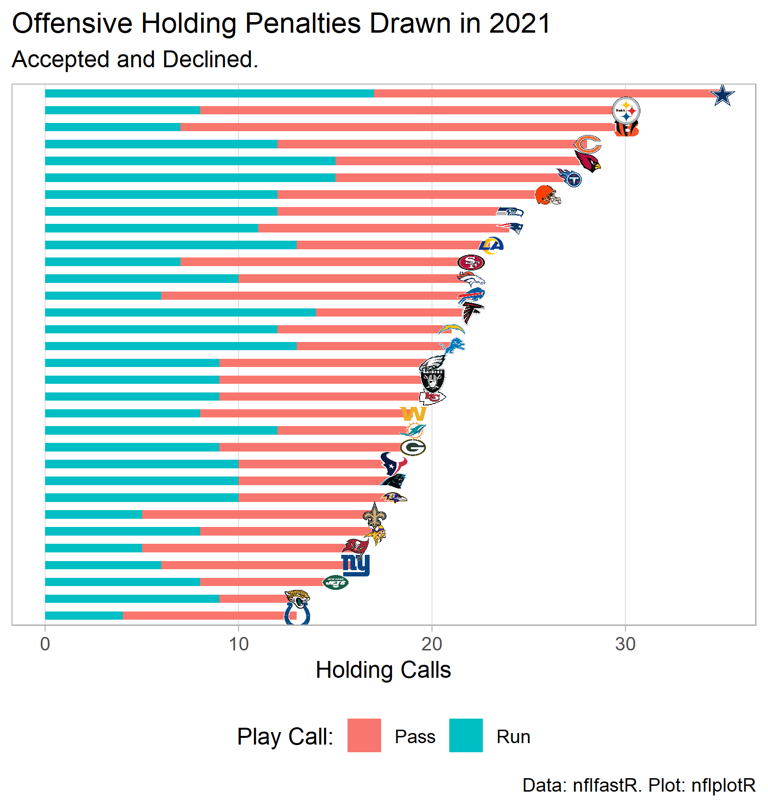

```{r setup, include=FALSE}
knitr::opts_chunk$set(echo = FALSE)
library(tidyverse)
library(nflfastR)
library(nflplotR)

```

```{r holds_2021, include=FALSE}
year = 2021
week = 18

nfl_hold_pbp_df <- load_pbp(year) %>%
  filter(week <= week) %>%
  filter(grepl("Offensive Holding", desc,
               ignore.case = T) == T) %>%
  filter(grepl("punts", desc) == F) %>%
  filter(grepl("kicks", desc) == F) %>%
  mutate(season = year) %>%
  mutate(off_hold_play_type = case_when(rush_attempt == 1 ~ "Run",
                                        pass_attempt == 1 ~ "Pass",
                                        grepl("pass", desc) == T ~ "Pass",
                                        grepl("scrambles", desc) == T ~ "Pass",
                                        grepl("sacked", desc) == T ~ "Pass",
                                        TRUE ~ "Run")) %>%
  rename(team = posteam,
         opponent = defteam) %>%
  select(season, team, week, opponent,
         desc, off_hold_play_type,
         rush_attempt, pass_attempt,
         penalty_player_id, penalty_player_name,
         series, series_success, series_result) %>%
  mutate(accept_decline = ifelse(grepl("Offensive Holding, declined", desc),
                                 "declined",
                                 "accepted"))

# Summarize holding penalties committed by each team
team_off_hold_commit <- nfl_hold_pbp_df %>%
  group_by(team, off_hold_play_type) %>%
  summarize(n_holds = n()) %>%
  ungroup()
team_off_hold_commit_totals <- team_off_hold_commit %>%
  group_by(team) %>%
  summarize(total_holds = sum(n_holds))
team_off_hold_commit <- left_join(team_off_hold_commit, team_off_hold_commit_totals,
                               by = c("team" = "team"))

# Summarize holding penalties drawn by each team
team_off_hold_drawn <- nfl_hold_pbp_df %>%
  group_by(opponent, off_hold_play_type) %>%
  summarize(n_holds = n()) %>%
  ungroup() %>%
  rename(team = opponent)
team_off_hold_drawn_totals <- team_off_hold_drawn %>%
  group_by(team) %>%
  summarize(total_holds = sum(n_holds))
team_off_hold_drawn <- left_join(team_off_hold_drawn, team_off_hold_drawn_totals,
                                  by = c("team" = "team"))

# Net offensive hold advantage
team_net_holds <- team_off_hold_drawn_totals %>%
  rename(total_holds_drawn = total_holds) %>%
  left_join(team_off_hold_commit_totals,
            by = c("team" = "team")) %>%
  rename(total_holds_committed = total_holds) %>%
  mutate(net_holds = total_holds_drawn - total_holds_committed)

write.csv(team_net_holds,
          "nfl_2021_off_holding.csv")

```


```{r table_prep, include=FALSE}

commit_wide <- team_off_hold_commit %>%
  mutate(total_holds = NULL) %>%
  pivot_wider(names_from = off_hold_play_type,
              values_from = n_holds) %>%
  mutate(Total = Pass + Run) %>%
  rename(pass_commit = Pass,
         run_commit = Run,
         total_commit = Total)

drawn_wide <- team_off_hold_drawn %>%
  mutate(total_holds = NULL) %>%
  pivot_wider(names_from = off_hold_play_type,
              values_from = n_holds) %>%
  mutate(Total = Pass + Run) %>%
  rename(pass_drawn = Pass,
         run_drawn = Run,
         total_drawn = Total)

table_df <- left_join(commit_wide, drawn_wide,
                      by = c("team" = "team")) %>%
  mutate(pass_net = pass_drawn - pass_commit,
         run_net = run_drawn - run_commit,
         total_net = total_drawn - total_commit)

table_df <- teams_colors_logos %>%
  select(team_logo_espn, team_abbr) %>%
  left_join(table_df,
            by = c("team_abbr" = "team")) %>%
  rename(team = team_abbr) %>%
  filter(is.na(pass_commit) == F)

```

## Intro

The following is a collection of offensive holding penalty statistics for the 2021 NFL regular season, derived from nflfastR play-by-play data.

The totals below include all called holding penalties, even if declined or offset by another penalty. Plays identified as QB scrambles are counted as "pass" play calls. Spikes and kneel downs are not counted. Two point conversion attempts are also not counted.

For the net offensive holds, positive numbers correspond to positive balance for the season: the team's defense drew more offensive holds than they committed.

```{r calcu_nfl_totals, echo=FALSE}

pbp_trim <- load_pbp(year) %>%
  filter(season_type == "REG") %>%
  filter(extra_point_attempt != 1) %>%
  filter(two_point_attempt != 1) %>%
  filter(field_goal_attempt!= 1) %>%
  filter(kickoff_attempt != 1) %>%
  filter(punt_attempt != 1) %>%
  filter(timeout != 1) %>%
  filter(qb_kneel != 1) %>%
  filter(qb_spike != 1) %>%
  filter(grepl("No Play.", desc) == F) %>%
  mutate(play_call_type = case_when(rush_attempt == 1 ~ "Run",
                                    pass_attempt == 1 ~ "Pass",
                                    grepl("pass", desc) == T ~ "Pass",
                                    grepl("scrambles", desc) == T ~ "Pass",
                                    grepl("sacked", desc) == T ~ "Pass",
                                    TRUE ~ "Run")) %>%
  group_by(play_call_type) %>%
  summarize(n = n()) %>%
  ungroup()

pbp_trim <- pbp_trim %>%
  mutate(percent = (n/sum(pbp_trim$n)) * 100)

nfl_pass_prop <- pbp_trim %>%
  filter(play_call_type == "Pass") %>%
  pull(percent) %>%
  round(1)
nfl_run_prop <- pbp_trim %>%
  filter(play_call_type == "Run") %>%
  pull(percent) %>%
  round(1)

nfl_pass <- pbp_trim %>%
  filter(play_call_type == "Pass") %>%
  pull(n)
nfl_run <- pbp_trim %>%
  filter(play_call_type == "Run") %>%
  pull(n)

nfl_pass_holds <- sum(commit_wide$pass_commit)
nfl_run_holds <- sum(commit_wide$run_commit)

nfl_prop_pass_hold <- round((nfl_pass_holds/nfl_pass) * 100,
                            1)
nfl_prop_run_hold <- round((nfl_run_holds/nfl_run) * 100,
                           1)

```

### League Wide Play Call Breakdown

The majority of play calls in the 2021 season were passes.  For all offensive snaps across the NFL,

* `r nfl_pass_prop` percent of offensive snaps were pass play calls.
* `r nfl_run_prop` percent were runs.

Overall, more holds occurred on pass play calls.

* `r nfl_pass_holds` holds were committed on pass play calls
* `r nfl_run_holds` holds were committed on run play calls.

On a per snap basis, however, run plays were more likely to result in an offensive holding. For all offensive snaps across the NFL,

* `r nfl_prop_pass_hold` percent of pass play calls resulted in a hold.
* `r nfl_prop_run_hold` percent of run play calls resulted in a hold.

## 2021 Offensive Holding Stats

```{r build_table, echo=FALSE}

library(reactable)
library(reactablefmtr)


table_df %>%
  reactable(
    theme = pff(),
    height = 800,
    defaultColDef = colDef(align = "center"),
    columns = list(
      team_logo_espn = colDef(name = " ",
                              sortable = F,
                              style = list(position = "sticky",
                                           left = 0,
                                           background = "#fff",
                                           zIndex = 1),
                              cell = embed_img(),
                              width = 40),
      team = colDef(name = "Team",
                    width = 70,
                    style = list(position = "sticky",
                                 left = 40,
                                 background = "#fff",
                                 zIndex = 1)),
      pass_commit = colDef(name = "Pass"),
      run_commit = colDef(name = "Run"),
      total_commit = colDef(name = "Total"),
      pass_drawn = colDef(name = "Pass"),
      run_drawn = colDef(name = "Run"),
      total_drawn = colDef(name = "Total"),
      pass_net = colDef(name = "Pass"),
      run_net = colDef(name = "Run"),
      total_net = colDef(name = "Total")
    ),
    columnGroups = list(
      colGroup(name = "Committed",
               columns = c("pass_commit",
                           "run_commit",
                           "total_commit")),
      colGroup(name = "Drawn",
               columns = c("pass_drawn",
                           "run_drawn",
                           "total_drawn")),
      colGroup(name = "Net Advantage",
               columns = c("pass_net",
                           "run_net",
                           "total_net"))
    ),
    pagination = F,
    highlight = T,
    #style = list(borderRight = "1px solid #eee"),
    bordered = T,
    defaultSorted = c("total_net"),
    defaultSortOrder = "desc"
  )

```

## Summary Graphics

```{r graphics, include=F}

# Plot holding penalties committed
p_commit <- team_off_hold_commit %>%
  ggplot(aes(x = desc(reorder(factor(team), total_holds)),
             y = n_holds)) +
  geom_col(aes(fill = off_hold_play_type),
           width = 0.5) +
  geom_nfl_logos(aes(y = total_holds,
                     team_abbr = team),
                 width = 0.04,
                 alpha = 0.8) +
  theme_light() +
  labs(x = NULL,
       y = "Holding Calls",
       title = "Offensive Holding Penalties Committed in 2021",
       subtitle = "Accepted and Declined.",
       caption = "Data: nflfastR. Plot: nflplotR",
       fill = "Play Call:") +
  scale_x_discrete(breaks = NULL) +
  scale_y_continuous(minor_breaks = NULL) +
  coord_flip() +
  theme(legend.position = "bottom")
ggsave(filename = "nfl_2021_off_holds_commit.png",
       plot = p_commit,
       width = 5,
       height = 5.25,
       units = "in",
       dpi = "retina")


# Plot holding penalties drawn
p_drawn <- team_off_hold_drawn %>%
  ggplot(aes(x = reorder(factor(team), total_holds),
             y = n_holds)) +
  geom_col(aes(fill = off_hold_play_type),
           width = 0.5) +
  geom_nfl_logos(aes(y = total_holds,
                     team_abbr = team),
                 width = 0.04,
                 alpha = 0.8) +
  theme_light() +
  labs(x = NULL,
       y = "Holding Calls",
       title = "Offensive Holding Penalties Drawn in 2021",
       subtitle = "Accepted and Declined.",
       caption = "Data: nflfastR. Plot: nflplotR",
       fill = "Play Call:") +
  scale_x_discrete(breaks = NULL) +
  scale_y_continuous(minor_breaks = NULL) +
  coord_flip() +
  theme(legend.position = "bottom")
ggsave(filename = "nfl_2021_off_holds_drawn.png",
       plot = p_drawn,
       width = 5,
       height = 5.25,
       units = "in",
       dpi = "retina")


# Plot net offensive hold advantage
p_net <- team_net_holds %>%
  ggplot(aes(x = reorder(factor(team), net_holds),
             y = net_holds)) +
  geom_col(width = 0.5,
           fill = "gray",
           alpha = 0.8) +
  geom_nfl_logos(aes(team_abbr = team),
                 width = 0.04,
                 alpha = 0.8) +
  theme_light() +
  labs(x = NULL,
       y = "Holding Calls",
       title = "Net Offensive Holding Penalties Drawn in 2021",
       subtitle = "Accepted and Declined.",
       caption = "Data: nflfastR. Plot: nflplotR.") +
  scale_x_discrete(breaks = NULL) +
  scale_y_continuous(minor_breaks = NULL) +
  coord_flip() +
  theme(legend.position = "bottom")
ggsave(filename = "nfl_2021_net_off_holds.png",
       plot = p_net,
       width = 5,
       height = 5.25,
       units = "in",
       dpi = "retina")

```





