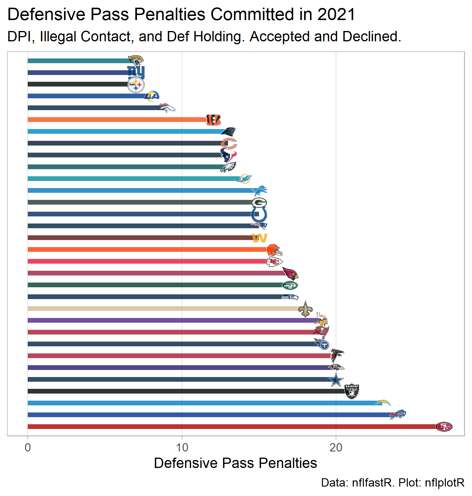

```{r setup, include=FALSE}

knitr::opts_chunk$set(echo = FALSE)

```

```{r libraries, echo=FALSE}

library(tidyverse)
library(nflfastR)
library(nflplotR)
library(reactable)
library(reactablefmtr)

```

```{r def_pass_2021, include=FALSE}

year = 2021
week = 18

pbp_df <- load_pbp(year) %>%
  filter(week <= week)

trim_df <- pbp_df %>%
  filter(two_point_attempt != 1) %>%
  filter(grepl("pass", desc) == T) %>%
  filter((grepl("Defensive Pass Interference", desc) == T) |
           (grepl("Illegal Contact", desc) == T) |
           (grepl("Defensive Holding", desc) == T)) %>%
  mutate(def_penalty = case_when(
    grepl("Defensive Pass Interference", desc) == T ~ "DPI",
    grepl("Illegal Contact", desc) == T ~ "Illegal Contact",
    grepl("Defensive Holding", desc) == T ~ "Defensive Holding"
  )) %>%
  rename(team = posteam,
         opponent = defteam) %>%
  select(season, team, week, opponent,
         desc, def_penalty, penalty_yards,
         penalty_player_id, penalty_player_name) %>%
  mutate(accepted_declined = ifelse(is.na(penalty_yards) == T,
                                    "Declined",
                                    "Accepted"))


# Summarize penalties committed by each team
team_def_pass_commit <- trim_df %>%
  group_by(team, def_penalty) %>%
  summarize(n = n(),
            penalty_yards = sum(penalty_yards, na.rm = T)) %>%
  ungroup()
team_def_pass_commit_totals <- team_def_pass_commit %>%
  group_by(team) %>%
  summarize(total_def_pass_penalties_commit = sum(n),
            total_def_pass_penalty_yards_commit = sum(penalty_yards))
team_def_pass_commit <- left_join(team_def_pass_commit, team_def_pass_commit_totals,
                                  by = c("team" = "team"))

# Summarize penalties drawn by each team
team_def_pass_drawn <- trim_df %>%
  group_by(opponent, def_penalty) %>%
  summarize(n = n(),
            penalty_yards = sum(penalty_yards, na.rm = T)) %>%
  ungroup() %>%
  rename(team = opponent)
team_def_pass_drawn_totals <- team_def_pass_drawn %>%
  group_by(team) %>%
  summarize(total_def_pass_penalties_drawn = sum(n),
            total_def_pass_penalty_yards_drawn = sum(penalty_yards))
team_def_pass_drawn <- left_join(team_def_pass_drawn, team_def_pass_drawn_totals,
                                 by = c("team" = "team"))

# Net penalty advantage
team_net_def_pass <- team_def_pass_drawn_totals %>%
  left_join(team_def_pass_commit_totals,
            by = c("team" = "team")) %>%
  mutate(net_def_pass_penalties = total_def_pass_penalties_drawn - total_def_pass_penalties_commit,
         net_def_pass_penalty_yards = total_def_pass_penalty_yards_drawn - total_def_pass_penalty_yards_commit)

```

```{r table_prep, include=FALSE}

commit_wide <- team_def_pass_commit %>%
  select(-c(penalty_yards,
            total_def_pass_penalty_yards_commit,
            total_def_pass_penalties_commit)) %>%
  pivot_wider(names_from = def_penalty,
              values_from = n) %>%
  replace(is.na(.), 0) %>%
  rename(dpi_commit = DPI,
         def_holding_commit = `Defensive Holding`,
         ill_contact_commit = `Illegal Contact`) %>%
  mutate(total_commit = dpi_commit + def_holding_commit + ill_contact_commit)

drawn_wide <- team_def_pass_drawn %>%
  select(-c(penalty_yards,
            total_def_pass_penalty_yards_drawn,
            total_def_pass_penalties_drawn)) %>%
  pivot_wider(names_from = def_penalty,
              values_from = n) %>%
  replace(is.na(.), 0) %>%
  rename(dpi_drawn = DPI,
         def_holding_drawn = `Defensive Holding`,
         ill_contact_drawn = `Illegal Contact`) %>%
  mutate(total_drawn = dpi_drawn + def_holding_drawn + ill_contact_drawn)

table_df <- left_join(commit_wide, drawn_wide,
                      by = c("team" = "team")) %>%
  mutate(dpi_net = dpi_drawn - dpi_commit,
         def_holding_net = def_holding_drawn - def_holding_commit,
         ill_contact_net = ill_contact_drawn - ill_contact_commit,
         total_net = total_drawn - total_commit)

table_df <- teams_colors_logos %>%
  select(team_logo_espn, team_abbr) %>%
  left_join(table_df,
            by = c("team_abbr" = "team")) %>%
  rename(team = team_abbr) %>%
  filter(is.na(dpi_commit) == F)

```


## 2021 Defensive Pass Penalty Stats

```{r build_table, echo=FALSE}

table_df %>%
  reactable(
    theme = pff(),
    defaultColDef = colDef(align = "center"),
    columns = list(
      team_logo_espn = colDef(name = " ",
                              sortable = F,
                              style = list(position = "sticky",
                                           left = 0),
                              cell = embed_img(),
                              width = 40),
      team = colDef(name = "Team",
                    width = 70),
      dpi_commit = colDef(name = "DPI"),
      def_holding_commit = colDef(name = "Def Hold"),
      ill_contact_commit = colDef(name = "Ill Cont"),
      total_commit = colDef(name = "Total"),
      dpi_drawn = colDef(name = "DPI"),
      def_holding_drawn = colDef(name = "Def Hold"),
      ill_contact_drawn = colDef(name = "Ill Cont"),
      total_drawn = colDef(name = "Total"),
      dpi_net = colDef(name = "DPI"),
      def_holding_net = colDef(name = "Def Hold"),
      ill_contact_net = colDef(name = "Ill Cont"),
      total_net = colDef(name = "Total")
    ),
    columnGroups = list(
      colGroup(name = "Committed",
               columns = c("dpi_commit",
                           "def_holding_commit",
                           "ill_contact_commit",
                           "total_commit")),
      colGroup(name = "Drawn",
               columns = c("dpi_drawn",
                           "def_holding_drawn",
                           "ill_contact_drawn",
                           "total_drawn")),
      colGroup(name = "Net Advantage",
               columns = c("dpi_net",
                           "def_holding_net",
                           "ill_contact_net",
                           "total_net"))
    ),
    pagination = F,
    highlight = T,
    #style = list(borderRight = "1px solid #eee"),
    bordered = T,
    defaultSorted = c("total_net")
  )

```

## Summary Graphics

```{r graphics, include=F}

# Plot holding penalties committed
p_commit <- team_def_pass_commit_totals %>%
  ggplot(aes(x = desc(reorder(factor(team), total_def_pass_penalties_commit)),
             y = total_def_pass_penalties_commit)) +
  geom_col(aes(fill = team),
           width = 0.4,
           alpha = 0.8) +
  geom_nfl_logos(aes(team_abbr = team),
                 width = 0.04,
                 alpha = 0.8) +
  theme_light() +
  scale_fill_nfl() +
  labs(x = NULL,
       y = "Defensive Pass Penalties",
       title = "Defensive Pass Penalties Committed in 2021",
       subtitle = "DPI, Illegal Contact, and Def Holding. Accepted and Declined.",
       caption = "Data: nflfastR. Plot: nflplotR") +
  scale_x_discrete(breaks = NULL) +
  scale_y_continuous(minor_breaks = NULL) +
  coord_flip()
ggsave(filename = "nfl_2021_def_pass_penalties_commit.png",
       plot = p_commit,
       width = 5,
       height = 5.25,
       units = "in",
       dpi = "retina")


# Plot penalties drawn
p_drawn <- team_def_pass_drawn_totals %>%
  ggplot(aes(x = reorder(factor(team), total_def_pass_penalties_drawn),
             y = total_def_pass_penalties_drawn)) +
  geom_col(aes(fill = team),
           width = 0.4,
           alpha = 0.8) +
  geom_nfl_logos(aes(team_abbr = team),
                 width = 0.04,
                 alpha = 0.8) +
  theme_light() +
  scale_fill_nfl() +
  labs(x = NULL,
       y = "Defensive Pass Penalties",
       title = "Defensive Pass Penalties Drawn in 2021",
       subtitle = "DPI, Illegal Contact, and Def Holding. Accepted and Declined.",
       caption = "Data: nflfastR. Plot: nflplotR") +
  scale_x_discrete(breaks = NULL) +
  scale_y_continuous(minor_breaks = NULL) +
  coord_flip()
ggsave(filename = "nfl_2021_def_pass_penalties_drawn.png",
       plot = p_drawn,
       width = 5,
       height = 5.25,
       units = "in",
       dpi = "retina")


# Plot net offensive hold advantage
p_net <- team_net_def_pass %>%
  ggplot(aes(x = reorder(factor(team), net_def_pass_penalties),
             y = net_def_pass_penalties)) +
  geom_col(width = 0.4,
           fill = "gray",
           alpha = 0.8) +
  geom_nfl_logos(aes(team_abbr = team),
                 width = 0.04,
                 alpha = 0.8) +
  theme_light() +
  labs(x = NULL,
       y = "Defensive Pass Penalties",
       title = "Net Defensive Pass Penalties Drawn in 2021",
       subtitle = "DPI, Illegal Contact, and Def Holding. Accepted and Declined.",
       caption = "Data: nflfastR. Plot: nflplotR.") +
  scale_x_discrete(breaks = NULL) +
  scale_y_continuous(minor_breaks = NULL) +
  coord_flip() +
  theme(legend.position = "bottom")
ggsave(filename = "nfl_2021_net_def_pass_penalties.png",
       plot = p_net,
       width = 5,
       height = 5.25,
       units = "in",
       dpi = "retina")

```




