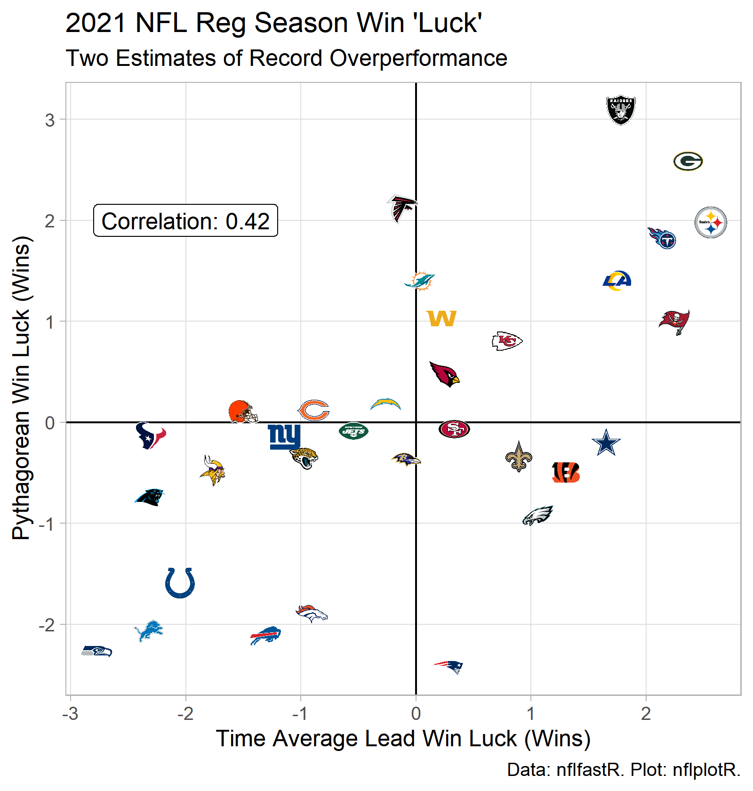
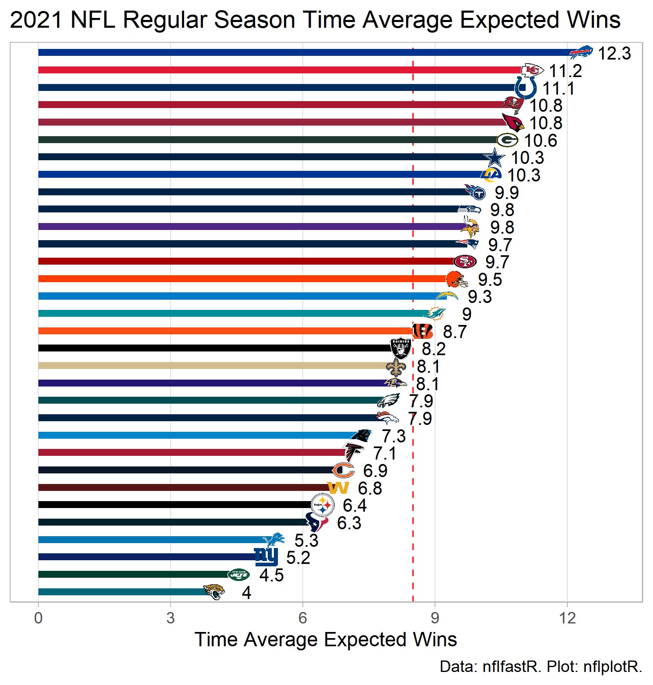
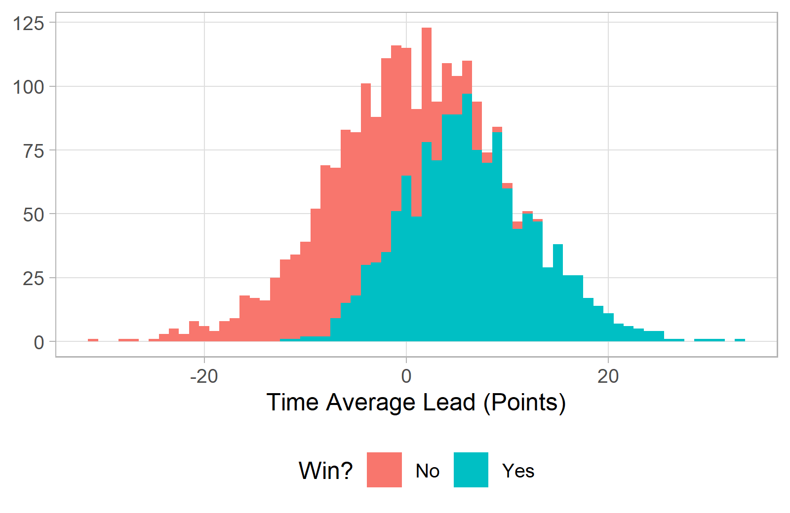
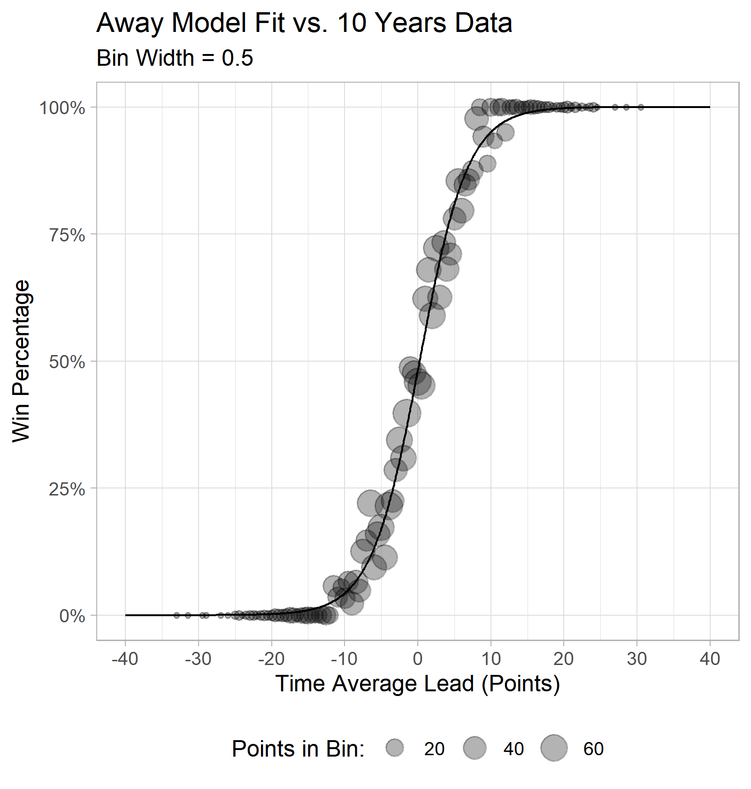

```{r setup, include=FALSE}
knitr::opts_chunk$set(echo = FALSE)
```

```{r libraries, include=FALSE}

library(tidyverse)
library(nflfastR)
library(nflplotR)
library(nfltools)
library(reactable)
library(reactablefmtr)

```

```{r build_data_set, include=FALSE}

# Load 2011-2020 data set prepared previously
results_df <- read.csv("win_loss_mvt_distribution_2011_2020.csv")


# Logistic regressions
# Estimated win probability as function of time average lead
# Separate models fit for home games and away games
mod_home <- glm(win ~ mean_point_diff,
                family = "binomial",
                data = results_df %>% filter(home_away == "home"))
home_int_coef = coef(mod_home)[1]
home_tal_coef = coef(mod_home)[2]
mod_away <- glm(win ~ mean_point_diff,
                family = "binomial",
                data = results_df %>% filter(home_away == "away"))
away_int_coef = coef(mod_away)[1]
away_tal_coef = coef(mod_away)[2]


# Load 2021 time average results by week
# Add model predicted win percentage for each game played
df_weekly = nfl_mvt_season(2021)
df_weekly = df_weekly %>%
  mutate(exp_wins = ifelse(home_away == "home",
                           exp(home_int_coef + home_tal_coef*mean_point_diff)/(1 + exp(home_int_coef + home_tal_coef*mean_point_diff)),
                           exp(away_int_coef + away_tal_coef*mean_point_diff)/(1 + exp(away_int_coef + away_tal_coef*mean_point_diff)))
  )


# Compute sum of expected wins projected by model for each team
# Add actual wins and pythag win expectation
# Compute "luck" estimates (i.e., wins > projected)
exp_results <- df_weekly %>%
  filter(is.na(home_away) == F) %>%
  group_by(team) %>%
  summarize(games = n(),
            exp_wins = sum(exp_wins))
exp_results <- left_join(nfl_reg_season_summary(2021) %>%
                           select(team, wins, pythag_wins),
                         exp_results,
                         by = c("team" = "team"))
exp_results <- exp_results %>%
  mutate(exp_win_luck = wins - exp_wins,
         pythag_win_luck = wins - pythag_wins)

```


## Intro

The following is an assessment of the agreement between 2021 regular season play and 2021 season win totals. The basic unit of analysis the time average lead for each game played in 2021.

Using 2011-2020 data, I made a simple model estimating the expected win percentage for a given time average lead (and also account for whether game is home or away game). As noted in a previous [post](https://caseycaprini.github.io/the_latest_numbers/posts/2021-11-28-time-average-nfl-metrics/), the time average lead for a game is a metric that summarizes its overall competitiveness.

### Ten Least Likely Wins

```{r luckiest_wins_2021, include=FALSE}

df_weekly <- df_weekly %>%
  left_join(nfl_reg_season_results(2021) %>%
              select(week, team, win, loss, tie),
            by = c("week" = "week",
                   "team" = "team"))

luckiest_wins <- df_weekly %>%
  filter(win == 1) %>%
  arrange(exp_wins) %>%
  slice(1:10) %>%
  select(week, team,
         opponent, home_away,
         mean_point_diff,
         exp_wins) %>%
  mutate(opponent = ifelse(home_away == "home",
                           paste("vs", opponent),
                           paste("@", opponent)),
         home_away = NULL,
         mean_point_diff = round(mean_point_diff, 1),
         exp_wins = round((exp_wins * 100), 1)
         ) %>%
  rename(exp_win_perc = exp_wins)

```

```{r}

knitr::kable(luckiest_wins,
             format = "html",
             digits = 1,
             col.names = c("Wk",
                           "Team",
                           "Opponent",
                           "Time Avg Lead (Points)",
                           "Avg Win Percentage (%)")
             )

```


## Graphical Summary

```{r win_luck_scatter, include=FALSE}

p_win_luck_scatter <- exp_results %>%
  ggplot(aes(x = exp_win_luck,
             y = pythag_win_luck)) +
  geom_hline(yintercept = 0) +
  geom_vline(xintercept = 0) +
  geom_nfl_logos(aes(team_abbr = team),
                 width = 0.05) +
  geom_label(aes(x = -2, y = 2,
                 label = paste("Correlation:",
                               round(cor(exp_results$exp_win_luck,
                                         exp_results$pythag_wins),
                                     2)))) +
  theme_light() +
  scale_x_continuous(minor_breaks = NULL) +
  scale_y_continuous(minor_breaks = NULL) +
  labs(title = "2021 NFL Reg Season Win 'Luck'",
       subtitle = "Two Estimates of Record Overperformance",
       x = "Time Average Lead Win Luck (Wins)",
       y = "Pythagorean Win Luck (Wins)",
       caption = "Data: nflfastR. Plot: nflplotR.")

ggsave(filename = "nfl_2021_win_luck.png",
       plot = p_win_luck_scatter,
       height = 5.25,
       width = 5,
       units = "in",
       dpi = "retina")

```



```{r exp_win_total, include=FALSE}

p_exp_wins <- exp_results %>%
  ggplot(aes(y = exp_wins,
             x = reorder(factor(team), exp_wins))) +
  geom_hline(yintercept = 8.5,
             alpha = 0.8,
             linetype = "dashed",
             color = "red") +
  geom_col(width = 0.4,
           aes(fill = team)) +
  geom_nfl_logos(aes(team_abbr = team),
                 width = 0.04) +
  geom_text(aes(label = round(exp_wins, 1)),
            nudge_y = 0.75,
            size = 3.5) +
  theme_light() +
  scale_fill_nfl() +
  scale_x_discrete(breaks = NULL) +
  scale_y_continuous(breaks = seq(from = 0, to = 18, by = 3),
                     minor_breaks = NULL) +
  labs(title = "2021 NFL Regular Season Time Average Expected Wins",
       y = "Time Average Expected Wins",
       x =  NULL,
       caption = "Data: nflfastR. Plot: nflplotR.") +
  coord_flip()

ggsave(filename = "nfl_2021_time_avg_exp_wins.png",
       plot = p_exp_wins,
       height = 5.25,
       width = 5,
       units = "in",
       dpi = "retina")

```



## Table

```{r}

knitr::kable(exp_results %>% select(-games) %>% arrange(team),
             format = "html",
             digits = 1,
             col.names = c("Tm",
                           "Wins",
                           "Pythag Wins",
                           "Time Avg Wins",
                           "Pythag Win Luck",
                           "Time Avg Win Luck")
             )

```

## Method

I put together a data set for the 2011 through 2020 regular seasons. Doing some EDA, the following histogram stood out. 

```{r hist, include=FALSE}

p_histogram <- results_df %>%
  filter(home_away == "home") %>%
  mutate(win = ifelse(win == 1, "Yes", "No")) %>%
  ggplot(aes(x = mean_point_diff)) +
  geom_histogram(aes(fill = factor(win)),
                 binwidth = 1.0) +
  theme_light() +
  scale_x_continuous(minor_breaks = NULL) +
  scale_y_continuous(minor_breaks = NULL) +
  labs(x = "Time Average Lead (Points)",
       y = NULL,
       fill = "Win?") +
  theme(legend.position = "bottom")

ggsave(filename = "historical_time_avg_win_dist.png",
       plot = p_histogram,
       height = 3.25,
       width = 5,
       units = "in",
       dpi = "retina")

```



I fit an extremely simple logistic regression to this data set: for all home teams: win probability as a function of time average lead. The model summary looked acceptable.

I binned the time average leads into 0.5 point bins, and I plotted both the average winning percentage for each bin.  It looked visually like logistic regression would be appropriate, so I fit an extremely simple logistic regression to this data set: for all home teams: win probability as a function of time average lead. For the away perspective, I fit a separate model to the same data set for away games.

The "bins + model fit" plot for the away model is provided below.

```{r model_to_training_data, include=FALSE}

get_midpoint <- function(cut_label) {
  mean(as.numeric(unlist(strsplit(gsub("\\(|\\)|\\[|\\]", "", as.character(cut_label)), ","))))
}

away_summ_df <- results_df %>%
  filter(home_away == "away") %>%
  mutate(tal_binned = cut_width(mean_point_diff, width = 0.5, center = 0)) %>%
  group_by(tal_binned) %>%
  summarize(n_games = n(),
            wins = sum(win),
            losses = sum(loss),
            ties = sum(tie)) %>%
  mutate(win_percent = wins/n_games)
away_summ_df$bin_center <- sapply(away_summ_df$tal_binned,
                                  get_midpoint)
away_mod_df <- data.frame(mean_point_diff = seq(from = -40,
                                                to = 40,
                                                by = 0.1),
                          win_percent = NA)
away_mod_df = away_mod_df %>%
  mutate(win_percent = predict.glm(mod_away,
                                   newdata = away_mod_df,
                                   type = "response")
  ) %>%
  rename(bin_center = mean_point_diff)

p_away_mod_fit <- away_summ_df %>%
  ggplot(aes(x = bin_center,
             y = win_percent)) +
  geom_point(aes(size = n_games),
             alpha = 0.3) +
  geom_path(data = away_mod_df,
            aes(x = bin_center,
                y = win_percent)) +
  scale_x_continuous(breaks = seq(from = -40, to = 40, by = 10)) +
  scale_y_continuous(breaks = seq(from = 0, to = 1, by = 0.25),
                     minor_breaks = NULL,
                     labels = scales::percent) +
  theme_light() +
  labs(title = "Away Model Fit vs. 10 Years Data",
       subtitle = "Bin Width = 0.5",
       x = "Time Average Lead (Points)",
       y = "Win Percentage",
       size = "Points in Bin:") +
  theme(legend.position = "bottom")

ggsave(filename = "historical_time_avg_win_away_fit.png",
       plot = p_away_mod_fit,
       height = 5.25,
       width = 5,
       units = "in",
       dpi = "retina")

```



The home model summary is provided below.

```{r include=TRUE}
summary(mod_home)
```

