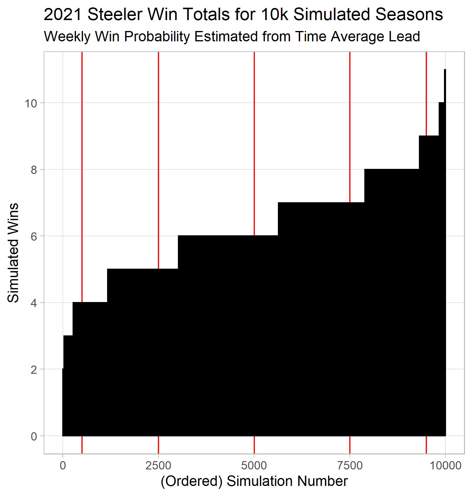
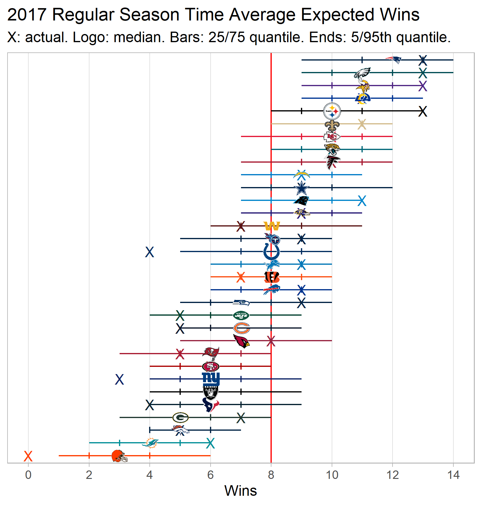
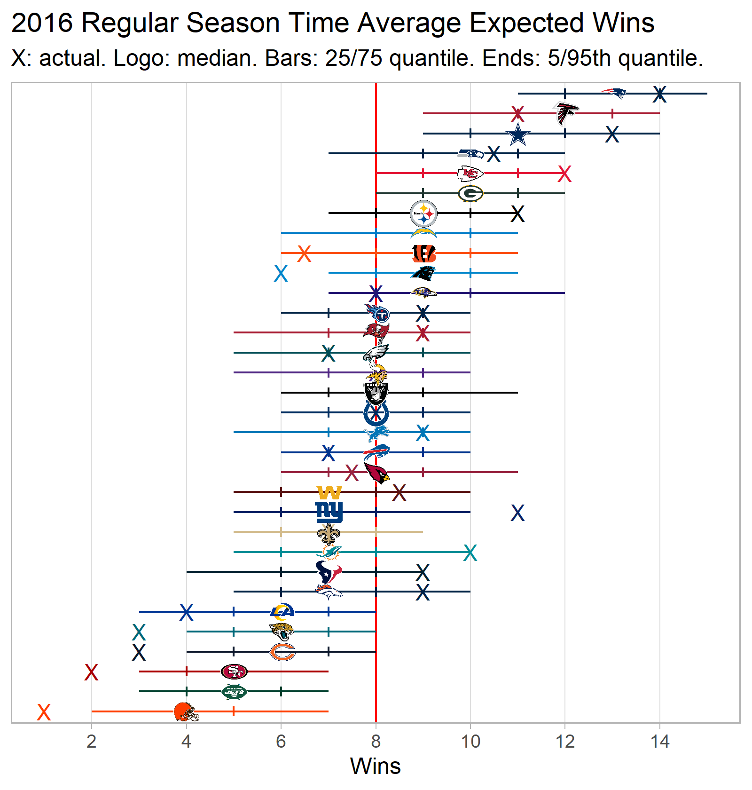

```{r setup, include=FALSE}
knitr::opts_chunk$set(echo = FALSE)
```

```{r packages, include=FALSE}

library(tidyverse)
library(nfltools)
library(nflfastR)
library(nflplotR)

```

### Method

In previous posts, I have looked explored the concept of the time average lead for NFL football games.

Here, I make simple simulation-based plots that estimate where actual win totals

For a given team in a given season,

1. Calculate the time average lead for each regular season game.
2. Given a team's time average lead, estimate expected win percentage for each game (based on previous logistic regression).
3. Simulate 10k seasons (each game a Bernoulli trial with p = expected win percentage from Item 2 above; no ties).
4. Plot actual win total against 5th, 25th, 50th, 75th, and 95th percentiles of win total from the 10k simulated seasons (ties counted as 0.5 a win for actual win totals)

#### Example: 2021 Pittsburgh Steelers

```{r build_pit_data}

pit_2021 <- nfltools::nfl_mvt_season(year = 2021) %>%
  filter(is.na(home_away) == FALSE) %>%
  filter(team == "PIT") %>%
  mutate(avg_win_perc = exp(0.3058 * time_avg_lead)/(1 + exp(0.3058 * time_avg_lead)))

pit_2021_sim <- replicate(
  10000,
  sum(rbernoulli(n = length(pit_2021$avg_win_perc),
                 p = pit_2021$avg_win_perc))
  )

df_pit_2021 <- data.frame(
  team = "PIT",
  sim_wins = pit_2021_sim) %>%
  arrange(sim_wins) %>%
  mutate(sim_num = 1:length(pit_2021_sim))

act_pit_wins <- nfltools::nfl_reg_season_summary(year = 2021) %>%
  filter(team == "PIT") %>%
  mutate(wins = wins + (0.5*ties)) %>%
  pull(wins)

df_pit_summ <- data.frame(
  team = "PIT",
  wins = act_pit_wins,
  w_05_perc = quantile(pit_2021_sim, 0.05),
  w_25_perc = quantile(pit_2021_sim, 0.25),
  w_50_perc = quantile(pit_2021_sim, 0.50),
  w_75_perc = quantile(pit_2021_sim, 0.75),
  w_95_perc = quantile(pit_2021_sim, 0.95)
)

```

```{r build_pit_plots, include=FALSE}

p_pit_sims <- df_pit_2021 %>%
  ggplot(aes(x = sim_num, y = sim_wins)) +
  geom_vline(xintercept = c(500.5, 2500.5, 5000.5, 7500.5, 9500.5),
             color = "red") +
  geom_col(fill = "black",
           color = "black") +
  scale_x_continuous(minor_breaks = NULL) +
  scale_y_continuous(breaks = seq(0, 18, 2),
                     minor_breaks = NULL) +
  theme_light() +
  labs(x = "(Ordered) Simulation Number",
       y = "Simulated Wins",
       title = "2021 Steeler Win Totals for 10k Simulated Seasons",
       subtitle = "Weekly Win Probability Estimated from Time Average Lead")

ggsave("pit_2021_tal_sims.png",
       plot = p_pit_sims,
       height = 5.25,
       width = 5,
       units = "in",
       dpi = "retina")


p_pit_2021 <- df_pit_summ %>%
  ggplot(aes(x = factor(team),
             y = w_50_perc)) +
  geom_hline(yintercept = 8.5,
             color = "red") +
  geom_linerange(aes(ymin = w_05_perc,
                     ymax = w_95_perc,
                     color = team)) +
  geom_errorbar(aes(ymin = w_25_perc,
                    ymax = w_75_perc,
                    color = team),
                width = 0.1) +
  geom_point(shape = "X",
             size = 10,
             aes(color = team,
                 y = wins)) +
  geom_nfl_logos(aes(team_abbr = team),
                 width = 0.15) +
  theme_light() +
  scale_color_nfl() +
  scale_x_discrete(label = NULL,
                   breaks = NULL) +
  scale_y_continuous(breaks = seq(0, 18, 2),
                     minor_breaks = NULL) +
  coord_flip() +
  labs(title = "2021 Steelers Time Average Expected Wins",
       subtitle = "X: actual. Logo: median. Bars: 25/75 quantile. Ends: 5/95th quantile.",
       x = NULL,
       y = "Wins")

ggsave("pit_2021_win_sim_summ.png",
       plot = p_pit_2021,
       height = 3,
       width = 5,
       units = "in",
       dpi = "retina")


```

To start, I use a function in my hacky package nfltools to calculate the time average lead for all 2021 Steelers games.

Based on the time average lead, an expected win probability is calculated for each week using the following equation.

$$E[Win Prob|Time Avg Lead] = \frac{e^{0.3058(Time Avg Lead)}}{1 + e^{0.3058(Time Avg Lead)}}$$

The weekly results are presented in the following table.

```{r pit_weekly_table}

pit_2021 %>%
  mutate(opponent = ifelse(home_away == "home",
                           paste("vs.", opponent),
                           paste("@", opponent))) %>%
  mutate(avg_win_perc = 100 * avg_win_perc,
         week = as.factor(week)) %>%
  select(-c(season, home_away)) %>%
  knitr::kable(format = "html",
               digits = 1,
               col.names = c("Week",
                             "Team",
                             "Opponent",
                             "Time Avg Lead",
                             "E[Win Prob|Time Avg Lead]"
                             ))

```

Given these weekly expected win probabilities, 10k seasons are simulated.  Here's the distribution of season win totals for the 10k simulations.

* The red lines represent the quantiles used to summarize the distribution (i.e., 5th, 25th, 50th, 75th, and 95th quantiles).



This information gets collapsed into a single row of the league-wide plots.

* The red line represent 0.500 winning percentage (i.e., 8.5 wins for 2021).
* The interval extends from the 5th quantile to the 95th quantile.
* Bars (i.e., "|") are provided to mark the 25th and 75th quantiles.
* The team logo is placed at the 50th quantile (i.e., median of simulations).
* An "X" marks the actual win totals (where ties are counted as a 0.5 wins to reflect impact on standings).


The "X" at "9.5" wins here shows the Steelers 9 wins matched the 95th percentile outcome predicted by the model. It is unlikely to expect similar play, as measured by the time average lead, over the course of a season to result in 9 wins (let alone 9 wins and 1 tie).

### Season Plots

#### 2021

```{r build_2021_plot, include=FALSE}

sim_season <- function(df){
  team = rep(NA_character_, nrow(df))
  w_05_perc = rep(NA_real_, nrow(df))
  w_25_perc = rep(NA_real_, nrow(df))
  w_50_perc = rep(NA_real_, nrow(df))
  w_75_perc = rep(NA_real_, nrow(df))
  w_95_perc = rep(NA_real_, nrow(df))
  
  for(i in 1:nrow(df)){
    team[i] = df$team[i]
    win_vec = replicate(
      10000,
      sum(rbernoulli(n = length(df$weekly_avg_win_perc[[i]]),
                 p = df$weekly_avg_win_perc[[i]]))
    )
    w_05_perc[i] = quantile(win_vec, 0.05)
    w_25_perc[i] = quantile(win_vec, 0.25)
    w_50_perc[i] = quantile(win_vec, 0.50)
    w_75_perc[i] = quantile(win_vec, 0.75)
    w_95_perc[i] = quantile(win_vec, 0.95)
  }
  
  results_df <- data.frame(team,
                           w_05_perc,
                           w_25_perc,
                           w_50_perc,
                           w_75_perc,
                           w_95_perc)
}

year_i = 2021

df <- nfltools::nfl_mvt_season(year = year_i) %>%
  filter(is.na(home_away) == FALSE) %>%
  mutate(avg_win_perc = exp(0.3058 * time_avg_lead)/(1 + exp(0.3058 * time_avg_lead))) %>%
  group_by(team) %>%
  summarize(weekly_avg_win_perc = list(avg_win_perc))


df_wins <- sim_season(df)

act_wins <- nfltools::nfl_reg_season_summary(year = year_i) %>%
  mutate(wins = wins + (0.5*ties)) %>%
  select(team, wins)

df_wins <- left_join(df_wins,
                     act_wins,
                     by = c("team" = "team"))

p_win <- df_wins %>%
  ggplot(aes(x = reorder(factor(team),
                         w_50_perc),
             y = w_50_perc)) +
  geom_hline(yintercept = 8.5,
             color = "red") +
  geom_linerange(aes(ymin = w_05_perc,
                     ymax = w_95_perc,
                     color = team)) +
  geom_errorbar(aes(ymin = w_25_perc,
                    ymax = w_75_perc,
                    color = team),
                width = 0.5) +
  geom_point(shape = "X",
             size = 3.5,
             aes(color = team,
                 y = wins)) +
  geom_nfl_logos(aes(team_abbr = team),
                 width = 0.04) +
  theme_light() +
  scale_color_nfl() +
  scale_x_discrete(label = NULL,
                   breaks = NULL) +
  scale_y_continuous(breaks = seq(0, 18, 2),
                     minor_breaks = NULL) +
  coord_flip() +
  labs(title = paste(year_i, "Regular Season Time Average Expected Wins"),
       subtitle = "X: actual. Logo: median. Bars: 25/75 quantile. Ends: 5/95th quantile.",
       x = NULL,
       y = "Wins")

ggsave(filename = "2021_win_plot.png",
       plot = p_win,
       height = 5.25,
       width = 5,
       units = "in",
       dpi = "retina")

```


#### 2020

```{r build_2020_plot, include=FALSE}

year_i = 2020

df <- nfltools::nfl_mvt_season(year = year_i) %>%
  filter(is.na(home_away) == FALSE) %>%
  mutate(avg_win_perc = exp(0.3058 * time_avg_lead)/(1 + exp(0.3058 * time_avg_lead))) %>%
  group_by(team) %>%
  summarize(weekly_avg_win_perc = list(avg_win_perc))


df_wins <- sim_season(df)

act_wins <- nfltools::nfl_reg_season_summary(year = year_i) %>%
  mutate(wins = wins + (0.5*ties)) %>%
  select(team, wins)

df_wins <- left_join(df_wins,
                     act_wins,
                     by = c("team" = "team"))

p_win <- df_wins %>%
  ggplot(aes(x = reorder(factor(team),
                         w_50_perc),
             y = w_50_perc)) +
  geom_hline(yintercept = 8,
             color = "red") +
  geom_linerange(aes(ymin = w_05_perc,
                     ymax = w_95_perc,
                     color = team)) +
  geom_errorbar(aes(ymin = w_25_perc,
                    ymax = w_75_perc,
                    color = team),
                width = 0.5) +
  geom_point(shape = "X",
             size = 3.5,
             aes(color = team,
                 y = wins)) +
  geom_nfl_logos(aes(team_abbr = team),
                 width = 0.04) +
  theme_light() +
  scale_color_nfl() +
  scale_x_discrete(label = NULL,
                   breaks = NULL) +
  scale_y_continuous(breaks = seq(0, 18, 2),
                     minor_breaks = NULL) +
  coord_flip() +
  labs(title = paste(year_i, "Regular Season Time Average Expected Wins"),
       subtitle = "X: actual. Logo: median. Bars: 25/75 quantile. Ends: 5/95th quantile.",
       x = NULL,
       y = "Wins")

ggsave(filename = "2020_win_plot.png",
       plot = p_win,
       height = 5.25,
       width = 5,
       units = "in",
       dpi = "retina")

```


#### 2019

```{r build_2019_plot, include=FALSE}

year_i = 2019

df <- nfltools::nfl_mvt_season(year = year_i) %>%
  filter(is.na(home_away) == FALSE) %>%
  mutate(avg_win_perc = exp(0.3058 * time_avg_lead)/(1 + exp(0.3058 * time_avg_lead))) %>%
  group_by(team) %>%
  summarize(weekly_avg_win_perc = list(avg_win_perc))


df_wins <- sim_season(df)

act_wins <- nfltools::nfl_reg_season_summary(year = year_i) %>%
  mutate(wins = wins + (0.5*ties)) %>%
  select(team, wins)

df_wins <- left_join(df_wins,
                     act_wins,
                     by = c("team" = "team"))

p_win <- df_wins %>%
  ggplot(aes(x = reorder(factor(team),
                         w_50_perc),
             y = w_50_perc)) +
  geom_hline(yintercept = 8,
             color = "red") +
  geom_linerange(aes(ymin = w_05_perc,
                     ymax = w_95_perc,
                     color = team)) +
  geom_errorbar(aes(ymin = w_25_perc,
                    ymax = w_75_perc,
                    color = team),
                width = 0.5) +
  geom_point(shape = "X",
             size = 3.5,
             aes(color = team,
                 y = wins)) +
  geom_nfl_logos(aes(team_abbr = team),
                 width = 0.04) +
  theme_light() +
  scale_color_nfl() +
  scale_x_discrete(label = NULL,
                   breaks = NULL) +
  scale_y_continuous(breaks = seq(0, 18, 2),
                     minor_breaks = NULL) +
  coord_flip() +
  labs(title = paste(year_i, "Regular Season Time Average Expected Wins"),
       subtitle = "X: actual. Logo: median. Bars: 25/75 quantile. Ends: 5/95th quantile.",
       x = NULL,
       y = "Wins")

ggsave(filename = "2019_win_plot.png",
       plot = p_win,
       height = 5.25,
       width = 5,
       units = "in",
       dpi = "retina")

```


#### 2018

```{r build_2018_plot, include=FALSE}

year_i = 2018

df <- nfltools::nfl_mvt_season(year = year_i) %>%
  filter(is.na(home_away) == FALSE) %>%
  mutate(avg_win_perc = exp(0.3058 * time_avg_lead)/(1 + exp(0.3058 * time_avg_lead))) %>%
  group_by(team) %>%
  summarize(weekly_avg_win_perc = list(avg_win_perc))


df_wins <- sim_season(df)

act_wins <- nfltools::nfl_reg_season_summary(year = year_i) %>%
  mutate(wins = wins + (0.5*ties)) %>%
  select(team, wins)

df_wins <- left_join(df_wins,
                     act_wins,
                     by = c("team" = "team"))

p_win <- df_wins %>%
  ggplot(aes(x = reorder(factor(team),
                         w_50_perc),
             y = w_50_perc)) +
  geom_hline(yintercept = 8,
             color = "red") +
  geom_linerange(aes(ymin = w_05_perc,
                     ymax = w_95_perc,
                     color = team)) +
  geom_errorbar(aes(ymin = w_25_perc,
                    ymax = w_75_perc,
                    color = team),
                width = 0.5) +
  geom_point(shape = "X",
             size = 3.5,
             aes(color = team,
                 y = wins)) +
  geom_nfl_logos(aes(team_abbr = team),
                 width = 0.04) +
  theme_light() +
  scale_color_nfl() +
  scale_x_discrete(label = NULL,
                   breaks = NULL) +
  scale_y_continuous(breaks = seq(0, 18, 2),
                     minor_breaks = NULL) +
  coord_flip() +
  labs(title = paste(year_i, "Regular Season Time Average Expected Wins"),
       subtitle = "X: actual. Logo: median. Bars: 25/75 quantile. Ends: 5/95th quantile.",
       x = NULL,
       y = "Wins")

ggsave(filename = "2018_win_plot.png",
       plot = p_win,
       height = 5.25,
       width = 5,
       units = "in",
       dpi = "retina")

```


#### 2017

```{r build_2017_plot, include=FALSE}

year_i = 2017

df <- nfltools::nfl_mvt_season(year = year_i) %>%
  filter(is.na(home_away) == FALSE) %>%
  mutate(avg_win_perc = exp(0.3058 * time_avg_lead)/(1 + exp(0.3058 * time_avg_lead))) %>%
  group_by(team) %>%
  summarize(weekly_avg_win_perc = list(avg_win_perc))


df_wins <- sim_season(df)

act_wins <- nfltools::nfl_reg_season_summary(year = year_i) %>%
  mutate(wins = wins + (0.5*ties)) %>%
  select(team, wins)

df_wins <- left_join(df_wins,
                     act_wins,
                     by = c("team" = "team"))

p_win <- df_wins %>%
  ggplot(aes(x = reorder(factor(team),
                         w_50_perc),
             y = w_50_perc)) +
  geom_hline(yintercept = 8,
             color = "red") +
  geom_linerange(aes(ymin = w_05_perc,
                     ymax = w_95_perc,
                     color = team)) +
  geom_errorbar(aes(ymin = w_25_perc,
                    ymax = w_75_perc,
                    color = team),
                width = 0.5) +
  geom_point(shape = "X",
             size = 3.5,
             aes(color = team,
                 y = wins)) +
  geom_nfl_logos(aes(team_abbr = team),
                 width = 0.04) +
  theme_light() +
  scale_color_nfl() +
  scale_x_discrete(label = NULL,
                   breaks = NULL) +
  scale_y_continuous(breaks = seq(0, 18, 2),
                     minor_breaks = NULL) +
  coord_flip() +
  labs(title = paste(year_i, "Regular Season Time Average Expected Wins"),
       subtitle = "X: actual. Logo: median. Bars: 25/75 quantile. Ends: 5/95th quantile.",
       x = NULL,
       y = "Wins")

ggsave(filename = "2017_win_plot.png",
       plot = p_win,
       height = 5.25,
       width = 5,
       units = "in",
       dpi = "retina")

```


#### 2016

```{r build_2016_plot, include=FALSE}

year_i = 2016

df <- nfltools::nfl_mvt_season(year = year_i) %>%
  filter(is.na(home_away) == FALSE) %>%
  mutate(avg_win_perc = exp(0.3058 * time_avg_lead)/(1 + exp(0.3058 * time_avg_lead))) %>%
  group_by(team) %>%
  summarize(weekly_avg_win_perc = list(avg_win_perc))


df_wins <- sim_season(df)

act_wins <- nfltools::nfl_reg_season_summary(year = year_i) %>%
  mutate(wins = wins + (0.5*ties)) %>%
  select(team, wins)

df_wins <- left_join(df_wins,
                     act_wins,
                     by = c("team" = "team"))

p_win <- df_wins %>%
  ggplot(aes(x = reorder(factor(team),
                         w_50_perc),
             y = w_50_perc)) +
  geom_hline(yintercept = 8,
             color = "red") +
  geom_linerange(aes(ymin = w_05_perc,
                     ymax = w_95_perc,
                     color = team)) +
  geom_errorbar(aes(ymin = w_25_perc,
                    ymax = w_75_perc,
                    color = team),
                width = 0.5) +
  geom_point(shape = "X",
             size = 3.5,
             aes(color = team,
                 y = wins)) +
  geom_nfl_logos(aes(team_abbr = team),
                 width = 0.04) +
  theme_light() +
  scale_color_nfl() +
  scale_x_discrete(label = NULL,
                   breaks = NULL) +
  scale_y_continuous(breaks = seq(0, 18, 2),
                     minor_breaks = NULL) +
  coord_flip() +
  labs(title = paste(year_i, "Regular Season Time Average Expected Wins"),
       subtitle = "X: actual. Logo: median. Bars: 25/75 quantile. Ends: 5/95th quantile.",
       x = NULL,
       y = "Wins")

ggsave(filename = "2016_win_plot.png",
       plot = p_win,
       height = 5.25,
       width = 5,
       units = "in",
       dpi = "retina")

```


#### 2015

```{r build_2015_plot, include=FALSE}

year_i = 2015

df <- nfltools::nfl_mvt_season(year = year_i) %>%
  filter(is.na(home_away) == FALSE) %>%
  mutate(avg_win_perc = exp(0.3058 * time_avg_lead)/(1 + exp(0.3058 * time_avg_lead))) %>%
  group_by(team) %>%
  summarize(weekly_avg_win_perc = list(avg_win_perc))


df_wins <- sim_season(df)

act_wins <- nfltools::nfl_reg_season_summary(year = year_i) %>%
  mutate(wins = wins + (0.5*ties)) %>%
  select(team, wins)

df_wins <- left_join(df_wins,
                     act_wins,
                     by = c("team" = "team"))

p_win <- df_wins %>%
  ggplot(aes(x = reorder(factor(team),
                         w_50_perc),
             y = w_50_perc)) +
  geom_hline(yintercept = 8,
             color = "red") +
  geom_linerange(aes(ymin = w_05_perc,
                     ymax = w_95_perc,
                     color = team)) +
  geom_errorbar(aes(ymin = w_25_perc,
                    ymax = w_75_perc,
                    color = team),
                width = 0.5) +
  geom_point(shape = "X",
             size = 3.5,
             aes(color = team,
                 y = wins)) +
  geom_nfl_logos(aes(team_abbr = team),
                 width = 0.04) +
  theme_light() +
  scale_color_nfl() +
  scale_x_discrete(label = NULL,
                   breaks = NULL) +
  scale_y_continuous(breaks = seq(0, 18, 2),
                     minor_breaks = NULL) +
  coord_flip() +
  labs(title = paste(year_i, "Regular Season Time Average Expected Wins"),
       subtitle = "X: actual. Logo: median. Bars: 25/75 quantile. Ends: 5/95th quantile.",
       x = NULL,
       y = "Wins")

ggsave(filename = "2015_win_plot.png",
       plot = p_win,
       height = 5.25,
       width = 5,
       units = "in",
       dpi = "retina")

```


