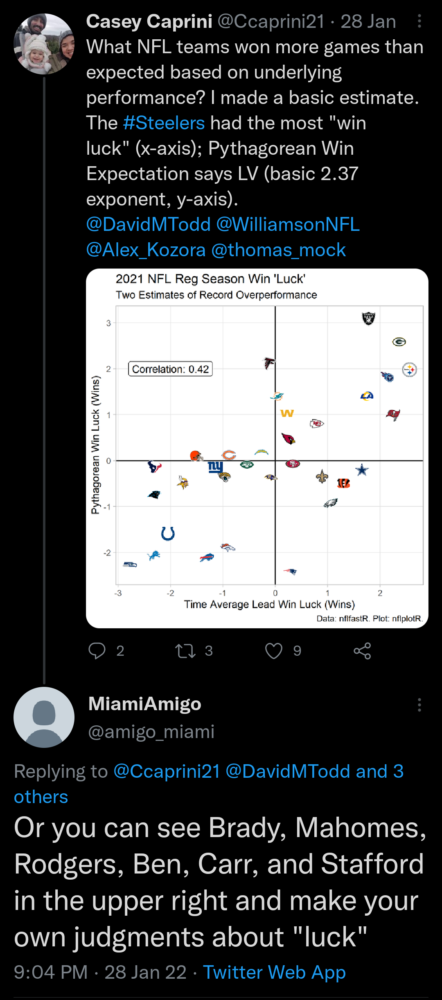

## Intro

Past posts have explored uses of [NFL time average leads as a single-point summary of overall game performance](https://caseycaprini.github.io/the_latest_numbers/posts/2021-11-28-time-average-nfl-metrics/).

Using a simple logistic regression model, I looked at [2021 regular season win luck](https://caseycaprini.github.io/the_latest_numbers/posts/2022-01-28-2021-nfl-regular-season-win-luck/). Notably, the "luckiest teams" had veteran/high quality QBs.



My intuition: quality QBs perform well in comeback and high leverage situations. The residuals from the single feature model reflect that the direct effect of QBs is significant.

Here, I expand the model to include QB quality, using an approach inspired by Mike Sando's QB Tiers.

## Mike Sando's QB Tiers

Mike Sando is probably my favorite national NFL writer. He's one of a few writers that make me a subscriber to the Athletic. His [recent tribute to the late John Clayton](https://theathletic.com/3198705/2022/03/21/john-clayton-espn-nfl-death/) was tremendous.

Each summer since 2014, Sando has released his QB Tier article, where several NFL team personnel evaluate the league's QBs using a simple rubric. From [the 2021 edition](https://theathletic.com/2727336/2021/07/28/2021-nfl-quarterback-tiers-50-coaches-and-evaluators-rank-the-leagues-starters/):

> TIER 1  
> A Tier 1 quarterback can carry his team each week. The team wins because of him. He expertly handles pure passing situations. He has no real holes in his game...
>
> TIER 2  
> A Tier 2 quarterback can carry his team sometimes but not as consistently. He can handle pure passing situations in doses and/or possesses other dimensions that are special enough to elevate him above Tier 3. He has a hole or two in his game...
>
> TIER 3  
> A Tier 3 quarterback is a legitimate starter but needs a heavier running game and/or defensive component to win. A low-volume dropback passing offense suits him best...
>
> TIER 4  
> A Tier 4 quarterback could be an unproven player with some upside or a veteran who is ultimately best suited as a backup...
>
> --- Mike Sando

I really like the tier approach: it aggregates subject matter expert opinion in a straightforward, meaningful way without requiring a false level of precision.

```{r setup, include=FALSE}
knitr::opts_chunk$set(echo = FALSE)
```

```{r libraries, include=FALSE}

library(tidyverse)
library(nflreadr)
library(nflfastR)
library(nflplotR)
library(nfltools)
library(rstanarm)
library(geomtextpath)

```

```{r get_qb_pfr_ids, include=FALSE}

qb_pfr_ids <- nflreadr::load_snap_counts(2014:2021) %>%
  filter(game_type == "REG") %>%
  filter(position == "QB") %>%
  select(player, pfr_player_id) %>%
  distinct()

```

```{r get_qb_tiers, include=FALSE}

# If NA, replace starter with 4.  Else 4.5.
qb_tiers <- readr::read_csv("qb_tiers_2014_2021.csv") %>%
  # If NA, replace starter with 4; else, replace with 4.5
  mutate(qb_tier = ifelse(is.na(qb_tier) == T,
                          ifelse(expected_starter == T,
                                 4,
                                 4.5),
                          qb_tier),
         qb_tier_avg = ifelse(is.na(qb_tier_avg) == T,
                              ifelse(expected_starter == T,
                                     4,
                                     4.5),
                              qb_tier_avg)
         ) %>%
  mutate(qb_name = ifelse(is.na(qb_name_suffix) == T,
                          paste0(qb_name_first, " ", qb_name_last),
                          paste(qb_name_first, qb_name_last, qb_name_suffix))
         ) %>%
  mutate(year = year - 1) %>%
  left_join(qb_pfr_ids,
            by = c("qb_name" = "player"))

```

## Time Average Lead + QB Quality Model

A summary of the model, fit on regular season games that occured between 2013 and 2020.

* In addition to the game's time average lead, a team's Sando QB Tier advantage is included as a feature in a logistic regression.
  * I've assumed that the following year's QB Tier is a better indicator of QB quality for a season than their preseason QB Tier.
    * This has the tradeoff of reducing the size of the data set.
    * If one of the QBs is not evaluated the next season (e.g., retires), that game is not included in the data set.
* For each game, the QB tier rating for QB with the most snap counts played for each team is used.
* For an unranked QB that was the planned opening day starter, I assumed a QB rank of 4.0.
* For an unranked QB that was not a planned opening day starter, I assumed a QB rank of 4.5.

```{r get_snap_counts, include=FALSE}

qb_snaps <- nflreadr::load_snap_counts(2014:2020) %>%
  filter(game_type == "REG") %>%
  filter(position == "QB") %>%
  mutate(team = case_when(team == "SD" ~ "LAC",
                          team == "OAK" ~ "LV",
                          team == "STL" ~ "LA",
                          TRUE ~ team),
         opponent = case_when(opponent == "SD" ~ "LAC",
                              opponent == "OAK" ~ "LV",
                              opponent == "STL" ~ "LA",
                              TRUE ~ opponent)) %>%
  group_by(season, game_id, team, opponent) %>%
  filter(offense_pct == max(offense_pct)) %>%
  summarize(qb_snap_pct = offense_pct,
            pfr_player_id = pfr_player_id) %>%
  left_join(qb_tiers %>%
              select(year, pfr_player_id, qb_tier_avg),
            by = c("season" = "year",
                   "pfr_player_id" = "pfr_player_id"))

valid_game_ids <- qb_snaps %>%
  group_by(game_id) %>%
  summarize(qb_tier_avg = max(qb_tier_avg)) %>%
  filter(is.na(qb_tier_avg) == F) %>%
  pull(game_id)

qb_snaps <- qb_snaps %>%
  filter(game_id %in% valid_game_ids) %>%
  separate(game_id, into = c("season_temp",
                             "week",
                             "home_temp",
                             "away_temp")) %>%
  mutate(season_temp = NULL,
         home_temp = NULL,
         away_temp = NULL)

```


```{r get_time_avg_leads, include=FALSE}

tal_df <- lapply(2014:2020,
                 nfltools::nfl_mvt_season) %>%
  bind_rows() %>%
  filter(is.na(time_avg_lead) == F)

win_df <- lapply(2014:2020,
                 nfltools::nfl_reg_season_results) %>%
  bind_rows() %>%
  mutate(team = case_when(team == "SD" ~ "LAC",
                          team == "OAK" ~ "LV",
                          team == "STL" ~ "LA",
                          TRUE ~ team))

tal_df <- tal_df %>%
  left_join(win_df %>%
              select(season, team, week, win),
            by = c("season", "week", "team")) %>%
  mutate(week = str_pad(week, width = 2, pad = "0"))

```


```{r calc_qb_advantage, include=FALSE}

qb_adv_df <- qb_snaps %>%
  mutate(qb_adv = NA_real_)

for(i in 1:nrow(qb_adv_df)){
  qb_adv_df$qb_adv[i] = ifelse(i %% 2 == 1,
                               qb_adv_df$qb_tier_avg[i + 1] - qb_adv_df$qb_tier_avg[i],
                               qb_adv_df$qb_tier_avg[i - 1] - qb_adv_df$qb_tier_avg[i])
}

```

```{r build_df, include=FALSE}

df <- tal_df %>%
  left_join(qb_adv_df,
            by = c("season",
                   "week",
                   "team",
                   "opponent")) %>%
  filter(is.na(qb_adv) == F) %>%
  mutate(fake_id = ifelse(home_away == "home",
                          paste(season, week, team, opponent),
                          paste(season, week, opponent, team)
                          )
         )

ids = df %>% distinct(fake_id) %>% pull(fake_id)
rand_home_away = sample(c("home", "away"),
                        nrow(df)/2,
                        replace = TRUE)

train_df <- data.frame(fake_id = ids,
                       home_away = rand_home_away)

train_df <- train_df %>%
  left_join(df,
            by = c("fake_id",
                   "home_away")) %>%
  mutate(home_away = ifelse(home_away == "away",
                            0,
                            1)
         )

```

```{r build_model, include=FALSE}

m <- stan_glm(win ~ -1 + time_avg_lead + qb_adv,
              family = binomial(link = "logit"),
              data = train_df,
          )

```

## Model Summary

A summary of the coefficients and standard error.

* Time Average Lead: ```r round(coef(m)[1], 3)```
  * Standard Error: ```r round(se(m)[1], 3)```
* QB Tier Advantage: ```r round(coef(m)[2], 3)```
  * Standard Error: ```r round(se(m)[2], 3)```
  
```{r model_plots, echo=FALSE}

b_tal <- coef(m)[1]
b_qb <- coef(m)[2]
se_tal <- se(m)[1]
se_qb <- se(m)[2]

df_forrest <- tribble(
  ~param, ~low, ~mid, ~high,
  "b_tal", b_tal - (2*se_tal), b_tal, b_tal + (2*se_tal),
  "b_qb", b_qb - (2*se_qb), b_qb, b_qb + (2*se_qb)
)

df_forrest %>%
  ggplot(aes(x = mid,
             y = factor(param,
                        levels = c("b_tal", "b_qb")))
         ) +
  geom_linerange(aes(xmin = low,
                     xmax = high)) +
  geom_point() +
  geom_text(aes(label = round(mid, 3)),
            nudge_y = 0.15) +
  theme_light() +
  coord_cartesian(xlim = c(-0.1, 0.5)) +
  labs(x = "Estimate",
       y = "Parameter",
       title = "Logistic Regression Coefficient Estimates (+/- 2 SEs)",
       subtitle = "win ~ -1 + time_avg_lead + qb_adv") +
  scale_x_continuous(minor_breaks = NULL)

df_train_fit <- train_df %>%
  mutate(exp_wp = exp((b_tal*time_avg_lead) + (b_qb*qb_adv))) %>%
  mutate(exp_wp = exp_wp/(1+exp_wp))

df_train_fit %>%
  mutate(win = factor(ifelse(win == 1,
                             "Win",
                             "Loss or Tie"))
         ) %>%
  ggplot(aes(x = exp_wp)) +
  geom_density(aes(fill = win)) +
  theme_light() +
  facet_wrap(~ win, ncol = 1) +
  scale_x_continuous(minor_breaks = NULL,
                     labels = scales::percent) +
  labs(x = "Expected Win Percentage (%)",
       y = "Density",
       title = "Win ~ Time Avg Lead and QB Tier Advantage",
       subtitle = "Density Plot of Predictions for Training Data")

get_midpoint <- function(cut_label) {
  mean(as.numeric(unlist(strsplit(gsub("\\(|\\)|\\[|\\]", "", as.character(cut_label)), ","))))
}

df_train_fit %>%
  mutate(exp_wp = cut_width(exp_wp,
                            center = 0.5,
                            width = 0.04)) %>%
  group_by(exp_wp) %>%
  summarize(exp_wp = get_midpoint(exp_wp),
            n = n(),
            observed_wp = sum(win)/n()) %>%
  ggplot(aes(x = exp_wp, y = observed_wp)) +
  geom_abline(intercept = 0,
              slope = 1) +
  geom_point(aes(size = n),
             shape = "X") +
  theme_light() +
  scale_x_continuous(breaks = seq(0, 1, by = 1/6),
                     minor_breaks = NULL,
                     labels = scales::percent) +
  scale_y_continuous(breaks = seq(0, 1, by = 1/6),
                     minor_breaks = NULL,
                     labels = scales::percent) +
  labs(x = "Expected Win Percentage (%)",
       y = "Observed Win Percentage (%)",
       title = "Model Expected Win Percentage vs Observed",
       subtitle = "Expected Win Percentage Bin Width: 4%",
       size = "Observations in Bin:") +
  theme(legend.position = "bottom")

```

## End of Season 2021 Tier Rankings

Using (1) the logistic model above and (2) some estimates I made of the Sando QB Tier grade of the QBs that finished the season (i.e., not L. Jackson for BAL, Big Ben rated Tier 3.5 vice 2.64 from 2021 grades), I made a plot of an end of season power ranking based on a team's season time average lead and QB quality. 

The contour lines represent the model's expected win probability ("exp_wp" in table) against an average team with an average QB. From the plot, think end of season Cleveland Browns led by an injury-plagued Baker Mayfield as roughly representing the baseline.

```{r tier_final_2021, echo=FALSE}

tal_seq = seq(-10, 10, 0.1)
qb_seq = seq(-4, 4, 0.1)
df_pred = expand_grid(tal_seq, qb_seq)
df_pred = df_pred %>%
  mutate(exp_wp = exp((b_tal*tal_seq) + (b_qb*qb_seq))) %>%
  mutate(exp_wp = exp_wp/(1 + exp_wp)) %>%
  rename(time_avg_lead = tal_seq,
         qb_adv = qb_seq)
rm(tal_seq, qb_seq)

df_2021_retro <- readr::read_csv("tale_qb_tier_ranks_2021.csv")

qb_avg_2021 <- df_2021_retro %>%
  pull(qb_tier_avg) %>%
  mean()

df_2021_retro <- df_2021_retro %>%
  rename(time_avg_lead = tale) %>%
  mutate(qb_adv = qb_avg_2021 - qb_tier_avg) %>%
  mutate(exp_wp = exp((b_tal*time_avg_lead) + (b_qb*qb_adv))) %>%
  mutate(exp_wp = exp_wp/(1+exp_wp)) %>%
  arrange(desc(exp_wp)) %>%
  mutate(rank = row_number())

p_2021 <- df_pred %>%
  ggplot(aes(x = time_avg_lead, y = qb_adv)) +
    geom_hline(yintercept = 0) +
  geom_vline(xintercept = 0) +
  geom_textcontour(aes(z = exp_wp),
                   binwidth = 1/10,
                   color = "dark gray") +
  geom_nfl_logos(data = df_2021_retro,
                 aes(x = time_avg_lead,
                     y = qb_adv,
                     team_abbr = team),
                 width = 0.05) +
  theme_light() +
  scale_x_continuous(breaks = seq(-12, 12, 3),
                     minor_breaks = NULL) +
  scale_y_continuous(breaks = seq(-4, 4, 1),
                     minor_breaks = NULL) +
  coord_cartesian(xlim = c(-7, 7),
                  ylim = c(-2, 2)) +
  labs(x = "Time Average Lead Eval (Pts)",
       y = "Estimated (Sando) QB Tiers Above Average",
       title = "2021 End of Year Power Rankings",
       subtitle = "Subjective Adjustments for End of Year QB Tiers")

p_2021

df_2021_retro %>%
  mutate(exp_wp = 100 * exp_wp) %>%
  select(rank, team, time_avg_lead, qb_adv, exp_wp) %>%
  knitr::kable(digits = 1, format = "html")
  
ggsave("sando_qb_tal_2021.png",
       plot = p_2021,
       height = 3.25,
       width = 5,
       units = "in",
       dpi = "retina")

```

## Quick Backtest on the 2021 Season

Model accuracy for 2021 regular season games, using

* 2020 end of season time average lead data
* 2021 preseason Sando QB Tiers.

```{r build_2021_forecast, echo=FALSE}

# Start with 2020 time avg lead baselines
tal_2020 <- nfltools::nfl_mvt_season(2020) %>%
  nfltools::nfl_mvt_season_summary() %>%
  rename(tale = adj_time_avg_lead) %>%
  select(team, tale)

qb_2021 <- readr::read_csv("qb_tiers_2014_2021.csv") %>%
  filter(year == 2021) %>%
  filter(expected_starter == TRUE) %>%
  select(team, qb_tier_avg)

sched_2021 <- nflfastR::fast_scraper_schedules(2021) %>%
  filter(game_type == "REG") %>%
  left_join(qb_2021,
            by = c("home_team" = "team")) %>%
  rename(home_qb = qb_tier_avg) %>%
  mutate(home_qb = ifelse(is.na(home_qb), 4.0, home_qb)) %>%
  left_join(qb_2021,
            by = c("away_team" = "team")) %>%
  rename(away_qb = qb_tier_avg) %>%
  mutate(away_qb = ifelse(is.na(away_qb), 4.0, away_qb)) %>%
  left_join(tal_2020,
            by = c("home_team" = "team")) %>%
  rename(home_tale = tale) %>%
  left_join(tal_2020,
            by = c("away_team" = "team")) %>%
  rename(away_tale = tale) %>%
  mutate(home_tale_adv = home_tale - away_tale,
         home_qb_adv = -1 * (home_qb - away_qb),
         home_exp_win_p = exp((b_qb * home_qb_adv) + (b_tal*home_tale_adv))) %>%
  mutate(home_exp_win_p = home_exp_win_p/(1 + home_exp_win_p),
         home_favorite = ifelse(home_exp_win_p > 0.5, 1, 0),
         home_win = ifelse(home_result > 0, 1, 0))

sched_2021 %>%
  mutate(accurate = ifelse(home_favorite == 1 & home_win == 1 |
                             home_favorite == 0 & home_win == 0,
                           1, 0)) %>%
  summarize(Accuracy = (sum(accurate)/n())*100) %>%
  knitr::kable(digits = 1, format = "html")

sched_2021 %>%
  mutate(home_win = ifelse(home_win == 1,
                           "Win",
                           "Loss/Tie"),
         home_favorite = ifelse(home_favorite == 0,
                                "Home Dog",
                                "Home Favorite")) %>%
  ggplot(aes(x = home_exp_win_p,
             fill = factor(home_win))) +
  geom_density(alpha = 0.4) +
  theme_light() +
  facet_wrap(~ home_favorite,
             ncol = 1) +
  labs(x = "Model Expected Win Percentage (%)",
       y = "Density",
       fill = "Home Team Result",
       title = "2021 Regular Season Backtest")


```

```{r build_pit_forecast, include=FALSE}

# ## Pittsburgh Steelers Way Too Early Win Forecast

# Using the model coefficients and some quick subjective estimates of team and QB quality: 

pit_2022 <- tribble(
  ~opponent,
  "BAL",
  "BAL",
  "CIN",
  "CIN",
  "CLE",
  "CLE",
  "NE",
  "NYJ",
  "LV",
  "NO",
  "TB",
  "CAR",
  "BUF",
  "MIA",
  "IND",
  "PHI",
  "ATL"
) %>%
  mutate(team = "PIT",
         tal_adv = NA_real_,
         qb_adv = NA_real_)

est_2022 <- readr::read_csv("reg_season_2022_forecast.csv")

pit_tal <- est_2022 %>%
  filter(team == "PIT") %>%
  pull(time_avg_lead)

pit_qb_tier_avg <- est_2022 %>%
  filter(team == "PIT") %>%
  pull(qb_tier_avg)

pit_2022 <- pit_2022 %>%
  left_join(est_2022,
            by = c("opponent" = "team")) %>%
  mutate(tal_adv = pit_tal - time_avg_lead,
         qb_adv = -1*(pit_qb_tier_avg - qb_tier_avg))

pit_2022 <- pit_2022 %>%
  mutate(exp_win_p = exp((tal_adv*b_tal) + (qb_adv*b_qb))) %>%
  mutate(exp_win_p = exp_win_p/(1 + exp_win_p))

pit_2022 %>%
  select(team, opponent, tal_adv, qb_adv, exp_win_p) %>%
  mutate(exp_win_p = exp_win_p * 100) %>%
  knitr::kable(digits = 1, format = "html")

n_sims = 10000
tal_adv_sim = rep(NA_real_, 17)
qb_adv_sim = rep(NA_real_, 17)
exp_win_p_sim = rep(NA_real_, 17)
sim_wins = rep(NA_real_, n_sims)

for(i in 1:n_sims){
  tal_adv_sim = rnorm(17,
                      pit_2022$tal_adv,
                      0.25)
  qb_adv_sim = rnorm(17,
                     pit_2022$tal_adv,
                     0.15)
  b_qb_sim = rnorm(1, b_qb, se_qb)
  b_tal_sim = rnorm(1, b_tal, se_tal)
  exp_win_p_sim = exp((tal_adv_sim*b_tal_sim) + (qb_adv_sim*b_qb_sim))
  exp_win_p_sim = exp_win_p_sim/(1 + exp_win_p_sim)
  sim_wins[i] = sum(rbernoulli(n = 17,
                                p = exp_win_p_sim))
}

df <- data.frame(team = "PIT",
                 wins = sim_wins) %>%
  group_by(team) %>%
  summarize(p_05 = quantile(wins, 0.05),
            p_25 = quantile(wins, 0.25),
            p_50 = median(wins),
            p_75 = quantile(wins, 0.75),
            p_95 = quantile(wins, 0.95))

df %>%
  ggplot(aes(x = p_50,
             y = factor(team))) +
  geom_linerange(aes(xmin = p_05,
                     xmax = p_95)) +
  geom_point(shape = "|",
             size = 5,
             aes(x = p_25)) +
  geom_point(shape = "|",
             size = 5,
             aes(x = p_75)) +
  geom_nfl_logos(aes(team_abbr = team,
                     x = p_50),
                 width = 0.1) +
  theme_light() +
  labs(x = "Win Total",
       y = NULL,
       title = "2022 Pittsburgh Steelers Win Total Estimate",
       subtitle = "10k Sims; Early Estimate")

```


