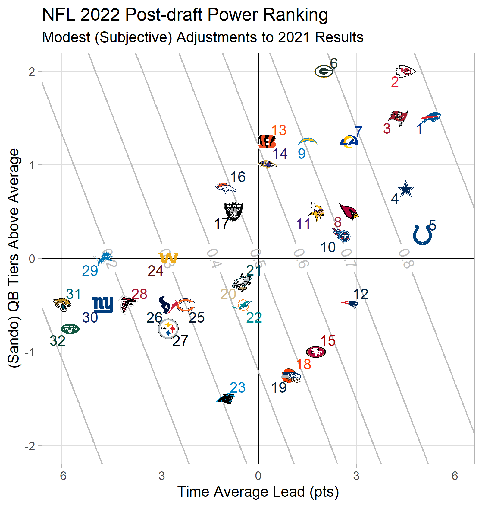
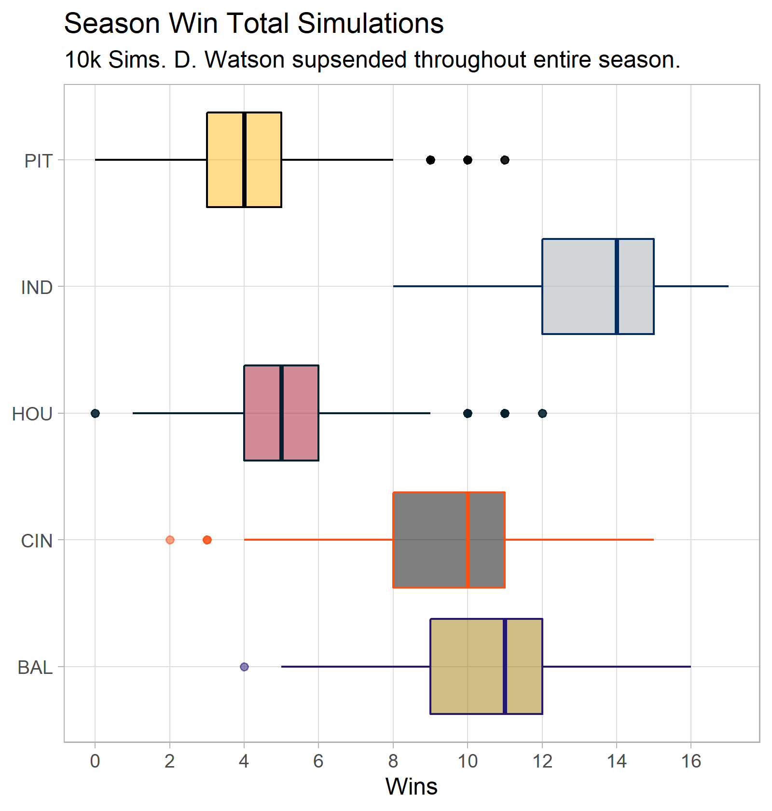

```{r setup, include=FALSE}
knitr::opts_chunk$set(echo = FALSE)
```

```{r libraries, include=FALSE}

library(tidyverse)
library(nflfastR)
library(nflplotR)
library(geomtextpath)
library(ggrepel)

```


```{r load_csv, include=FALSE}

sched_df <- readr::read_csv("early_win_total_sched.csv")
input_df <- readr::read_csv("qb_tier_early_est.csv")

```


```{r grid_df, include=FALSE}

qb_vector = seq(-4, 4, 0.05)
tal_vector = seq(-12, 12, 0.05)

grid_df = expand_grid(qb_vector,
                      tal_vector)

grid_df = grid_df %>%
  mutate(exp_wp = exp((0.306 * tal_vector) + (0.337 * qb_vector))) %>%
  mutate(exp_wp = exp_wp/(1 + exp_wp)) %>%
  rename(qb_adv = qb_vector,
         tal_adv = tal_vector)

rm(qb_vector, tal_vector)

```

```{r 2022_power_rankings, include=FALSE}

rank_df <- input_df %>%
  select(team, sando_qb_tier, tal_est) %>%
  rename(qb_adv = sando_qb_tier,
         tal_adv = tal_est) %>%
  mutate(qb_adv = 3 - qb_adv) %>%
  mutate(exp_wp = exp((0.306 * tal_adv) + (0.337 * qb_adv))) %>%
  mutate(exp_wp = exp_wp/(1 + exp_wp)) %>%
  arrange(desc(exp_wp)) %>%
  mutate(rank = row_number())

p_power_rank <- grid_df %>%
  ggplot(aes(x = tal_adv,
             y = qb_adv)) +
  geom_vline(xintercept = 0) +
  geom_hline(yintercept = 0) +
  geom_textcontour(aes(z = exp_wp),
                   color = "gray") +
  labs(x = "Time Average Lead (pts)",
       y = "(Sando) QB Tiers Above Average",
       title = "NFL 2022 Post-draft Power Ranking",
       subtitle = "Modest (Subjective) Adjustments to 2021 Results") +
  geom_nfl_logos(data = rank_df,
                 aes(team_abbr = team),
                 width = 0.05) +
  geom_text_repel(data = rank_df,
                  aes(label = rank,
                      color = team)) +
  theme_light() +
  coord_cartesian(xlim = c(-6, 6),
                  ylim = c(-2, 2)) +
  scale_x_continuous(minor_breaks = NULL,
                     breaks = seq(-6, 6, 3)) +
  scale_y_continuous(minor_breaks = NULL,
                     breaks = seq(-2, 2, 1)) +
  scale_color_nfl()

ggsave("nfl_2022_preseason_power_ranks.png",
       plot = p_power_rank,
       width = 5,
       height = 5.25,
       units = "in",
       dpi = "retina")

```



```{r season_sim, include=FALSE}

b_tal <- 0.306
se_tal <- 0.018
b_qb <- 0.337
se_qb <- 0.07

team_vec = c("HOU", "IND", "BAL", "CIN", "PIT")
sim = 1:10000

df <- sched_df %>%
  left_join(input_df %>%
              select(team,
                     sando_qb_tier,
                     min_tal,
                     max_tal,
                     tal_est),
            by = c("opponent" = "team")) %>%
  rename(opp_qb = sando_qb_tier,
         opp_min = min_tal,
         opp_max = max_tal,
         opp_tal = tal_est) %>%
  left_join(input_df %>%
              select(team,
                     sando_qb_tier,
                     min_tal,
                     max_tal,
                     tal_est),
            by = c("team" = "team")) %>%
  rename(team_qb = sando_qb_tier,
         team_min = min_tal,
         team_max = max_tal,
         team_tal = tal_est) %>%
  mutate(sim_tal_adv = NA_real_,
         sim_qb_adv = NA_real_,
         sim_win = NA_real_,
         sim = NA_real_) %>%
  filter(is.na(opponent) == F)

sim_df = expand_grid(team_vec, sim) %>%
  rename(team = team_vec) %>%
  mutate(wins = NA_integer_)

temp_df <- data.frame(
  sim = NA_integer_,
  team = team_vec,
  wins = NA_integer_
)

for(i in 1:10000){
  b_tal_sim = rnorm(n = 1,
                    mean = b_tal,
                    sd = se_tal)
  b_qb_sim = rnorm(n = 1,
                   mean = b_qb,
                   sd = se_qb)
  
  df <- df %>%
    mutate(sim = i)
  
  for(j in 1:nrow(df)){
    df$team_tal[j] = runif(1, min = df$team_min[j], max = df$team_max[j])
    df$opp_tal[j] = runif(1, min = df$opp_min[j], max = df$opp_max[j])
    df$sim_tal_adv[j] = df$team_tal[j] - df$opp_tal[j]
    df$sim_qb_adv[j] = rnorm(1, df$opp_qb[j], 0.1) - rnorm(1, df$team_qb[j], 0.1)
    df$sim_win[j] = exp((b_tal_sim * df$sim_tal_adv[j]) + (b_qb_sim * df$sim_qb_adv[j]))
    df$sim_win[j] = df$sim_win[j]/(1 + df$sim_win[j])
    df$sim_win[j] = rbernoulli(1, p = df$sim_win[j])
  }
  
  temp_df <- df %>%
    group_by(sim, team) %>%
    summarize(wins = sum(sim_win)) %>%
    ungroup()
  
  sim_df <- rows_update(sim_df,
                        temp_df,
                        by = c("sim", "team")) %>%
    ungroup()
}

p_win_totals <- sim_df %>%
  ggplot(aes(x = wins, y = factor(team))) +
  geom_boxplot(aes(color = team,
                   fill = team),
               alpha = 0.5) +
  theme_light() +
  labs(x = "Wins",
       y = NULL,
       title = "Season Win Total Simulations",
       subtitle = "10k Sims. D. Watson supsended throughout entire season.") +
  scale_x_continuous(breaks = seq(0, 18, 2),
                     minor_breaks = NULL) +
  scale_color_nfl(type = "primary") +
  scale_fill_nfl(type = "secondary")

ggsave("nfl_early_2022_sims.png",
       plot = p_win_totals,
       width = 5,
       height = 5.25,
       units = "in",
       dpi = "retina")
```

