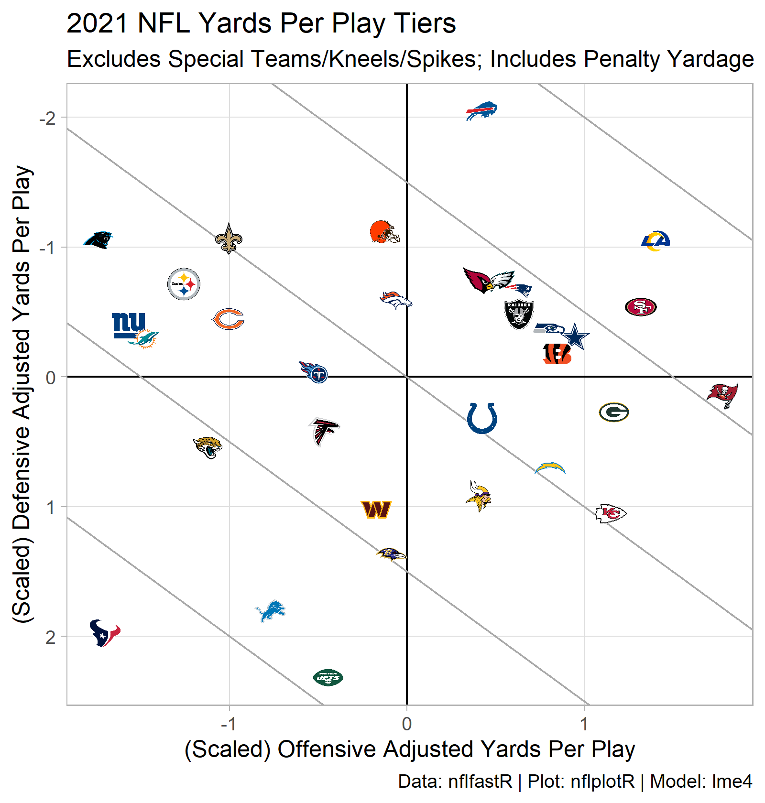

```{r setup, include=FALSE}
knitr::opts_chunk$set(echo = FALSE)
```

### Packages Used

I will use the tidyverse, packages from the nflverse, and lme4 for the multilevel model.

```{r libraries, include=FALSE}

library(tidyverse)
library(nflfastR)
library(nflplotR)
library(lme4)

```

## Intuition

Yards per play...

While penalty assessment is a bit arbitrary in the NFL, penalty yardage is earned by poor technique and related to the tactics employed. Therefore, net penalty yardage is considered just the same as yards gained or lost conventionally, even if the down is replayed. This is a bit like preferring plate appearances to at bats in baseball (since at bats exclude walks, scorer assessed sacrifices, etc.).

```{r penalty_yards}

penalty_yards_gained <- function(df){
  df %>%
    mutate(yards_gained = ifelse(play_type_nfl == "PENALTY",
                                 ifelse(penalty_team == posteam,
                                        -1 * penalty_yards,
                                        penalty_yards),
                                 yards_gained)) %>%
    return()
}

```

Since they are on the field for most of the snaps in a game, analysis is confined to the offensive and defensive units. Plays spikes and kneels, where the purpose of the down is not gain yardage, are discarded.

```{r get_pbp_data, results=FALSE}

pbp_df <- nflfastR::load_pbp(2021) %>%
  filter(season_type == "REG") %>%
  filter(play_type_nfl %in% c("GAME_START",
                              "KICK_OFF",
                              "PUNT",
                              "TIMEOUT",
                              "FIELD_GOAL",
                              "XP_KICK",
                              "END_QUARTER",
                              "END_GAME",
                              "PAT2",
                              "FREE_KICK",
                              "COMMENT") == F) %>%
  filter(is.na(play_type_nfl) == F) %>%
  filter(play_type %in% c("qb_kneel",
                          "qb_spike") == F) %>%
  filter(grepl("(Punt formation)", desc) == F) %>%
  filter(grepl(", offsetting.", desc) == F) %>%
  penalty_yards_gained()

```

## The Advantages of a Multilevel Approach

Random intercepts models are the simplest multilevel models and are generally used as a baseline for which to compare more complicated multilevel models against. Here, a random intercepts model is proposed as an improved averaging method.

Multilevel models have a number of advantages over simpler regression models. Importantly, multilevel models make more realistic assumptions about the independence of observations in the data set.

In the context of NFL yards per play, gaining 5 yards/play against the league's best defense reflects more positively on an offense than gaining 5 yards/play against the league's worst defense. Simple averages and linear regression models, however, do not recognize this; the 5 yards/play the same, regardless of opponent, are "valued" the same (the independence assumption).

Multilevel models also provide regularized estimates. It is expected that offenses will be systematically different from one another in their yards/play output (i.e., clustering by offense is expected). However, the yards/play output of one offense is informative for others.  If I asked you how many yards/play the Dallas Cowboys offense produced in 2021, your guess would probably improve if I told you the answer for the Carolina Panthers.  Similarly, offenses in 2022 are more similar to the one another than they are to offenses in 1995.


### Partial Pooling

```{r off_unit_averages}

avg_yards_per_play <- pbp_df %>%
  summarize(mean = mean(yards_gained)) %>%
  pull(mean)

off_avg_df <- pbp_df %>%
  group_by(posteam) %>%
  summarize(off_yards_per_play = mean(yards_gained),
            off_sd = sd(yards_gained),
            off_n = n(),
            .groups = "drop") %>%
  mutate(off_se = off_sd/sqrt(off_n),
         dist_from_avg = off_yards_per_play - avg_yards_per_play) %>%
  rename(team = posteam)

off_rand_int_mod <- lmer(yards_gained ~ 1 + (1|posteam),
                         data = pbp_df)

summary(off_rand_int_mod)

off_rand_int <- coef(off_rand_int_mod)$posteam %>%
  rownames_to_column(var = "team") %>%
  rename(off_estimate = `(Intercept)`)

off_avg_df <- off_avg_df %>%
  left_join(off_rand_int,
            by = "team") %>%
  mutate(estimate_adjust = off_estimate - off_yards_per_play)

off_avg_df %>%
  ggplot(aes(x = dist_from_avg,
             y = estimate_adjust)) +
  geom_smooth(method = "lm",
              se = FALSE) +
  geom_point(aes(color = team)) +
  scale_color_nfl() +
  theme_light()

rm(off_avg_df,
   def_avg_df)

```

```{r calculate_unit_averages}

off_avg_df <- pbp_df %>%
  group_by(posteam) %>%
  summarize(off_yards_per_play = mean(yards_gained),
            off_sd = sd(yards_gained),
            off_n = n()) %>%
  mutate(off_se = off_sd/sqrt(off_n))

def_avg_df <- pbp_df %>%
  group_by(defteam) %>%
  summarize(def_yards_per_play = mean(yards_gained),
            def_sd = sd(yards_gained),
            def_n = n()) %>%
  mutate(def_se = def_sd/sqrt(def_n))

unit_avg <- left_join(off_avg_df,
                      def_avg_df,
                      by = c("posteam" = "defteam")) %>%
  rename(team = posteam)

rm(off_avg_df,
   def_avg_df)

```

```{r calculate_unit_rand_int}

rand_int <- lmer(yards_gained ~ 1 + (1|posteam) + (1|defteam),
                 data = pbp_df)

off_rand_int <- coef(rand_int)$posteam %>%
  rownames_to_column(var = "team") %>%
  rename(off_estimate = `(Intercept)`)

def_rand_int <- coef(rand_int)$defteam %>%
  rownames_to_column(var = "team") %>%
  rename(def_estimate = `(Intercept)`)

unit_est <- left_join(off_rand_int,
                      def_rand_int,
                      by = c("team" = "team"))

df <- left_join(unit_avg,
                unit_est,
                by = c("team" = "team")) %>%
  mutate(def_adjustment = def_estimate - def_yards_per_play,
         off_adjustment = off_estimate - off_yards_per_play,
         def_dist_from_avg = def_yards_per_play - avg_yards_per_play,
         off_dist_from_avg = off_yards_per_play - avg_yards_per_play)

yards_per_play <- mean(pbp_df$yards_gained)

rm(off_rand_int,
   def_rand_int,
   unit_avg,
   unit_est,
   pbp_df)

```

```{r}

df %>%
  select(team, off_estimate, off_adjustment, off_se, def_estimate, def_adjustment, def_se) %>%
  knitr::kable(digits = 2)

summary(rand_int)

df %>%
  ggplot(aes(x = off_dist_from_avg,
             y = off_adjustment)) +
  geom_smooth(method = "lm",
              se = FALSE) +
  geom_point(aes(color = team)) +
  scale_color_nfl() +
  theme_light()

df %>%
  ggplot(aes(x = def_dist_from_avg,
             y = def_adjustment)) +
  geom_smooth(method = "lm",
              se = FALSE) +
  geom_point(aes(color = team)) +
  scale_color_nfl() +
  theme_light()

```


```{r plot}

p_pooling <- df %>%
  ggplot(aes(x = off_yards_per_play,
             y = def_yards_per_play)) +
  geom_hline(yintercept = yards_per_play) +
  geom_vline(xintercept = yards_per_play) +
  geom_point(aes(color = team)) +
  geom_segment(aes(xend = off_estimate,
                   yend = def_estimate,
                   color = team)) +
  geom_nfl_logos(aes(x = off_estimate,
                     y = def_estimate,
                     team_abbr = team),
                 width = 0.05) +
  scale_y_reverse(breaks = seq(4.0, 6.0, by = 0.2),
                  minor_breaks = NULL) +
  scale_x_continuous(breaks = seq(4.0, 6.0, by = 0.2),
                     minor_breaks = NULL) +
  scale_color_nfl() +
  labs(x = "Offensive Yards Per Play",
       y = "Defensive Yards Per Play",
       title = "Adjusted Yards Per Play",
       subtitle = "The Plexiglass Principle Adaptively Applied Via Partial Pooling",
       caption = "Data: nflfastR | Plot: nflplotR | Model: lme4") +
  theme_light()

ggsave("nfl_2021_yards_per_play_pooling.png",
       plot = p_pooling,
       units = "in",
       height = 5.25,
       width = 5,
       dpi = "retina")

```


```{r scaled_plot}

scaled_df <- df %>%
  mutate(off_estimate = scale(off_estimate),
         def_estimate = scale(def_estimate),
         overall = (off_estimate + (-1*def_estimate))/2,
         off_yards_per_play = scale(off_yards_per_play),
         def_yards_per_play = scale(def_yards_per_play),
         overall_raw = (off_yards_per_play + (-1*def_yards_per_play))/2,) %>%
  arrange(desc(overall)) %>%
  mutate(rank = row_number(),
         percentile = pnorm(overall),
         percentile_raw = pnorm(overall_raw))
  
scaled_plot <- scaled_df %>%
  ggplot(aes(x = off_estimate,
             y = def_estimate)) +
  geom_hline(yintercept = 0) +
  geom_vline(xintercept = 0) +
  geom_abline(slope = -1,
              intercept = seq(-6, 6, by = 1.5),
              color = "dark gray") +
  geom_nfl_logos(aes(team_abbr = team),
                 width = 0.05) +
  scale_y_reverse(breaks = seq(-4, 4, by = 1),
                  minor_breaks = NULL) +
  scale_x_continuous(breaks = seq(-4, 4, by = 1),
                     minor_breaks = NULL) +
  labs(title = "2021 NFL Yards Per Play Tiers",
       subtitle = "Excludes Special Teams/Kneels/Spikes; Includes Penalty Yardage",
       x = "(Scaled) Offensive Adjusted Yards Per Play",
       y = "(Scaled) Defensive Adjusted Yards Per Play",
       caption = "Data: nflfastR | Plot: nflplotR | Model: lme4") +
  theme_light()

ggsave("nfl_2021_reg_season_per_play_tiers.png",
       plot = scaled_plot,
       units = "in",
       height = 5.25,
       width = 5,
       dpi = "retina")

```



```{r ranking_plot}

p_2021 <- scaled_df %>%
  ggplot(aes(x = percentile,
             y = rank)) +
  geom_hline(yintercept = c(0.5, 8.5, 16.5, 24.5, 32.5),
             color = "dark gray",
             linetype = "dashed") +
  geom_vline(xintercept = c(0, 0.25, 0.5, 0.75, 1),
             color = "dark gray") +
  geom_segment(aes(x = percentile,
                   xend = percentile_raw,
                   y = rank,
                   yend = rank,
                   color = team)) +
  geom_point(aes(x = percentile_raw,
                 color = team)) +
  geom_nfl_logos(aes(team_abbr = team),
                 width = 0.05,
                 alpha = 0.8) +
  scale_x_continuous(minor_breaks = NULL,
                     labels = scales::percent) +
  scale_y_reverse(breaks = NULL,
                  minor_breaks = NULL) +
  scale_color_nfl() +
  theme_light() +
  labs(title = "2021 NFL Regular Season Per Play Rankings",
       subtitle = "Excludes Special Teams/Kneels/Spikes; Includes Penalty Yardage",
       x = "Combined Adjusted Yards Per Play Percentile",
       y = NULL,
       caption = "Data: nflfastR | Plot: nflplotR | Model: lme4")

ggsave("nfl_2021_reg_season_per_play.png",
       plot = p_2021,
       units = "in",
       height = 5.25,
       width = 5,
       dpi = "retina")

```


