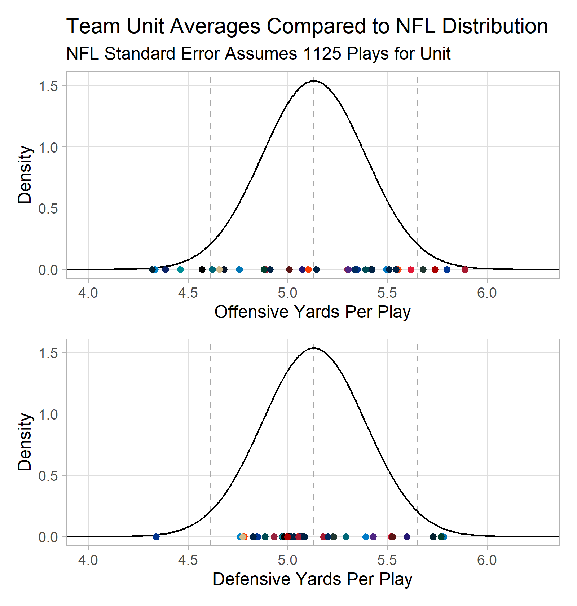
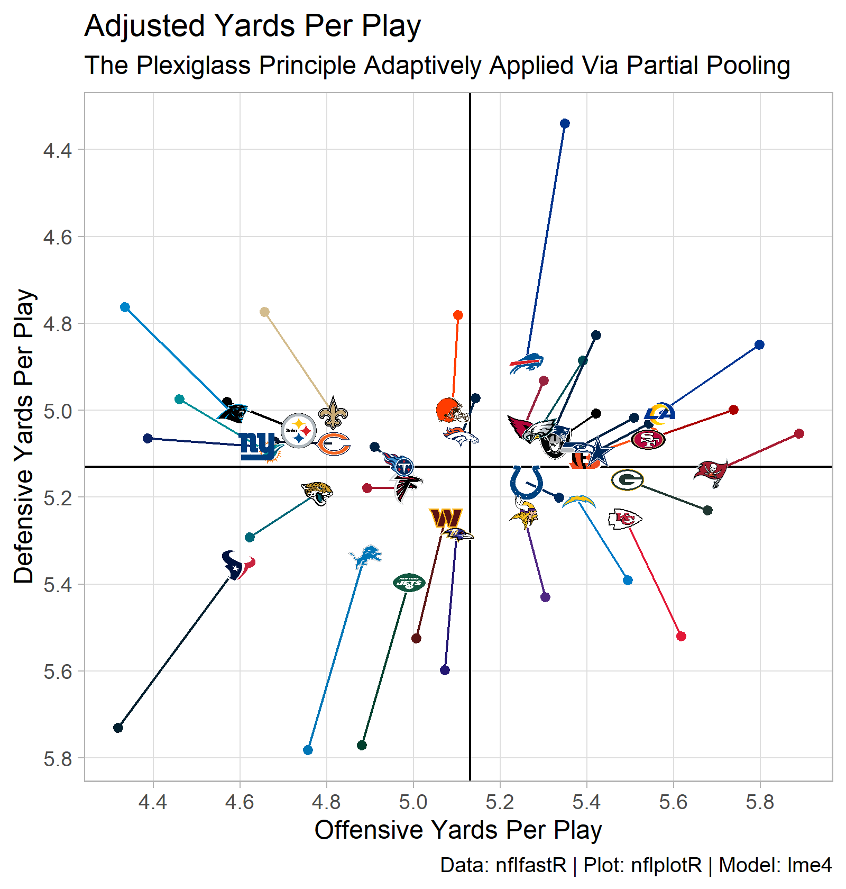
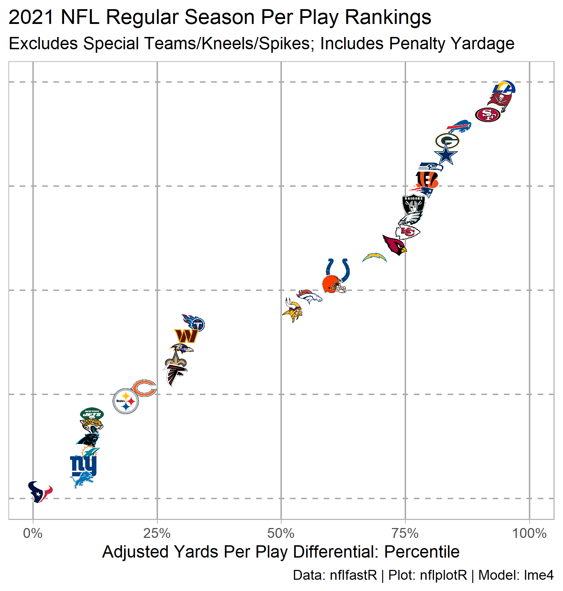

```{r setup, include=FALSE}
knitr::opts_chunk$set(echo = FALSE)
```

### Packages Used

I will use the tidyverse, packages from the nflverse, and lme4 for the multilevel model.

```{r libraries, include=FALSE}

library(tidyverse)
library(nflfastR)
library(nflplotR)
library(lme4)
library(patchwork)

```

## Why Yards/Play Differential?

Yards per play...

While penalty assessment is a bit arbitrary in the NFL, penalty yardage is earned by poor technique and related to the tactics employed. Therefore, net penalty yardage is considered just the same as yards gained or lost conventionally, even if the down is replayed. This is a bit like preferring plate appearances to at bats in baseball (since at bats exclude walks, scorer assessed sacrifices, etc.).

```{r penalty_yards}

penalty_yards_gained <- function(df){
  df %>%
    mutate(yards_gained = ifelse(play_type_nfl == "PENALTY",
                                 ifelse(penalty_team == posteam,
                                        -1 * penalty_yards,
                                        penalty_yards),
                                 yards_gained)) %>%
    return()
}

```

Since they are on the field for most of the snaps in a game, analysis is confined to the offensive and defensive units. Plays spikes and kneels, where the purpose of the down is not gain yardage, are discarded.

```{r get_pbp_data, results=FALSE}

pbp_df <- nflfastR::load_pbp(2021) %>%
  filter(season_type == "REG") %>%
  filter(play_type_nfl %in% c("GAME_START",
                              "KICK_OFF",
                              "PUNT",
                              "TIMEOUT",
                              "FIELD_GOAL",
                              "XP_KICK",
                              "END_QUARTER",
                              "END_GAME",
                              "PAT2",
                              "FREE_KICK",
                              "COMMENT") == F) %>%
  filter(is.na(play_type_nfl) == F) %>%
  filter(play_type %in% c("qb_kneel",
                          "qb_spike") == F) %>%
  filter(grepl("(Punt formation)", desc) == F) %>%
  filter(grepl(", offsetting.", desc) == F) %>%
  penalty_yards_gained()

```

## The Advantages of a Multilevel Approach

Multilevel models have a number of advantages over simpler regression models. Random intercepts models are the simplest multilevel models and are generally used as a baseline for which to compare more complicated multilevel models against. Here, a random intercepts model is proposed as an improvement on averaging.

### Realistic Assumptions About Independence

Importantly, multilevel models make more realistic assumptions about the independence of observations in a data set.  In the NFL, context rightly shapes the meaning we derive from statistics.  For example, gaining 5 yards/play against the league's best defense reflects more positively on an offense than gaining 5 yards/play against the league's worst defense. For some games, weather conditions severely depress offense (think the Bills/Patriots game last season). Averages and simpler regression models, however, do not recognize any such context; all observations are assumed to be independent.

Clustering is expected in yards/play data, along a number of different dimensions. Consider the following examples.

* Two offenses playing in inclement weather are likely to be more similar to one another for that game than the other NFL offenses playing in more typical weather conditions that week.
* Offenses in 2022 are likely to be more similar to the one another than they are to offenses in 1995.

Multilevel models take advantage of these dependencies in the structure of the data.

### Paritial Pooling and Regularization

The observations in one cluster of our data are also informative for other clusters. This may be less intuitive, but consider the following.

* If I asked you how many yards/play the Dallas Cowboys offense produced in 2021, your guess would probably improve if I told you the answer for the Carolina Panthers.
* If I asked you how many yards/play the Green Bay Packers defense surrendered in 2021, your guess would probably improve if I told you how many yards/play in all NFL games played that season.

Sharing of information between the results of all plays across the league, regardless of cluster, and the individual clusters in the data provides regularized estimates. The regularization (or shrinkage) performed by multilevel models tempers the conclusions drawn in each cluster of the data by considering all clusters, thus minimizing the adverse affects of overfitting (roughly, taking the noise in the sample too seriously). Regularization can thus improve out-of-sample prediction.

Readers of the Football Outsiders may be familiar with the Plexiglass Principle, which roughly states that a big improvement (or decline) in performance will on average be followed by a relapse (or bounce back). The Plexiglass Principle was coined by the legendary baseball sabermetrician Bill James, who later renamed it the Whirlpool Principle: "All teams are drawn forcefully toward the center. Most of the teams which had winning records in 1982 will decline in 1983; most of the teams which had losing records in 1982 will improve in 1983." ^[Quotation and background repeated from this [excellent blog post](http://baseballanalysts.com/archives/2004/09/abstracts_from_18.php).] 

Traditional statisticians call this the Paradox of Regression to the Mean.  Exceptionally good performance is likely the result of a combination of high ability and good luck; subsequent performance is likely to be better than average but not as good as the previous exceptional outcome. ^[See Section 6.5 in [Regression and Other Stories](https://avehtari.github.io/ROS-Examples/) by Gelman, Hill, and Vehtari, from which this summary of regression to the mean is adapted.]

## Partial Pooling: An Intuitive Approach

We will use Empirical Bayes, shrinkage estimates, to regularize NFL offensive and defensive yards/play averages.^[See Section 8.7.1 of [Beyond Multiple Linear Regression](https://bookdown.org/roback/bookdown-BeyondMLR/ch-multilevelintro.html#randomslopeandint) by Roback and Legler or this NBER seminar on [Empirical Bayes methods](https://www.youtube.com/watch?v=SdWt8xAAF_4).]

How much shrinkage is appropriate? We begin by building a league-wide normal distribution centered on the mean yards gained for all observations in the data set.  The standard deviation of this distribution is the standard error of the league-wide mean, assuming n = 1125 (a nominal number of plays for a team's offensive or defensive unit that is representative for the 2021 season) rather than the total number of plays in the regular season.  We'll plot this curve as a league-wide nominal distribution, since its parameters are estimated considering all plays in the 2021 NFL regular season.

Next, we plot the average yards/play calculated for each offense and defense under the league-wide nominal distribution.  This allows us to compare the distribution of offensive unit averages and the distribution of the defensive unit averages against all plays.

```{r nfl_vs_unit_averages, results=FALSE}
# Estimate NFL Distribution using mean for all plays...
avg_yards_per_play <- pbp_df %>%
  summarize(mean = mean(yards_gained)) %>%
  pull(mean)

# and standard error of the mean, which assumes
# 1125 plays in a season for a unit.
sd_yards_per_play <- pbp_df %>%
  summarize(sd = sd(yards_gained)) %>%
  pull(sd)
se_unit <- sd_yards_per_play/sqrt(1125)

# Build data frame to plot estimated distribution
ypp <- seq(0, 10, by = 0.01)
d_ypp <- dnorm(ypp, mean = avg_yards_per_play, sd = se_unit)
df_ypp <- data.frame(ypp, d_ypp)
rm(ypp, d_ypp)

# Calculate (Raw, Unadjusted) Unit Averages
off_avg_df <- pbp_df %>%
  group_by(posteam) %>%
  summarize(off_yards_per_play = mean(yards_gained),
            off_n = n()) %>%
  rename(team = posteam)
def_avg_df <- pbp_df %>%
  group_by(defteam) %>%
  summarize(def_yards_per_play = mean(yards_gained),
            def_n = n()) %>%
  rename(team = defteam)


# Plot unit averages against league-wide estimated distribution
# Stack of plots will show much greater spread among offenses
# compared to defenses.
p_top <- df_ypp %>%
  ggplot(aes(x = ypp,
             y = d_ypp)) +
  geom_vline(xintercept = c(avg_yards_per_play,
                            avg_yards_per_play - 2*se_unit,
                            avg_yards_per_play + 2*se_unit),
             color = "dark gray",
             linetype = "dashed") +
  geom_line() +
  geom_point(data = off_avg_df,
             aes(x = off_yards_per_play,
                 y = 0,
                 color = team)) +
  scale_color_nfl() +
  theme_light() +
  scale_x_continuous(minor_breaks = NULL) +
  scale_y_continuous(minor_breaks = NULL) +
  coord_cartesian(xlim = c(4.0, 6.25)) +
  labs(x = "Offensive Yards Per Play",
       y = "Density",
       title = "Team Unit Averages Compared to NFL Distribution",
       subtitle = "NFL Standard Error Assumes 1125 Plays for Unit")
p_bottom <- df_ypp %>%
  ggplot(aes(x = ypp,
             y = d_ypp)) +
  geom_vline(xintercept = c(avg_yards_per_play,
                            avg_yards_per_play - 2*se_unit,
                            avg_yards_per_play + 2*se_unit),
             color = "dark gray",
             linetype = "dashed") +
  geom_line() +
  geom_point(data = def_avg_df,
             aes(x = def_yards_per_play,
                 y = 0,
                 color = team)) +
  scale_color_nfl() +
  theme_light() +
  scale_x_continuous(minor_breaks = NULL) +
  scale_y_continuous(minor_breaks = NULL) +
  coord_cartesian(xlim = c(4.0, 6.25)) +
  labs(x = "Defensive Yards Per Play",
       y = "Density")
library(patchwork)
p_units <- p_top / p_bottom
ggsave("nfl_2021_unit_dist.png",
       plot = p_units,
       height = 5.25,
       width = 5,
       units = "in",
       dpi = "retina")
```



A few observations:

* The defensive average are much more closely packed around the league wide mean than the offensive averages. This indicates that the offense identity more reliably accounts for variation in the data than defense identity. Therefore, we expect our model shrink offensive deviations from average less than defensive deviations.
* Looking at the offenses, about 9 or 10 offenses (of 32) are greater than 2 standard errors from the league wide mean (i.e., outside of gray dashed lines).  Since the standard errors should be similar, about 2 would be expected (0.05 * 32 = about 2). This suggests that the offense averages are too greatly dispersed, so some modest shrinkage is expected.

Let's look at the actual shrinkage performed by the model.

```{r rand_int_model, echo=TRUE}
mod_rand_int <- lmer(yards_gained ~ 1 + (1|posteam) + (1|defteam) + (1|game_id),
                     data = pbp_df)
```

To visualize the "whirlpool" effect of the multilevel model, we build a data frame with the unadjusted unit averages and their Empirical Bayes (random intercepts) estimates.

```{r build_summary_df, results=FALSE}
off_rand_int <- coef(mod_rand_int)$posteam %>%
  rownames_to_column(var = "team") %>%
  rename(off_estimate = `(Intercept)`)

off_avg_df <- off_avg_df %>%
  left_join(off_rand_int,
            by = "team") %>%
  mutate(off_estimate_adjust = off_estimate - off_yards_per_play)


def_rand_int <- coef(mod_rand_int)$defteam %>%
  rownames_to_column(var = "team") %>%
  rename(def_estimate = `(Intercept)`)

def_avg_df <- def_avg_df %>%
  left_join(def_rand_int,
            by = "team") %>%
  mutate(def_estimate_adjust = def_estimate - def_yards_per_play)

est_df <- left_join(off_avg_df,
                    def_avg_df,
                    by = "team") %>%
  mutate(combined_estimate = off_estimate - def_estimate) %>%
  arrange(desc(combined_estimate)) %>%
  mutate(estimate_rank = row_number(),
         percentile_estimate = scale(combined_estimate)) %>%
  mutate(percentile_estimate = pnorm(percentile_estimate))

rm(off_avg_df,
   def_avg_df)

```

Then, we plot the unadjusted unit averages and their regularized estimate to show the shrinkage.

```{r plot, results=FALSE}

p_pooling <- est_df %>%
  ggplot(aes(x = off_yards_per_play,
             y = def_yards_per_play)) +
  geom_hline(yintercept = avg_yards_per_play) +
  geom_vline(xintercept = avg_yards_per_play) +
  geom_point(aes(color = team)) +
  geom_segment(aes(xend = off_estimate,
                   yend = def_estimate,
                   color = team)) +
  geom_nfl_logos(aes(x = off_estimate,
                     y = def_estimate,
                     team_abbr = team),
                 width = 0.05) +
  scale_y_reverse(breaks = seq(4.0, 6.0, by = 0.2),
                  minor_breaks = NULL) +
  scale_x_continuous(breaks = seq(4.0, 6.0, by = 0.2),
                     minor_breaks = NULL) +
  scale_color_nfl() +
  labs(x = "Offensive Yards Per Play",
       y = "Defensive Yards Per Play",
       title = "Adjusted Yards Per Play",
       subtitle = "The Plexiglass Principle Adaptively Applied Via Partial Pooling",
       caption = "Data: nflfastR | Plot: nflplotR | Model: lme4") +
  theme_light() +
  coord_fixed()

ggsave("nfl_2021_yards_per_play_pooling.png",
       plot = p_pooling,
       units = "in",
       height = 5.25,
       width = 5,
       dpi = "retina")

```



To better quantify the average shrinkage applied to deviations from average for offenses, we can fit an ordinary least squares regression to a centered data frame (i.e., the league average is subtracted from both the regularized estimates and the unadjusted averages).

```{r off_shrinkage_plot}

centered_df <- est_df %>%
  mutate(off_estimate = off_estimate - avg_yards_per_play,
         off_yards_per_play = off_yards_per_play - avg_yards_per_play,
         def_estimate = def_estimate - avg_yards_per_play,
         def_yards_per_play = def_yards_per_play - avg_yards_per_play)

lm(off_estimate ~ off_yards_per_play,
   data = centered_df) %>%
  coefficients()

est_df %>%
  ggplot(aes(x = off_yards_per_play - avg_yards_per_play,
             y = off_estimate - avg_yards_per_play)) +
  geom_smooth(method = "lm",
              se = FALSE) +
  geom_text(aes(color = team,
                label = team)) +
  scale_color_nfl() +
  scale_x_continuous(breaks = seq(-10, 10, by = 0.2),
                     minor_breaks = NULL) +
  scale_y_continuous(breaks = seq(-10, 10, by = 0.2),
                     minor_breaks = NULL) +
  theme_light() +
  coord_fixed(xlim = c(-0.9, 0.9),
              ylim = c(-0.8, 0.8))
```

We repeat for the defensive units. As anticipated, more shrinkage is applied to the defensive units (i.e., the slope of the defensive line is closer to 0 than the offensive line).

```{r }
lm(def_estimate ~ def_yards_per_play,
   data = centered_df) %>%
  coefficients()

est_df %>%
  ggplot(aes(x = def_yards_per_play - avg_yards_per_play,
             y = def_estimate - avg_yards_per_play)) +
  geom_smooth(method = "lm",
              se = FALSE) +
  geom_text(aes(color = team,
                label = team)) +
  scale_color_nfl() +
  scale_x_continuous(breaks = seq(-10, 10, by = 0.2),
                     minor_breaks = NULL) +
  scale_y_continuous(breaks = seq(-10, 10, by = 0.2),
                     minor_breaks = NULL) +
  theme_light() +
  coord_fixed(xlim = c(-0.9, 0.9),
              ylim = c(-0.8, 0.8))

```

Finally, we plot adjusted yard/play differential (i.e., offense yards/play regularized estimate - defense yards/play regularized) in terms of percentiles.

```{r ranking_plot, results=FALSE}

p_2021 <- est_df %>%
  ggplot(aes(x = percentile_estimate,
             y = estimate_rank)) +
  geom_hline(yintercept = c(0.5, 8.5, 16.5, 24.5, 32.5),
             color = "dark gray",
             linetype = "dashed") +
  geom_vline(xintercept = c(0, 0.25, 0.5, 0.75, 1),
             color = "dark gray") +
  geom_nfl_logos(aes(team_abbr = team),
                 width = 0.05) +
  scale_x_continuous(minor_breaks = NULL,
                     labels = scales::percent) +
  scale_y_reverse(breaks = NULL,
                  minor_breaks = NULL) +
  scale_color_nfl() +
  theme_light() +
  labs(title = "2021 NFL Regular Season Per Play Rankings",
       subtitle = "Excludes Special Teams/Kneels/Spikes; Includes Penalty Yardage",
       x = "Adjusted Yards Per Play Differential: Percentile",
       y = NULL,
       caption = "Data: nflfastR | Plot: nflplotR | Model: lme4")

ggsave("nfl_2021_reg_season_per_play.png",
       plot = p_2021,
       units = "in",
       height = 5.25,
       width = 5,
       dpi = "retina")

```



## Quick Back Test: Adjusted Yard/Play Differential as a Predictor of Playoff Success

