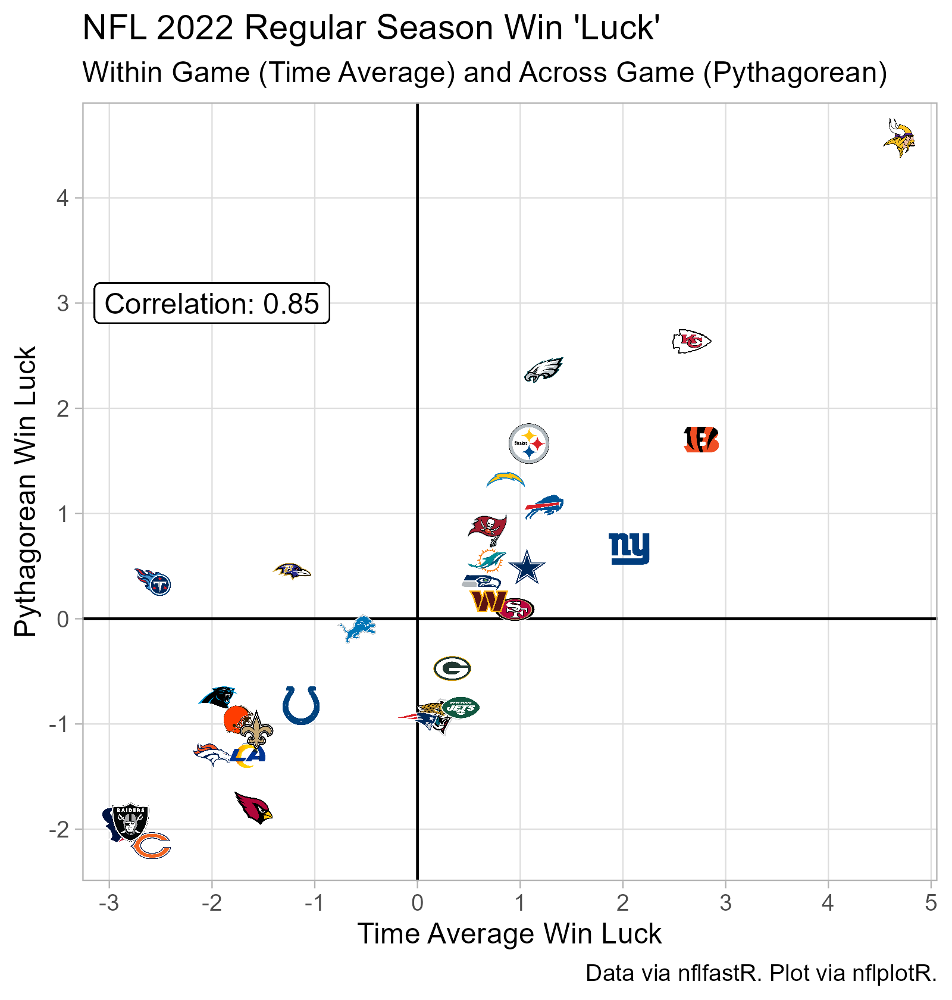

#### Packages Used

```{r setup, message=FALSE}
knitr::opts_chunk$set(echo = FALSE)


library(tidyverse)
library(nflfastR)
library(nflplotR)
library(nfltools)
```

## Measures of Win 'Luck'

### Pythagorean Win Luck

### Time Average Win Luck


This post takes a look at two estimates of win luck, or roughly actual record compared with expected record.

One, Pythagorean Win Expectation. I'll use the [Daryl Morey formulation](https://grantland.com/features/breaking-best-nfl-stats/), which built form Bill James's work for baseball. The basic logic of Pythagorean Win Expectation is that points scored and allowed for an entire season are more reliable gauges of team's true ability than within a single game. Thus, Pythagorean Win Expectation is an <i>across game estimate</i> of expected regular season record.

Two, I'll use my time average lead concept. This approach estimates the expected win percentage for each individual game, and estimates the season win percentage by taking the average of the individual game estimates. uses the average lead or deficit in a game to estimate the average win percentage for each game and computes. Since the real estimation is done at the individual game level, I call this a <i>within game estimate</i>.

### Time Average Model Win Expectancy Model

The code below fits a logistic model to the 2015 to 2021 regular seasons. It also assembles the information for and calculates the Pythagorean Win Expectation.

```{r, message=FALSE}

train <- map_dfr(
  2015:2021,
  nfl_mvt_season) %>%
  filter(home_away == "home")

train_results <- load_pbp(2015:2021) %>%
  filter(season_type == "REG") %>%
  mutate(home_result = case_when(
    result > 0 ~ "Win",
    result == 0 ~ "Tie",
    result < 0 ~ "Loss"
  )) %>%
  group_by(game_id) %>%
  summarize(
    season = season,
    week = week,
    team = home_team,
    opponent = away_team,
    result = home_result,
    .groups = "drop") %>%
  distinct() %>%
  mutate(game_id = NULL)

train_df <- left_join(
  train,
  train_results) %>%
  filter(result != "Tie") %>%
  filter(home_away == "home") %>%
  mutate(
    result = ifelse(
      result == "Win",
      1L, 0L),
    home_away = as.factor(home_away)
  )

model <- rstanarm::stan_glm(
  result ~ -1 + time_avg_lead,
  data = train_df,
  family = "binomial"
)

test <- nfl_mvt_season(2022)

beta <- coef(model)

test_df <- test %>%
  mutate(exp_wp = 1/(1 + exp(-beta * time_avg_lead)))

df_2022 <- test_df %>%
  group_by(team) %>%
  summarize(exp_wp = mean(exp_wp, na.rm = T),
            .groups = "drop")

home_2022 <- load_pbp(2022) %>%
  filter(season_type == "REG") %>%
  group_by(game_id) %>%
  slice_head(n = 1) %>%
  ungroup() %>%
  mutate(home_win = ifelse(result > 0,
                           1L, 0L)) %>%
  group_by(home_team) %>%
  summarize(games_played = n(),
            points_scored = sum(home_score),
            points_allowed = sum(away_score),
            wins = sum(home_win),
            .groups = "drop") %>%
  rename(team = home_team)

away_2022 <- load_pbp(2022) %>%
  filter(season_type == "REG") %>%
  group_by(game_id) %>%
  slice_head(n = 1) %>%
  ungroup() %>%
  mutate(away_win = ifelse(result < 0,
                           1L, 0L)) %>%
  group_by(away_team) %>%
  summarize(games_played = n(),
            points_scored = sum(away_score),
            points_allowed = sum(home_score),
            wins = sum(away_win),
            .groups = "drop") %>%
  rename(team = away_team)

team_2022 <- rbind(
  home_2022,
  away_2022) %>%
  group_by(team) %>%
  summarize(
    games_played = sum(games_played),
    points_scored = sum(points_scored),
    points_allowed = sum(points_allowed),
    wins = sum(wins),
    .groups = "drop") %>%
  mutate(actual_wp = wins/games_played,
         pythag_wp = (points_scored ^ 2.37)/((points_scored ^ 2.37) + (points_allowed) ^ 2.37)) %>%
  left_join(df_2022) %>%
  mutate(time_avg_win_luck = (actual_wp - exp_wp) * 17,
         pythag_win_luck = (actual_wp - pythag_wp) * 17)

```

The summary for the time average win expectation model:

```{r}

summary(model)

```


### Plot

```{r}

p <- team_2022 %>%
  ggplot(aes(x = time_avg_win_luck,
             y = pythag_win_luck)) +
  geom_hline(yintercept = 0) +
  geom_vline(xintercept = 0) +
  geom_nfl_logos(aes(team_abbr = team),
                 width = 0.05) +
  geom_label(aes(x = -2,
                y = 3,
                label = paste0("Correlation: ",
                               cor(team_2022$time_avg_win_luck,
                                   team_2022$pythag_win_luck) %>%
                                 round(2)))) +
  scale_x_continuous(breaks = seq(-6, 6, by = 1),
                     minor_breaks = NULL) +
  scale_y_continuous(breaks = seq(-6, 6, by = 1),
                     minor_breaks = NULL) +
  labs(x = "Time Average Win Luck",
       y = "Pythagorean Win Luck",
       caption = "Data via nflfastR. Plot via nflplotR.",
       title = "NFL 2022 Regular Season Win 'Luck'",
       subtitle = "Within Game (Time Average) and Across Game (Pythagorean)") +
  theme_light()

ggsave(plot = p,
       filename = "nfl_2022_win_luck.png",
       height = 5.25,
       width = 5,
       units = "in",
       dpi = "retina")

```


