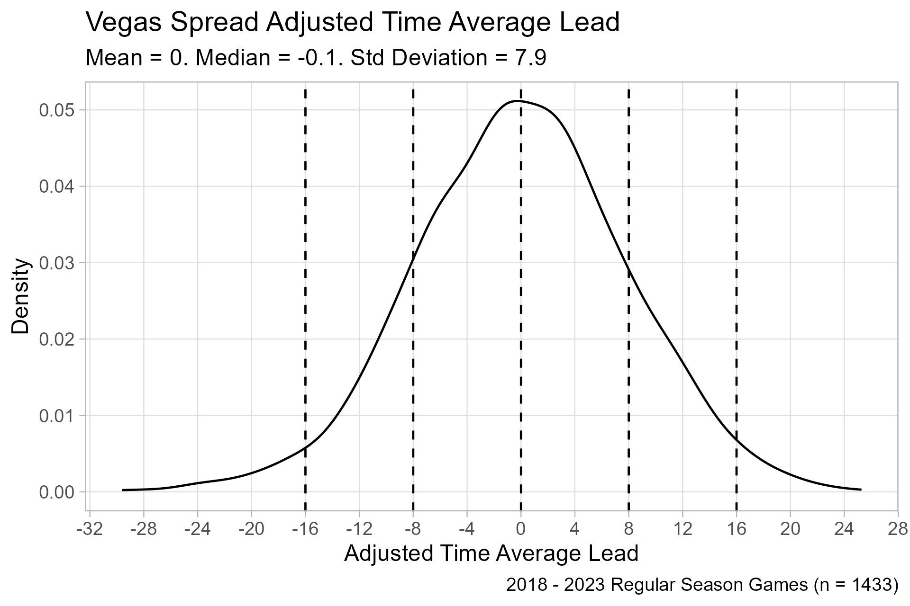
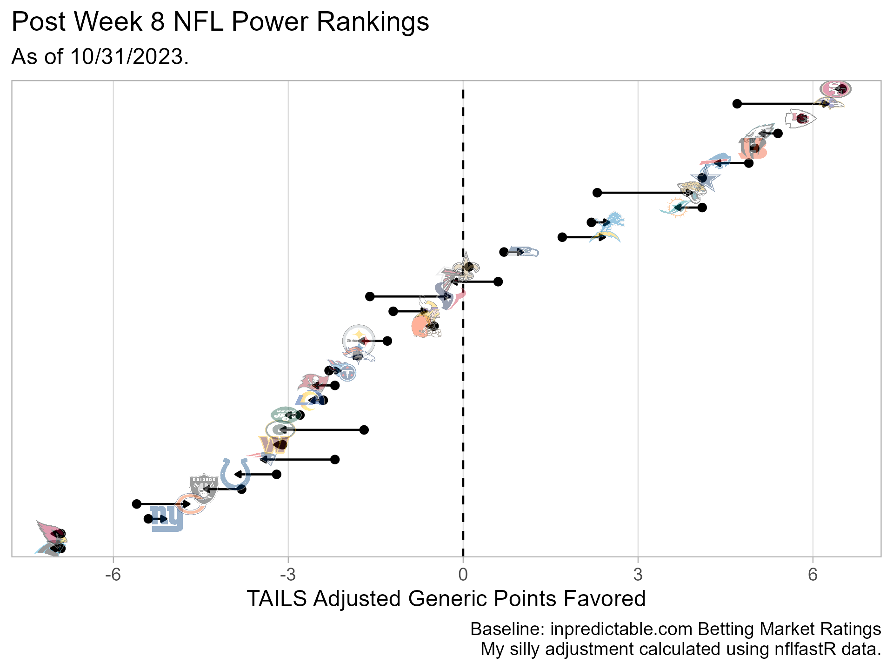

```{r setup, include=FALSE}
knitr::opts_chunk$set(echo = FALSE)
```

### Load Libraries

```{r load_libraries}

library(tidyverse)
library(nflfastR)
library(nfltools)
library(nflplotR)

```

### Get Time Average Lead Data

```{r get_data}

seasons <-
  2018:2023

raw_df <-
  purrr::map_df(
    seasons,
    nfl_mvt_season
  )
```

## Intro

Previously, I made some code that calculates the (time) average lead for an NFL game using `nflfastR` play-by-play data.  Based on this data, I developed a simple retrospective expected win percentage model.  Here, I play with another use of time average lead data: in-season handicap adjustments.

It is a common practice for traditional handicappers to adjust team power ratings weekly based on performance and health.

### Adjusted Time Average Lead Metric

The spread provides an estimate of the median final score differential. To provide a context adjustment (e.g., opponent, home field advantage, weather), assume linear growth between (1) a 0 point differential  at opening kickoff and (2) final score differential implied by the spread.

The time average lead implied by this linear model is 1/2 of the spread.

#### Toy Example

Assume Team A is favored by 6 points (-6 point spread).  Then this simple adjustment model expects Team A to lead, on average, by 3 points (1/2 of the 6 point spread).  The actual calculated time average lead for the game reveals Team A led, on average, by 2 points.  Although Team A held a lead, on average, for the course of their game, they slightly underperformed the Vegas expectation (i.e., 2 point actual average lead - 3 point expected average lead = -1).  This difference between actual and expected time average lead could provide some information for a power rating adjustment.

#### Calculate Adjustment

```{r calculate_adjustment}

df <-
  raw_df %>%
  # This is a convenient way to ensure each
  # game shows up in data once.
  filter(home_away == "home") %>%
  # Removes bye weeks entries
  filter(is.na(home_away) == F) %>%
  # The spread provides an estimate of the median
  # final score differential (and incorporates home
  # field advantage). To provide an adjustment, assume linear
  # growth from (1) a 0 point differential  at opening kickoff
  # to (2) final score differential implied by spread. The
  # time average lead implied by this linear model is
  # 1/2 of the spread.
  mutate(
    adj_time_avg_lead = time_avg_lead + (0.5 * team_spread)
  )

```

### Distribution of Adjusted Time Average Leads

To understand the distribution of adjusted time average leads, a density plot is created and some summary statistics are calculated.

Ideally, our adjustment would yield a distribution centered at 0.  It does!

In addition, the standard deviation is about 8 points (one possession).  This is an easy value to remember and interpret.

```{r plot_adj_time_avg_lead}

p_adj_distribution <-
  df %>%
  ggplot(aes(x = adj_time_avg_lead)) +
  geom_density() +
  geom_vline(
    xintercept = 
      c(-16, -8, 0, 8, 16),
    linetype = "dashed"
  ) +
  labs(
    x = "Adjusted Time Average Lead",
    y = "Density",
    title = "Vegas Spread Adjusted Time Average Lead",
    subtitle = paste0(
      "Mean = ",
      mean(df$adj_time_avg_lead) %>%
        round(., digits = 1),
      ". Median = ",
      median(df$adj_time_avg_lead) %>%
        round(., digits = 1),
      ". Std Deviation = ",
      sd(df$adj_time_avg_lead) %>%
        round(., digits = 1)
    ),
    caption = paste0(
      "2018 - 2023 Regular Season Games (n = ",
      nrow(df),
      ")"
    )
  ) +
  scale_x_continuous(
    breaks = seq(-32, 32, by = 4),
    minor_breaks = NULL
  ) +
  scale_y_continuous(
    minor_breaks = NULL
  ) +
  theme_light()

ggsave(
  "adjusted_time_avg_lead.png",
  plot = p_adj_distribution,
  width = 6,
  height = 4,
  units = "in",
  dpi = "retina"
)

```



## TAILS: Time Averge inpredictable Line Smidgen

Here, I put together a toy adjustment.

A common discussion point early in a season is the question: How should you best incorporate early results with your preseason priors?  A single game isn't much use.  As a first guess, I'll consider the most recent four or five games to be an appropriate number to develop an average that is recent enough to still be relevant.

Adjustments should be modest (e.g., 3 points should be extremely rare).  The distribution of an average of five games should be about half as wide as the underlying distribution.  That would put a result that is two standard deviations above the mean at roughly +8 points, which is way too big for power rating adjustment.  Because this is just a toy project, I'm going to choose to scale the results by 0.2 to pull this hypothetical two standard deviations above the mean result to under 2 points.  This will yield a result to adjust inpredictable's market-based ratings (that are derived from game lines for the entire season) by an algorithmically-defined smidgen.

A key element any modern sports metrics is an asinine acronym.  My daughter loves Miles "Tails" Prower of the Sonic the Hedgehog series.  Therefore, I am obliged to shoehorn my idea into the TAILS acronym: Time Average inpredictable Line Smidgen.


### Current 2023 TAILS Adjustment

```{r}

tails <-
  raw_df %>%
  filter(season == 2023) %>%
  filter(!(is.na(opponent))) %>%
  mutate(
    adj_time_avg_lead = time_avg_lead + (0.5 * team_spread)
  ) %>%
  group_by(team) %>%
  slice_tail(n = 5) %>%
  summarize(
    tails = mean(adj_time_avg_lead),
    .groups = "drop"
  ) %>%
  mutate(
    tails = 0.2 * tails
  )

inpred <-
  # This is a function I wrote as my first bit of
  # webscraping code. It retrieves info from the
  # inpredictable power ratings at the time it is run.
  get_current_inpredictable()

inpred <-
  left_join(
    inpred,
    tails
  ) %>%
  mutate(
    adj_gpf = gpf + tails
  )

```

### Plot

```{r}

p_adj_gpf <-
  inpred %>%
  ggplot(
    aes(
      x = gpf,
      y = reorder(factor(team),
                  adj_gpf)
    )
  ) +
  geom_vline(
    xintercept = 0,
    linetype = "dashed"
  ) +
  geom_segment(
    aes(
      x = gpf,
      xend = adj_gpf,
      yend = team
    ),
    arrow = arrow(
      type = "closed",
      length = unit(
        0.1, "cm"
      )
    )
  ) +
  geom_point() +
  geom_nfl_logos(
    aes(
      team_abbr = team,
      x = adj_gpf),
    width = 0.04,
    alpha = 0.4
  ) +
  scale_x_continuous(
    breaks = seq(-18, 18, by = 3),
    minor_breaks = NULL
  ) +
  scale_y_discrete(
    labels = NULL,
    breaks = NULL
  ) +
  labs(
    x = "TAILS Adjusted Generic Points Favored",
    y = NULL,
    title = "Post Week 8 NFL Power Rankings",
    subtitle = "As of 10/31/2023.",
    caption = "Baseline: inpredictable.com Betting Market Ratings\nMy silly adjustment calculated using nflfastR data."
  ) +
  theme_light()

ggsave(
  "tails_adj_gpf.png",
  plot = p_adj_gpf,
  width = 6,
  height = 4.5,
  units = "in",
  dpi = "retina"
)

```



### Table

```{r}

inpred %>%
  select(
    team, gpf, tails, adj_gpf
  ) %>%
  arrange(
    desc(adj_gpf)
  ) %>%
  mutate(
    tails = round(tails, 2),
    adj_gpf = round(adj_gpf, 2),
    rank = row_number()
  ) %>%
  knitr::kable()

```

