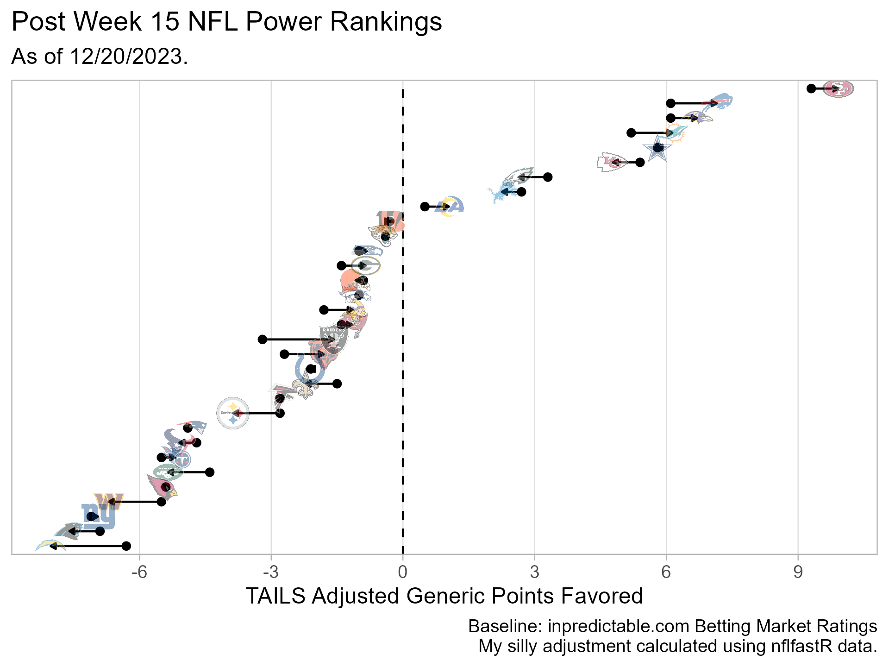

```{r setup, include=FALSE}
knitr::opts_chunk$set(echo = FALSE)
```

### Load Libraries

```{r load_libraries}

library(tidyverse)
library(nflfastR)
library(nfltools)
library(nflplotR)

```

### Get Time Average Lead Data

```{r get_data}

raw_df <-
  nfltools::nfl_mvt_season(2023)

```

### Calculate TAILS Adjustment

```{r calculate_tails_adjustment}

tails <-
  raw_df %>%
  filter(!(is.na(opponent))) %>%
  mutate(
    adj_time_avg_lead = time_avg_lead + (0.5 * team_spread)
  ) %>%
  group_by(team) %>%
  slice_tail(n = 5) %>%
  summarize(
    tails = mean(adj_time_avg_lead),
    .groups = "drop"
  ) %>%
  mutate(
    tails = 0.2 * tails
  )

inpred <-
  # This is a function I wrote as my first bit of
  # webscraping code. It retrieves info from the
  # inpredictable power ratings at the time it is run.
  get_current_inpredictable()

inpred <-
  left_join(
    inpred,
    tails
  ) %>%
  mutate(
    adj_gpf = gpf + tails
  )

```

### Plot

```{r create_plot}

p_adj_gpf <-
  inpred %>%
  ggplot(
    aes(
      x = gpf,
      y = reorder(factor(team),
                  adj_gpf)
    )
  ) +
  geom_vline(
    xintercept = 0,
    linetype = "dashed"
  ) +
  geom_segment(
    aes(
      x = gpf,
      xend = adj_gpf,
      yend = team
    ),
    arrow = arrow(
      type = "closed",
      length = unit(
        0.1, "cm"
      )
    )
  ) +
  geom_point() +
  geom_nfl_logos(
    aes(
      team_abbr = team,
      x = adj_gpf),
    width = 0.04,
    alpha = 0.4
  ) +
  scale_x_continuous(
    breaks = seq(-18, 18, by = 3),
    minor_breaks = NULL
  ) +
  scale_y_discrete(
    labels = NULL,
    breaks = NULL
  ) +
  labs(
    x = "TAILS Adjusted Generic Points Favored",
    y = NULL,
    title = "Post Week 15 NFL Power Rankings",
    subtitle = "As of 12/20/2023.",
    caption = "Baseline: inpredictable.com Betting Market Ratings\nMy silly adjustment calculated using nflfastR data."
  ) +
  theme_light()

ggsave(
  "post_week_15_tails_adj_gpf.png",
  plot = p_adj_gpf,
  width = 6,
  height = 4.5,
  units = "in",
  dpi = "retina"
)

```



### Table

```{r display_table}

inpred %>%
  select(
    team, gpf, tails, adj_gpf
  ) %>%
  arrange(
    desc(adj_gpf)
  ) %>%
  mutate(
    tails = round(tails, 2),
    adj_gpf = round(adj_gpf, 2),
    rank = row_number()
  ) %>%
  knitr::kable()

```