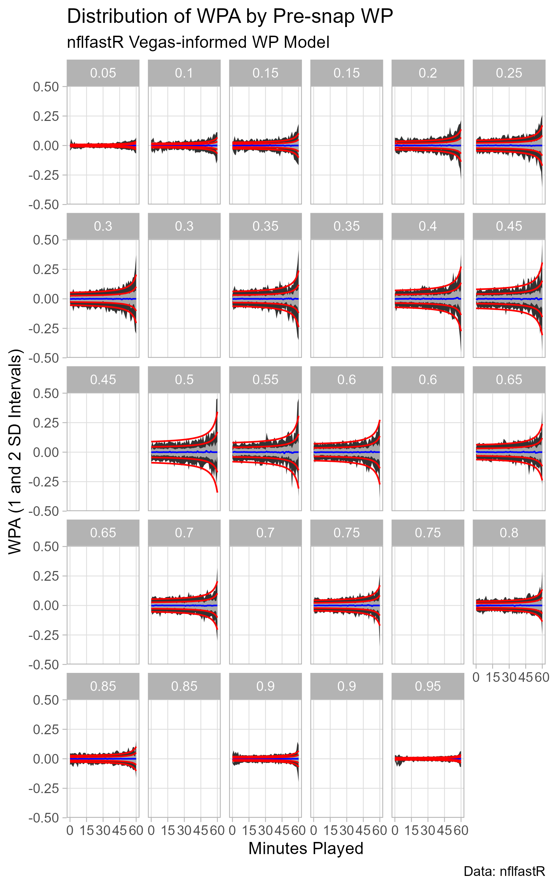

```{r setup, include=FALSE}

knitr::opts_chunk$set(echo = FALSE)

```

```{r load_libraries, include=FALSE}

library(tidyverse)
library(nflfastR)

```

### Background

In [Part I](https://caseycaprini.github.io/the_latest_numbers/posts/2023-12-04-partiwinprobabilitystochasticprocess/) of this series, I provided the most basic of introductions to options pricing, describing a simplified Bachelier model for a binary call option. The real point was to introduce the quantitative finance idea of valuing something on the basis of a stochastic process: simulate many possible paths for an assumed dynamic, and determine the value of an instrument based on the distribution of the simulated outcomes.

Here, I examine the dynamics of NFL win probability forecasts: specifically, I look at the `nflfastR` win probability model that incorporates the pre-game Vegas line (i.e., `vegas_wpa`, `vegas_home_wpa`, `vegas_wp`, `vegas_home_wp`). For a technical description of the model (or something close to it), see it's creator's ([Ben Baldwin](https://twitter.com/benbbaldwin)) article [here](https://opensourcefootball.com/posts/2021-04-13-creating-a-model-from-scratch-using-xgboost-in-r/).

My interest in the topic was sparked by a [Nassim Taleb video on YouTube](https://www.youtube.com/watch?v=YRvPF__du9w), summarized by the opening quote in the introduction to a Taleb paper on [election forecasting dynamics](https://arxiv.org/pdf/1703.06351.pdf).

> "A standard result in quantitative finance is that when the
> volatility of the underlying security increases, arbitrage
> pressures push the corresponding binary option to trade closer
> to 50%, and become less variable over the remaining time
> to expiration. Counterintuitively, the higher the uncertainty of
> the underlying security, the lower the volatility of the binary
> option."
> 
> Nassim Taleb

Previously, I explored some tests for [excess movement in win probability streams](https://caseycaprini.github.io/the_latest_numbers/posts/2022-10-15-nflfastr-win-prob-excessmovement/) for NFL (`nflfastR` model) and MLB (MLB.com data) games based on a paper by [Ned Augenblick and Matthew Rabin](https://faculty.haas.berkeley.edu/ned/AugenblickRabin_MovementUncertainty.pdf).

### Intuition

> "Volatility involves uncertain changes of state... Time and
> chance happen to us all. A stock price that moves unpredictably
> up and down is volatile. Its volatility reflects the unstable
> equilibrium between two simultaneous but conflicting occurrences:
> good news and bad news, the desire to buy and the desire to sell,
> in permanent conflict. As in politics, there is no volatility
> without conflict."
> 
> [Emanual Derman](https://whyisthisinteresting.substack.com/p/why-is-this-interesting-the-volatility)

Consider each in-game win probability (WP) estimate as a price. The threat of arbitrage forces the WP stream to be a martingale: “knowledge of the past will be of no use in predicting the future” and “the direction of anticipated future swings… should be already baked into the current prediction” ([from Andrew Gelman et al, 2020](http://www.stat.columbia.edu/~gelman/research/published/jdm200907b.pdf)). Therefore, Win Probability Added (WPA) should be 0 in expectation.

The Taleb quote describes some effects of uncertainty.

* As uncertainty increases, WP estimates get pulled toward 0.5 (a coin flip, maximum ignorance).
* As uncertainty increases, the volatility of a WP stream should increase.

What are the systematic sources of uncertainty in an NFL WP stream?

* <b>Time remaining</b>. The greater the amount of time remaining, the greater the uncertainty in the final outcome. Therefore, for a given pre-snap WP, we should expect lower volatility (i.e., smaller variance in WPA) early in games and increasing volatility as the game draws to a close.
* <b>Pre-snap Win Probability</b>. The pre-snap WP should already incorporate the outstanding uncertainty in the contest. Therefore, for a given amount of time remaining, we should expect lower volatility (i.e., smaller variance in WPA) for plays with pre-snap WP closer to either 1 or 0 than plays with pre-snap WP closer to 0.5.

#### Acquire Data

I'll acquire the data from `nflfastR` and then prepare it for plotting.

For convenience, I'll look at win probabilities for home teams only, from 2017 until the time time of publishing.

As described above, I want to be able to look across time for a given WP. Therefore, I do some grouping by time remaining and pre-snap WP to get a more reasonable number of points in each "bucket."

Then, I find some empirical WPA quantiles in each pre-snap WP/Time-in-Game bucket.

```{r get_data_shape_data}

pbp_df <- load_pbp(2017:2023)

df <- pbp_df %>%
  filter(is.na(vegas_home_wpa) == F) %>%
  mutate(vegas_home_wp = cut_width(vegas_wp, width = 0.05, center = 0.5),
         game_seconds_played = 3600 - game_seconds_remaining,
         game_seconds_played = cut_width(game_seconds_played,
                                         center = 1800,
                                         width = 60)) %>%
  filter(game_half != "Overtime") %>%
  filter(game_seconds_played != 0)

# Via https://stackoverflow.com/questions/22312207/how-to-assign-cut-range-midpoints-in-r
# The cut_width function provides intervals
# To plot, I want the midpoint.  This function
# does so by removing the interval notation
# (e.g., open/close brackets or parentheses,
# comma between values) and taking the mean
# of the interval boundaries.
get_midpoint <- function(cut_label) {
  mean(as.numeric(unlist(strsplit(gsub("\\(|\\)|\\[|\\]", "",
                                       as.character(cut_label)), ","))))
}

df$vegas_home_wp <-
  sapply(df$vegas_home_wp, get_midpoint)

df$game_seconds_played <-
  sapply(df$game_seconds_played, get_midpoint)

empirical_df <-
  df %>%
  group_by(game_seconds_played, vegas_home_wp) %>%
  summarize(lower_bound_1 = quantile(vegas_home_wpa, pnorm(-1)),
            lower_bound_2 = quantile(vegas_home_wpa, pnorm(-2)),
            median = quantile(vegas_home_wpa, 0.5),
            upper_bound_1 = quantile(vegas_home_wpa, pnorm(1)),
            upper_bound_2 = quantile(vegas_home_wpa, pnorm(2)),
            n = n())

```

#### Plot Data

```{r plot_data}

p_wpa <-
  empirical_df %>%
  filter(vegas_home_wp %in% c(0, 1, 0.9975) == F) %>%
  ggplot(aes(x = game_seconds_played/60,
             y = vegas_home_wp,
             group = vegas_home_wp)) +
  geom_ribbon(aes(ymin = lower_bound_2,
                  ymax = upper_bound_2)) +
  geom_ribbon(aes(ymin = lower_bound_1,
                  ymax = upper_bound_1),
              fill = "dark gray") +
  geom_path(aes(y = median),
            color = "blue") +
  theme_light() +
  scale_x_continuous(breaks = c(0, 15, 30, 45, 60),
                     minor_breaks = NULL) +
  scale_y_continuous(breaks = seq(-0.5, 0.5, 0.25),
                     minor_breaks = NULL) +
  facet_wrap(~ vegas_home_wp) +
  labs(x = "Minutes Played",
       y = "WPA (1 and 2 SD Intervals)",
       title = "Distribution of WPA by Pre-snap WP",
       subtitle = "nflfastR Vegas-informed WP Model",
       caption = "Data: nflfastR")

ggsave(
  filename = "wpa_by_pre-snap_wp_and_time.png",
  plot = p_wpa,
  height = 5.5,
  width = 5,
  units = "in",
  dpi = "retina"
)

```


#### Observations

The data matches the expected patterns pretty well.

* Across all pre-snap WP and time-in-game combinations, the median WPA is near 0 (blue line).
* As a game nears its conclusion (i.e., time remaining decreases), the variance of WPA increases significantly (empirical +/- 1 (normal) standard deviation band in gray, empirical +/- 2 (normal) standard deviation band in black).
* As pre-snap WP approaches 0 or 1, WPA tends toward 0.  For each slice of time, the variance of WPA is the highest at pre-snap WP of 0.5.

### A Toy WP Dynamic

Here, I introduce a toy dynamic for WP based on the preceding observations. The point is to develop a simple model that matches the `nflfastR` WP model well enough to develop some novel conclusions via a stochastic process approach.

For simplicity, I'll assume WPA follows a Normal distribution.

* The dynamic will be a function of time-in-game (i.e., game seconds played) and current pre-snap WP.
* Consistent with the Martingale property discussed above, the mean WPA will be 0 for each play.

#### WPA Stochastic Process Model

$WPA \sim N(\mu = 0, SD = \sigma_{WP, t})$

$\sigma_{WP, t} = 0.07 (0.5 - \lvert{WP - 0.5}\rvert) + \frac{75 ((0.5 - \lvert{WP - 0.5}\rvert))}{3875 - t}$

Here, <i>t</i> is game seconds played.

The "0.5 - |WP - 0.5|" term is just the distance from certainty (i.e, WP = 0 or WP = 1).

```{r dist_from_certainty}

wp_vector = seq(0.0, 1.0, by = 0.05)
dist_from_certain = 0.5 - abs(wp_vector - 0.5)

plot_df <-
  data.frame(wp_vector, dist_from_certain)

plot_df %>%
  ggplot(aes(
    x = wp_vector,
    y = dist_from_certain
  )) +
  geom_hline(yintercept = 0) +
  geom_vline(xintercept = 0) +
  geom_path(color = "dark gray") +
  geom_point() +
  theme_light()

rm(wp_vector, dist_from_certain, plot_df)

```

The fractional term captures the growth in Var[WPA] as the game progresses. I picked a hyperbolic form to capture the rapid increase in Var[WPA] as games reach their conclusion and the digital resolution of (non-overtime) WP streams.

The three constants were picked by trial-and-error, eyeballing the fit with the plot of the `nflfastR` model data above.

#### WPA Stochastic Process Model Fit to nflfastR Data

```{r plot_model_fit}

stochastic_model <-
  expand_grid(game_seconds_played = seq(0, 3600, by = 30),
              wp = seq(0.05, 0.95, by = 0.05)) %>%
  mutate(dist_from_certainty = 0.5 - abs(wp - 0.5)) %>%
  mutate(wpa_sd_model = (0.07*dist_from_certainty) + ((75*dist_from_certainty)/(3875 - game_seconds_played))) %>%
  mutate(vegas_home_wp = wp) %>%
  mutate(lower_bound_1 = -1 * wpa_sd_model,
         lower_bound_2 = -2 * wpa_sd_model,
         upper_bound_1 = 1 * wpa_sd_model,
         upper_bound_2 = 2 * wpa_sd_model)

p_stochastic_fit <-
  p_wpa +
  geom_path(
    aes(
      x = game_seconds_played/60,
      y = lower_bound_1
    ),
    data = stochastic_model,
    color = "red"
  ) +
  geom_path(
    aes(
      x = game_seconds_played/60,
      y = lower_bound_2
    ),
    data = stochastic_model,
    color = "red"
  ) +
  geom_path(
    aes(
      x = game_seconds_played/60,
      y = upper_bound_1
    ),
    data = stochastic_model,
    color = "red"
  ) +
  geom_path(
    aes(
      x = game_seconds_played/60,
      y = upper_bound_2
    ),
    data = stochastic_model,
    color = "red"
  )

ggsave(
  filename = "stochastic_fit.png",
  plot = p_stochastic_fit,
  height = 8,
  width = 5,
  units = "in",
  dpi = "retina"
)

```



That's clunky code, and I'm not really sure what is going on with the blank panels.

Overall, the quantiles fit reasonably well. Again, the goal is to develop a simple model that matches the `nflfastR` WP model well enough to develop some novel conclusions via a stochastic process approach.