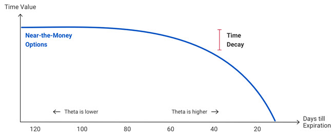
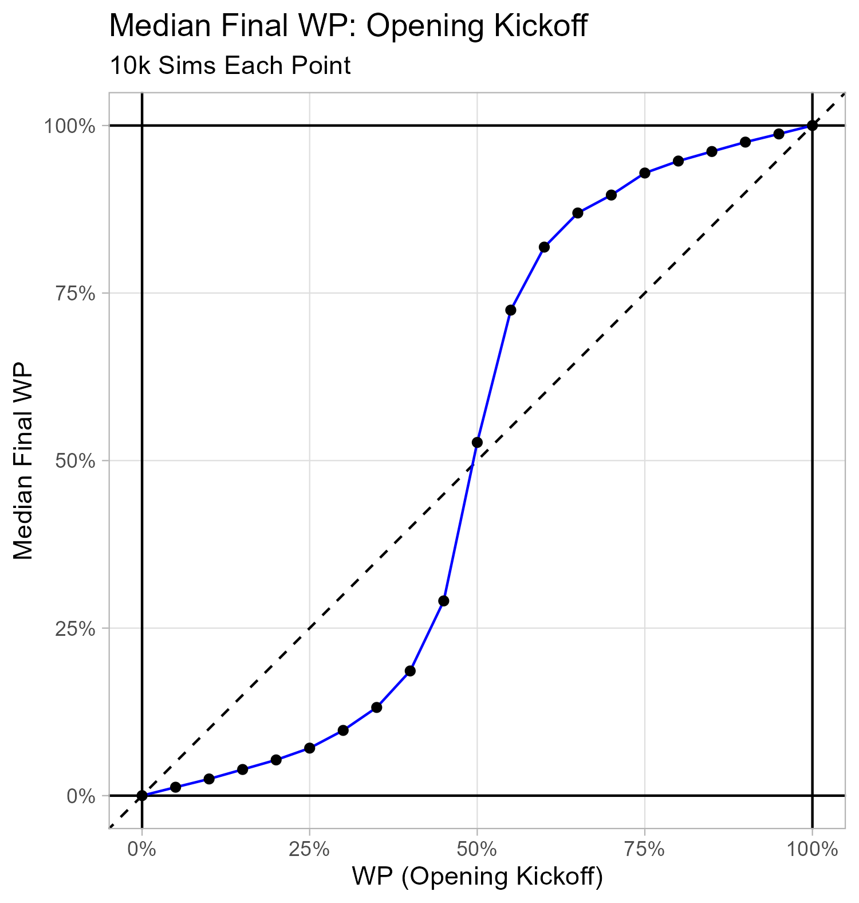
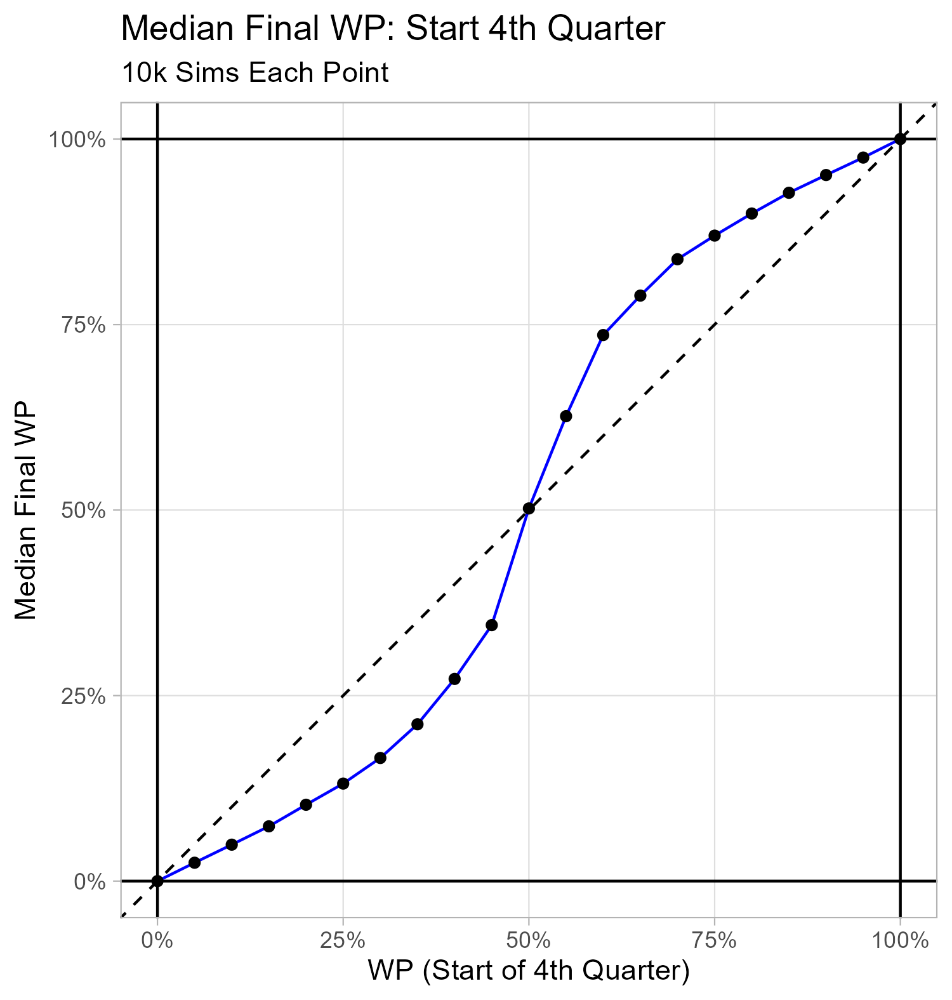
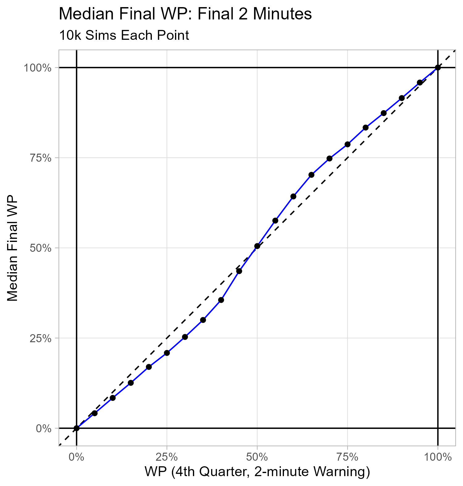

```{r setup, include=FALSE}

knitr::opts_chunk$set(echo = FALSE)

```

```{r load_libraries, include=FALSE}

library(tidyverse)
library(nflfastR)

```

### Background

In [Part I](https://caseycaprini.github.io/the_latest_numbers/posts/2023-12-04-partiwinprobabilitystochasticprocess/), I introduced the quantitative finance idea of valuing something on the basis of a stochastic process via a simplified Bachelier model.

In [Part II](https://caseycaprini.github.io/the_latest_numbers/posts/2023-12-26-partiiwinprobabilitystochasticprocess/), I discussed some theoretical properties of binary forecast streams, and I provided evidence of them holding for the Vegas-informed `nflfastR` Win Probability (WP) model estimates. I also developed a simple stochastic process model for Win Probability Added (WPA) that has these properties and match the `nflfastR` data well enough to provide a toy dynamic for WP streams.

> $WPA \sim N(\mu = 0, SD = \sigma_{WP, t})$
> 
> $\sigma_{WP, t} = 0.07 (0.5 - \lvert{WP - 0.5}\rvert) + \frac{75 ((0.5 - \lvert{WP - 0.5}\rvert))}{3875 - t}$
> 
> Here, <i>t</i> is game seconds played.
> 
> The "0.5 - |WP - 0.5|" term is just the distance from certainty (i.e, WP = 0 or WP = 1).

### An Example

Initial conditions:

* Initial WP = 67%
* Time-in-game: Opening Kickoff

The code below simulates a single WP stream using these initial conditions and the dynamic above. A discrete stochastic process is used: a WPA is simulated every 24 seconds. (Note: To ensure a simulated WPA does not result in a WP outside the bounds of [0, 1], resulting WPs get checked each step and an out of bounds WP manually set at 0.5% or 99.5%.)

```{r single_trajectory}

# Jaylen Warren
set.seed(30)

t_single = seq(0, 3600, by = 24)
wp_single = rep(NA_real_, length(t_single))
wp_single[1] = 2/3

# i - 1 steps  
for(i in 1:(length(t_single) - 1)){
  dist_from_certainty = 0.5 - abs(wp_single[i] - 0.5)
    
  wpa_sd_single = (0.07*dist_from_certainty) + ((75*dist_from_certainty)/(3875 - t_single[i]))
    
  wp_single[i + 1] = wp_single[i] + rnorm(n = 1, mean = 0, sd = wpa_sd_single)
    
  if(wp_single[i + 1] > 1){wp_single[i + 1] = 0.995}
  if(wp_single[i + 1] < 0){wp_single[i + 1] = 0.005}
}

df_single <-
  data.frame(t_single, wp_single)

```

The single (losing) trajectory is plotted below.

```{r plot_single_trajectory}

df_single %>%
  ggplot(aes(
    x = t_single,
    y = wp_single
  )) +
  geom_hline(yintercept = c(0, 1)) +
  geom_vline(xintercept = c(0, 60 * 60)) +
  geom_vline(xintercept = c(60 * 15, 60 * 30, 60 * 45),
             linetype = "dashed") +
  scale_y_continuous(labels = scales::percent) +
  scale_x_continuous(breaks = seq(0, 3600, by = 5 * 60),
                     minor_breaks = NULL) +
  geom_path(color = "blue") +
  theme_light() +
  labs(x = "Seconds Played",
       y = "Simulated WP",
       title = "A Single Simulated Trajectory",
       subtitle = "Assumed Pre-game WP: 67%")

```

Similar to the Bachelier model in Part I, I'm really interested in an ensemble of final WPs. I'll put the simulation into a function (with parameters for initial conditions for WP and time-in-game.)

```{r sim_stream_function}

sim_stream <- function(game_seconds_played = 0, wp = 0.5){
  t = seq(game_seconds_played, 3600, by = 24)
  wp = rep(wp, length(t))
  
  for(i in 1:(length(t) - 1)){
    dist_from_certainty = 0.5 - abs(wp[i] - 0.5)
    
    wpa_sd = (0.07*dist_from_certainty) + ((75*dist_from_certainty)/(3875 - t[i]))
    
    wp[i + 1] = wp[i] + rnorm(n = 1, mean = 0, sd = wpa_sd)
    
    if(wp[i + 1] > 1){wp[i + 1] = 0.995}
    if(wp[i + 1] < 0){wp[i + 1] = 0.005}
  }
  
  return(wp[length(t)])
}

```

Let's simulate 10k results (initial WP = 67%, opening kickoff) and plot the distribution.

```{r wp_67_t_0}

wp_67_t_0 <-
  replicate(
    10000,
    sim_stream(
      game_seconds_played = 0,
      wp = 2/3
    )
  )

wp_67_t_0 <-
  data.frame(
    sim_id = 1:length(wp_67_t_0),
    wp_final = wp_67_t_0
  )

wp_67_t_0 %>%
  ggplot(aes(x = wp_final)) +
  geom_histogram(
    fill = "blue",
    color = "black",
    binwidth = 0.05
  ) +
  theme_light() +
  scale_x_continuous(minor_breaks = NULL,
                     labels = scales::percent) +
  scale_y_continuous(minor_breaks = NULL) +
  labs(x = "Final Simulated WP",
       y = "Count",
       title = "Distribution of Final WP for 10k Simulated Trajectories",
       subtitle = "Assumed Pre-game WP: 67%")

```

(Visually, this reminds me of a beta distribution with both shape parameters < 1.) The mean final WP is `r mean(wp_67_t_0$wp_final * 100) %>% round(., 1) %>% paste0(.,"%")`, and the median final WP is `r median(wp_67_t_0$wp_final * 100) %>% round(., 1) %>% paste0(.,"%")`.

Let's compare this distribution with a simulation with the same initial WP (67%) but with only the 4th quarter left to play (2712 seconds played, 14.8 minutes remaining).

```{r wp_67_t_2712}

wp_67_t_2712 <-
  replicate(
    10000,
    sim_stream(
      game_seconds_played = 2712,
      wp = 2/3
    )
  )

wp_67_t_2712 <-
  data.frame(
    sim_id = 1:length(wp_67_t_2712),
    wp_final = wp_67_t_2712
  )

wp_67_t_2712 %>%
  ggplot(aes(x = wp_final)) +
  geom_histogram(
    fill = "blue",
    color = "black",
    binwidth = 0.05
  ) +
  theme_light() +
  scale_x_continuous(minor_breaks = NULL,
                     labels = scales::percent) +
  scale_y_continuous(minor_breaks = NULL) +
  labs(x = "Final Simulated WP",
       y = "Count",
       title = "Distribution of Final WP for 10k Simulated Trajectories",
       subtitle = "Start of 4th Quarater, Initial WP: 67%")

```

The mean final WP of this distribution is `r mean(wp_67_t_2712$wp_final * 100) %>% round(., 1) %>% paste0(.,"%")`, and the median final WP is `r median(wp_67_t_2712$wp_final * 100) %>% round(., 1) %>% paste0(.,"%")`.

Finally, let's compare this distribution with a simulation with the same initial WP (67%) but with only 2 minutes left to play (3480 seconds played, 2 minutes remaining).

```{r wp_67_t_3480}

wp_67_t_3480 <-
  replicate(
    10000,
    sim_stream(
      game_seconds_played = 3480,
      wp = 2/3
    )
  )

wp_67_t_3480 <-
  data.frame(
    sim_id = 1:length(wp_67_t_3480),
    wp_final = wp_67_t_3480
  )

wp_67_t_3480 %>%
  ggplot(aes(x = wp_final)) +
  geom_histogram(
    fill = "blue",
    color = "black",
    binwidth = 0.05
  ) +
  theme_light() +
  scale_x_continuous(minor_breaks = NULL,
                     labels = scales::percent) +
  scale_y_continuous(minor_breaks = NULL) +
  labs(x = "Final Simulated WP",
       y = "Count",
       title = "Distribution of Final WP for 10k Simulated Trajectories",
       subtitle = "Start of 4th Quarater, Initial WP: 67%")

```

(Visually, this reminds me of a beta distribution with both shape parameters > 1. This suggests that WP could be thought of as resolving to a near point estimate with magnitude of shape parameters increasing as time remaining goes to 0.) The mean final WP of this distribution is `r mean(wp_67_t_3480$wp_final * 100) %>% round(., 1) %>% paste0(.,"%")`, and the median final WP is `r median(wp_67_t_3480$wp_final * 100) %>% round(., 1) %>% paste0(.,"%")`.

#### Time Invariance of WP?

This stochastic process approach let's us model questions like time preference.

Which situation would you prefer?
* Option 1: WP 67%, opening kickoff
* Option 2: WP 67% with 2 minutes remaining

The examples above show a divergence between the mean and median of 10k trajectories. Since the median is the 50th percentile result, the stochastic process model supports a preference for the Option 1. This time element appears to be absent from more public WP discussions I've encountered.

There's a intuitive story that can support the conclusion as well: If you're a 67% WP favorite at kickoff, you'd likely be disappointed to only be a 67% WP favorite at the 2-minute warning in the 4th quarter. It reminds me of a Buffet quote:

> "Time is the friend of the wonderful business:
> you keep compounding, it keeps doing more business,
> and keeps making more money. Time is the enemy of
> the lousy business.”
> 
> Warren Buffet

Anyways, the stochastic process approach allows you to simulate a bunch of streams at different times-in-game with a fixed WP and compare the results.

Here's a comparison of median and mean for 67% WP, from opening kickoff to the 4th quarter 2-minute warning in two minute increments.

```{r time_invariance}

mean_10k_streams <- function(initial_t, initial_wp){
  replicate(10000,
            sim_stream(
              game_seconds_played = initial_t,
              wp = initial_wp
            )
           ) %>%
    mean() %>%
    return()
}


median_10k_streams <- function(initial_t, initial_wp){
  replicate(10000,
            sim_stream(
              game_seconds_played = initial_t,
              wp = initial_wp
              )
            ) %>%
    median() %>%
    return()
}


initial_t <- seq(0, 3600 - (24*5), by = 24*5)
initial_wp <- 2/3
wp_final <- rep(NA_real_, length(initial_t))

df_mean_final_wp <-
  data.frame(initial_t, initial_wp, wp_final) %>%
  mutate(metric = "Mean",
         wp_final = map2_dbl(initial_t, initial_wp,
                             mean_10k_streams))

df_median_final_wp <-
  data.frame(initial_t, initial_wp, wp_final) %>%
  mutate(metric = "Median",
         wp_final = map2_dbl(initial_t, initial_wp,
                             median_10k_streams))

df_metric_comparison <-
  bind_rows(df_mean_final_wp,
            df_median_final_wp)

p_time_value <-
  df_metric_comparison %>%
  ggplot(
    aes(x = initial_t/60,
        y = wp_final,
        group = metric,
        color = metric)
  ) +
  geom_vline(xintercept = c(0, 3600)/60) +
  geom_vline(xintercept = c(900, 1800, 2700)/60,
             linetype = "dashed") +
  geom_hline(yintercept = c(0, 1)) +
  geom_point() +
  geom_path(
    arrow = arrow(type = "closed",
                  length = unit(0.1, "inches"))
  ) +
  theme_light() +
  scale_y_continuous(
    minor_breaks = NULL,
    labels = scales::percent
  ) +
  scale_x_continuous(
    breaks = seq(0, 60, by = 5)
  ) +
  labs(x = "Starting Time-in-Game of Sims (Minutes Played)",
       y = "Mean/Median of Final WP for 10k Sims",
       color = "Metric:",
       title = "Summary Statistics of Final WP for Varying Time-in-Game",
       subtitle = "10k Sims Each Point: Various Time-in-Game, Initial WP: 67%") +
  theme(legend.position = "bottom")

ggsave(
  filename = "wp_time_value.png",
  plot = p_time_value,
  width = 6,
  height = 4.5,
  units = "in"
)

```

(Visually, this plot reminds me of the concept of [time decay](https://www.merrilledge.com/investment-products/options/learn-understand-theta-options) in options trading, of which I know nearly nothing about.)



An alternative approach might be to simulate trajectories between two different conditions and compute a contrast.  Here's a comparison of the Option 1 and Option 2 above.

```{r wp_67_contrasts}

option_1 <-
  replicate(
    10000,
    sim_stream(
      game_seconds_played = 0,
      wp = 2/3
    )
  )

option_2 <-
  replicate(
    10000,
    sim_stream(
      game_seconds_played = 3600 - 120,
      wp = 2/3
    )
  )

contrast <-
  sample(option_1, size = 2000, replace = T) - sample(option_2, size = 2000, replace = T)

data.frame(delta_wp = contrast) %>%
  ggplot(aes(x = delta_wp)) +
  geom_vline(xintercept = 0,
             linetype = "dashed") +
  geom_boxplot(fill = "blue",
               alpha = 0.4) +
  geom_jitter(aes(y = 1),
              alpha = 0.15,
              width = 0) +
  scale_x_continuous(labels = scales::percent) +
  scale_y_continuous(labels = NULL, breaks = NULL) +
  theme_light() +
  labs(x = "Advantage of Option 1 Draw over Option 2 Draw",
       y = NULL,
       title = "Contrast Between Options",
       subtitle = "Option 1: WP 67%, Opening Kickoff; Option 2: WP 67%; Final 2-minute Warning")

```

#### Fix Time-in-Game, Vary Initial WP

Previously, we fixed the starting WP for our simulations and varied the time-in-game. Estimating the resulting median final WP revealed what could be a time value effect.

Here, we reverse that: fix the amount of time remaining, and vary the starting WP. Estimating the resulting median final WP reveals what looks like a basis for departures from risk-neutrality and the emergence of a sigmoid that tends toward linearity as time remaining goes to 0. The implications here would be really significant (e.g., 4th down decisions, Jensen' inequality impact on EV calculations).

The plots below use the same three milestones as before: opening kickoff, start of the 4th quarter, and the final 2-minute warning.

```{r various_wp_kickoff}

initial_wp <- seq(0.0, 1.0, by = 0.05)
initial_t <- rep(0, length(initial_wp))
wp_final <- rep(NA_real_, length(initial_wp))

df_median_final_wp <-
  data.frame(initial_t, initial_wp, wp_final) %>%
  mutate(wp_final = map2_dbl(initial_t, initial_wp,
                             median_10k_streams))

p_final_wp_kickoff <-
  df_median_final_wp %>%
  ggplot(
    aes(x = initial_wp,
        y = wp_final)
  ) +
  geom_abline(intercept = 0, slope = 1, linetype = "dashed") +
  geom_vline(xintercept = c(0, 1)) +
  geom_hline(yintercept = c(0, 1)) +
  geom_path(color = "blue") +
  geom_point() +
  scale_x_continuous(labels = scales::percent,
                     minor_breaks = NULL) +
  scale_y_continuous(labels = scales::percent,
                     minor_breaks = NULL) +
  theme_light() +
  labs(
    x = "Halftime WP",
    y = "Median Final WP",
    title = "Median Final WP: Opening Kickoff",
    subtitle = "10k Sims Each Point"
  )

ggsave(
  filename = "final_wp_kickoff.png",
  plot = p_final_wp_kickoff,
  height = 5.25,
  width = 5,
  units = "in"
)

```



```{r various_wp_start_4th}

initial_wp <- seq(0.0, 1.0, by = 0.05)
initial_t <- rep(2700, length(initial_wp))
wp_final <- rep(NA_real_, length(initial_wp))

df_median_final_wp <-
  data.frame(initial_t, initial_wp, wp_final) %>%
  mutate(wp_final = map2_dbl(initial_t, initial_wp,
                             median_10k_streams))

p_final_wp_start_4th <-
  df_median_final_wp %>%
  ggplot(
    aes(x = initial_wp,
        y = wp_final)
  ) +
  geom_abline(intercept = 0, slope = 1, linetype = "dashed") +
  geom_vline(xintercept = c(0, 1)) +
  geom_hline(yintercept = c(0, 1)) +
  geom_path(color = "blue") +
  geom_point() +
  scale_x_continuous(labels = scales::percent,
                     minor_breaks = NULL) +
  scale_y_continuous(labels = scales::percent,
                     minor_breaks = NULL) +
  theme_light() +
  labs(
    x = "WP (Start of 4th Quarter)",
    y = "Median Final WP",
    title = "Median Final WP: Start 4th Quarter",
    subtitle = "10k Sims Each Point"
  )

ggsave(
  filename = "final_wp_start_4th.png",
  plot = p_final_wp_start_4th,
  height = 5.25,
  width = 5,
  units = "in"
)

```



```{r various_wp_final_2minutes}

initial_wp <- seq(0.0, 1.0, by = 0.05)
initial_t <- rep(3480, length(initial_wp))
wp_final <- rep(NA_real_, length(initial_wp))

df_median_final_wp <-
  data.frame(initial_t, initial_wp, wp_final) %>%
  mutate(wp_final = map2_dbl(initial_t, initial_wp,
                             median_10k_streams))

p_final_wp_final_2_minutes <-
  df_median_final_wp %>%
  ggplot(
    aes(x = initial_wp,
        y = wp_final)
  ) +
  geom_abline(intercept = 0, slope = 1, linetype = "dashed") +
  geom_vline(xintercept = c(0, 1)) +
  geom_hline(yintercept = c(0, 1)) +
  geom_path(color = "blue") +
  geom_point() +
  scale_x_continuous(labels = scales::percent,
                     minor_breaks = NULL) +
  scale_y_continuous(labels = scales::percent,
                     minor_breaks = NULL) +
  theme_light() +
  labs(
    x = "WP (4th Quarter, 2-minute Warning)",
    y = "Median Final WP",
    title = "Median Final WP: Final 2 Minutes",
    subtitle = "10k Sims Each Point"
  )

ggsave(
  filename = "final_wp_final_2_minutes.png",
  plot = p_final_wp_final_2_minutes,
  height = 5.25,
  width = 5,
  units = "in"
)

```

