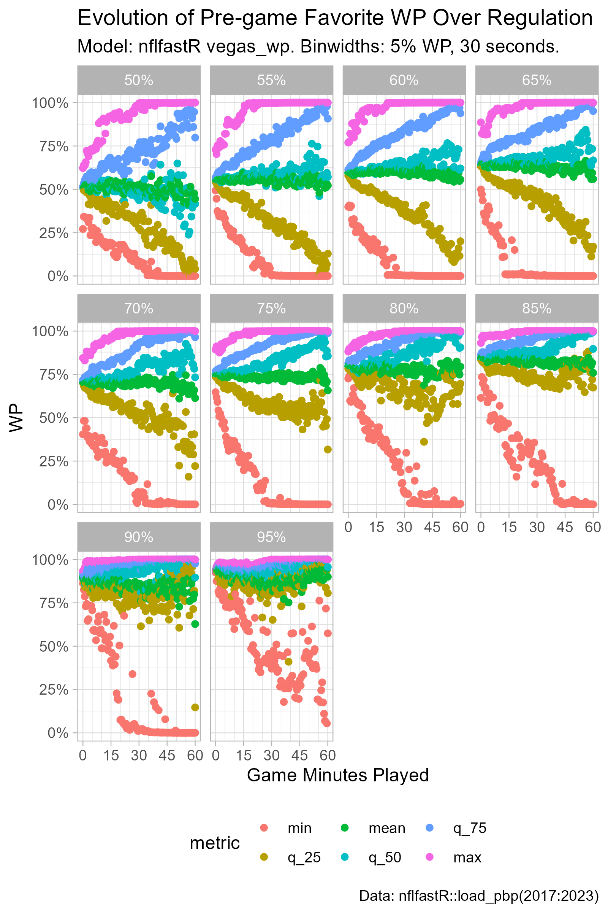
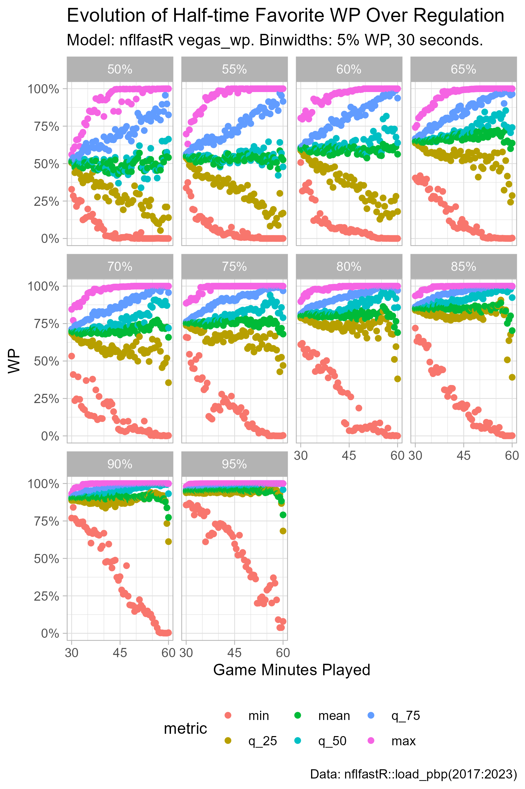
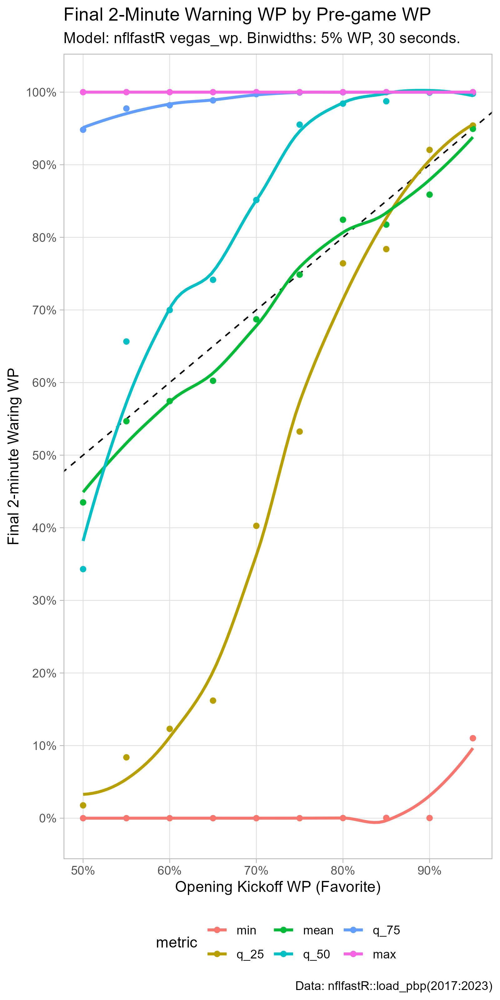

```{r setup, include=FALSE}
knitr::opts_chunk$set(echo = FALSE)
```


```{r libraries}

# Load libraries
library(tidyverse)
library(nflfastR)

```

```{r}

raw_df <-
  load_pbp(2017:2023)

# Pull a vector of game_id's where
# the home team is a favorite.
# This will be used to develop a columns
# that track the pre-game favorite's
# current WP and WPA.
home_favorite <-
  raw_df %>%
  group_by(game_id) %>%
  slice_head(n = 1) %>%
  filter(vegas_home_wp >= 0.5) %>%
  pull(game_id)

# Build a dataframe for regulation time
# win probabilities for the pre-game favorite,
# binned by time remaining.
df <-
  raw_df %>%
  filter(qtr %in% c(1, 2, 3, 4)) %>%
  filter(!(is.na(play_type))) %>%
  select(game_id, desc,
         vegas_home_wp, vegas_home_wpa,
         game_seconds_remaining) %>%
  mutate(init_favorite_wp = ifelse(
    game_id %in% home_favorite,
    vegas_home_wp,
    1 - vegas_home_wp
  )) %>%
  mutate(init_favorite_wpa = ifelse(
    game_id %in% home_favorite,
    vegas_home_wpa,
    -1 * vegas_home_wpa
  )) %>%
  mutate(game_seconds_played = 3600 - game_seconds_remaining) %>%
  mutate(
    game_minutes_played_binned =
      round(game_seconds_played / 30) / 2
  )

```

### Evolution of Pre-game Favorite WP

```{r}

# Build a dataframe with game_id's and the
# initial favorite wp (binned).
init_favorite_wp_binned <-
  df %>%
  group_by(game_id) %>%
  slice_head(n = 1) %>%
  mutate(
    init_favorite_wp_binned =
      round(init_favorite_wp / 0.05) * .05
  ) %>%
  select(game_id, init_favorite_wp_binned)

# Looks like there were some data errors for the following 11 games:
# "2017_09_CIN_JAX" "2017_14_SEA_JAX" "2018_01_LA_OAK"  "2018_03_TEN_JAX"
# "2018_07_HOU_JAX" "2018_11_PIT_JAX" "2018_13_KC_OAK"  "2018_15_WAS_JAX"
# "2018_16_DEN_OAK" "2019_09_DET_OAK" "2019_14_TEN_OAK"
bad_games <-
  init_favorite_wp_binned %>%
  filter(
    init_favorite_wp_binned < 0.5
  ) %>%
  pull(
    game_id
  )

df_pregame_wp_evolution <-
  df %>%
  filter(
    (game_id %in% bad_games) == F
  ) %>%
  filter(
    is.na(game_seconds_remaining) == F
  ) %>%
  left_join(
    init_favorite_wp_binned %>%
      filter(
        (game_id %in% bad_games) == F
      ),
    by = c("game_id" = "game_id")
  ) %>%
  group_by(
    game_minutes_played_binned,
    init_favorite_wp_binned
  ) %>%
  summarize(
    n = n(),
    min = min(init_favorite_wp),
    q_25 = quantile(init_favorite_wp, 0.25),
    q_50 = quantile(init_favorite_wp, 0.5),
    mean = mean(init_favorite_wp),
    q_75 = quantile(init_favorite_wp, 0.75),
    max = max(init_favorite_wp),
    .groups = "drop"
  ) %>%
  pivot_longer(
    min:max,
    names_to = "metric",
    values_to = "value"
  ) %>%
  # Convert metric variable to a factor,
  # with levels ordered smallest to largest.
  mutate(
    metric = factor(
      metric,
      levels = c(
        "min", "q_25", "mean", "q_50", "q_75", "max"
      )
    )
  ) %>%
  # Next 2 mutates used to make a character
  # label for facet labels.
  mutate(
    init_favorite_wp_binned_label =
      round((init_favorite_wp_binned * 100), 1)
  ) %>%
  mutate(
    init_favorite_wp_binned_label =
      paste0(
        as.character(init_favorite_wp_binned_label),
        "%"
      )
  )

p_pregame_wp_evolution <-
  df_pregame_wp_evolution %>%
  ggplot(
    aes(
      x = game_minutes_played_binned,
      y = value,
      color = metric
    )
  ) +
  geom_point() +
  facet_wrap(~ init_favorite_wp_binned_label) +
  theme_light() +
  scale_x_continuous(
    breaks = seq(0, 60, by = 15),
    minor_breaks = seq(0, 60, by = 5)
  ) +
  scale_y_continuous(
    labels = scales::percent
  ) +
  theme(legend.position = "bottom") +
  labs(x = "Game Minutes Played",
       y = "WP",
       title = "Evolution of Pre-game Favorite WP Over Regulation",
       subtitle = "Model: nflfastR vegas_wp. Binwidths: 5% WP, 30 seconds.",
       caption = "Data: nflfastR::load_pbp(2017:2023)")

ggsave(
  filename = "pregame_favorite_wp_evolution.png",
  plot = p_pregame_wp_evolution,
  height = 7.5,
  width = 5,
  units = "in",
  dpi = "retina"
)

```



### Evolution of Halftime Favorite WP

```{r}

# Build a dataframe with game_id's, half_favorite side (home or away),
# and the favorite to start the 2nd half (binned).
half_favorite <-
  df %>%
  filter(game_seconds_remaining <= 1800) %>%
  group_by(game_id) %>%
  slice_head(n = 1) %>%
  mutate(
    half_favorite = 
      ifelse(vegas_home_wp > 0.5,
        "home",
        "away")
  ) %>%
  mutate(
    half_favorite_wp =
      ifelse(half_favorite == "home",
        vegas_home_wp,
        1 - vegas_home_wp)
  ) %>%
  mutate(
    half_favorite_wp_binned =
      round(half_favorite_wp / 0.05) * .05
  ) %>%
  select(game_id, half_favorite, half_favorite_wp_binned)

df_half_wp_evolution <-
  df %>%
  filter(game_seconds_remaining <= 1800) %>%
  left_join(
    half_favorite,
    by = c("game_id" = "game_id")
  ) %>%
  mutate(
    half_favorite_wp =
      ifelse(half_favorite == "home",
        vegas_home_wp,
        1 - vegas_home_wp)
  ) %>%
  group_by(
    game_minutes_played_binned,
    half_favorite_wp_binned
  ) %>%
  summarize(n = n(),
            min = min(half_favorite_wp),
            q_25 = quantile(half_favorite_wp, 0.25),
            q_50 = quantile(half_favorite_wp, 0.5),
            q_75 = quantile(half_favorite_wp, 0.75),
            max = max(half_favorite_wp),
            mean = mean(half_favorite_wp),
            .groups = "drop") %>%
  pivot_longer(min:mean,
               names_to = "metric",
               values_to = "value") %>%
  mutate(
    metric = factor(
      metric,
      levels = c(
        "min",
        "q_25",
        "mean",
        "q_50",
        "q_75",
        "max"
      )
    )
  ) %>%
  mutate(
    half_favorite_wp_binned_label =
      round((half_favorite_wp_binned * 100), 1)
  ) %>%
  mutate(
    half_favorite_wp_binned_label =
      paste0(
        as.character(half_favorite_wp_binned_label),
        "%"
      )
  )

p_half_wp_evolution <-
  df_half_wp_evolution %>%
  filter(
    half_favorite_wp_binned != 1
  ) %>%
  ggplot(aes(x = game_minutes_played_binned,
             y = value,
             color = metric)) +
  geom_point() +
  facet_wrap(~ half_favorite_wp_binned_label) +
  theme_light() +
  scale_x_continuous(
    breaks = seq(0, 60, by = 15),
    minor_breaks = seq(0, 60, by = 5)
  ) +
  scale_y_continuous(
    labels = scales::percent
  ) +
  theme(legend.position = "bottom") +
  labs(x = "Game Minutes Played",
       y = "WP",
       title = "Evolution of Half-time Favorite WP Over Regulation",
       subtitle = "Model: nflfastR vegas_wp. Binwidths: 5% WP, 30 seconds.",
       caption = "Data: nflfastR::load_pbp(2017:2023)")

ggsave(
  filename = "halftime_favorite_wp_evolution.png",
  plot = p_half_wp_evolution,
  height = 7.5,
  width = 5,
  units = "in",
  dpi = "retina"
)

```



### Distribution of 2-minute Warning WP for Pre-game Favorites

```{r}

p_2_min_warning <-
  df_pregame_wp_evolution %>%
  filter(
    game_minutes_played_binned == 58
  ) %>%
  ggplot(
    aes(
      x = init_favorite_wp_binned,
      y = value,
      color = metric,
      group = metric
    )
  ) +
  geom_abline(
    intercept = 0.0,
    slope = 1,
    linetype = "dashed"
  ) +
  geom_point() +
  geom_smooth(se = F) +
  labs(
    x = "Opening Kickoff WP (Favorite)",
    y = "Final 2-minute Waring WP",
    title = "Final 2-Minute Warning WP by Pre-game WP",
       subtitle = "Model: nflfastR vegas_wp. Binwidths: 5% WP, 30 seconds.",
       caption = "Data: nflfastR::load_pbp(2017:2023)"
  ) +
  scale_x_continuous(
    breaks = seq(0, 1, by = 0.1),
    minor_breaks = NULL,
    labels = scales::percent
  ) +
  scale_y_continuous(
    breaks = seq(0, 1, by = 0.1),
    minor_breaks = NULL,
    labels = scales::percent
  ) +
  theme_light() +
  theme(
    legend.position = "bottom"
  )

ggsave(
  filename = "2nd_half_wp_distro.png",
  plot = p_2_min_warning,
  height = 10,
  width = 5,
  units = "in",
  dpi = "retina"
)

```

